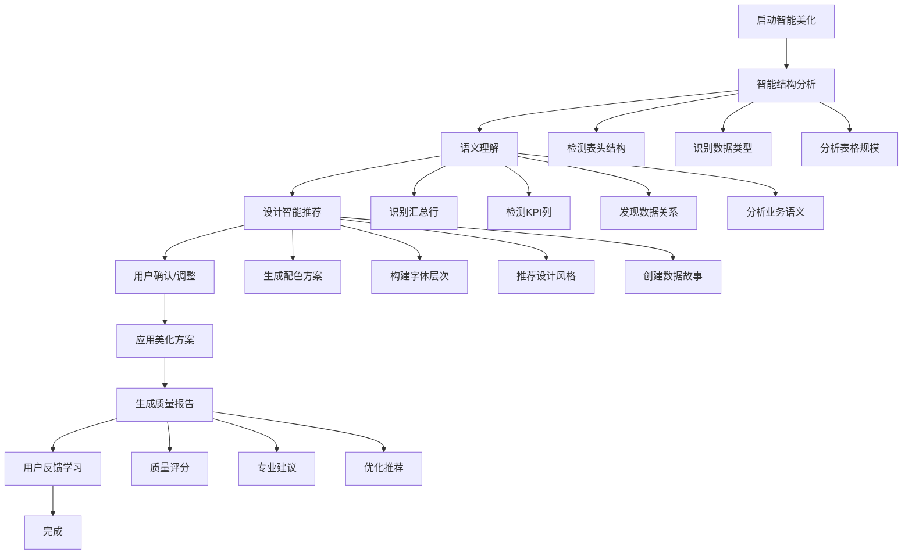
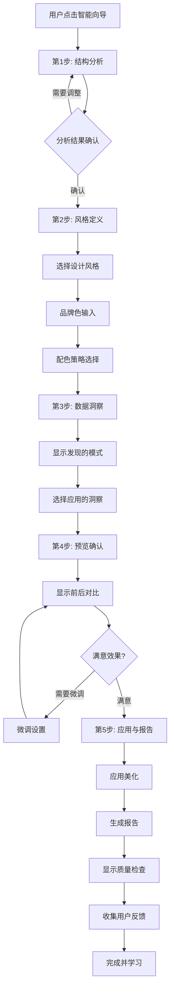

# Excel表格美化系统需求文档 v4.1

## 1. 项目概述

### 1.1 项目背景
基于现有的Excel智能布局优化系统，新增表格美化功能模块，专注于提升Excel表格的视觉效果和专业度。该系统将在保持原有布局优化能力的基础上，增加丰富的格式化和美化功能。

### 1.2 v4.1 重大升级
**三大核心改进，实现专业级用户体验**：

#### 1.2.1 交互体验质变：UserForm专业界面 🎨
- **告别InputBox粗糙体验**：采用专业UserForm图形界面
- **防错设计**：点选操作杜绝用户输入错误
- **扩展友好**：新功能可轻松添加到界面中
- **专业美观**：瞬间提升工具的专业档次

#### 1.2.2 智能识别轻量化：关键词语义识别 🧠
- **自动识别汇总行**：智能识别"合计"、"总计"等关键词
- **上下文感知**：理解表格内容语义，不仅仅是格式结构
- **特殊处理**：汇总行自动应用专业特殊样式
- **轻量实现**：无需复杂AI，基于关键词匹配的简单高效方案

#### 1.2.3 安全撤销机制：自动备份保障 🛡️
- **操作前自动备份**：每次美化前自动创建工作表备份
- **一键撤销恢复**：`UndoBeautify()`函数快速恢复原状
- **用户信心保障**：用户可放心试验各种美化效果
- **数据安全**：避免操作失误导致的数据损失

### 1.3 设计目标
- **快速部署**：单模块VBA实现，导入即用
- **专业体验**：UserForm界面替代粗糙InputBox
- **智能识别**：轻量级语义识别，自动处理特殊行
- **安全可靠**：内置备份撤销机制，保障数据安全
- **兼容性强**：与现有布局优化系统无缝集成

### 1.4 核心价值
- 快速将普通表格转换为专业级报表
- 提高工作效率，减少手动格式化时间（节省80%以上时间）
- 确保表格风格统一，提升文档专业度
- 支持单模块部署，适合个人和小团队使用
- 提供专业级用户体验，媲美商业软件插件

## 2. 功能需求详细说明

### 2.1 表头美化功能

#### 2.1.1 首行突出显示 ⭐ (用户需求)
**功能描述**：自动识别表头行，应用突出的视觉效果

**实现细节**：
- **自动检测规则**：
  - 首行非空单元格占比 > 60%
  - 包含文本内容的单元格占比 > 70%
  - 第二行开始出现数值型数据
  - 支持多行表头检测（最多3行）

- **渐变背景**（Excel兼容性限制）：
  - ~~渐变类型：线性渐变、径向渐变~~
  - **建议限制**：仅支持两段线性渐变（跨版本一致）
  - **渐变方向**：水平（0°）、垂直（90°）为主
  - **渐变步数**：限制为2个颜色节点（打印兼容）
  - ~~透明度支持：0-100%~~：Excel打印一致性差

**简化渐变方案**：
```vba
Sub ApplySimpleGradient(headerRange As Range, startColor As Long, endColor As Long)
    ' 只用两色线性渐变，确保打印一致性
    With headerRange.Interior
        .Pattern = xlPatternLinearGradient
        .Gradient.Degree = 90  ' 垂直渐变
        .Gradient.ColorStops.Clear
        .Gradient.ColorStops.Add(0).Color = startColor
        .Gradient.ColorStops.Add(1).Color = endColor
    End With
End Sub
```

- **预设主题详细参数**：
  - 蓝色商务：
    - 起始色：#1E3A8A (RGB: 30,58,138)
    - 结束色：#3B82F6 (RGB: 59,130,246)
    - 字体色：#FFFFFF
    - 边框色：#1E40AF
  - 绿色清新：
    - 起始色：#065F46 (RGB: 6,95,70)
    - 结束色：#10B981 (RGB: 16,185,129)
    - 字体色：#FFFFFF
    - 边框色：#047857
  - 灰色专业：
    - 起始色：#374151 (RGB: 55,65,81)
    - 结束色：#9CA3AF (RGB: 156,163,175)
    - 字体色：#FFFFFF
    - 边框色：#4B5563
  - 紫色优雅：
    - 起始色：#581C87 (RGB: 88,28,135)
    - 结束色：#A855F7 (RGB: 168,85,247)
    - 字体色：#FFFFFF
    - 边框色：#6B21A8

- **字体优化详细参数**：
  - 字体加粗：Bold (700)
  - 字体大小：数据行字号 + 1pt（最大12pt，最小9pt）
  - 字符间距：正常（0）到宽松（+0.5pt）
  - 行高：自动调整（最小18pt）

#### 2.1.2 首行冻结 ⭐ (用户需求)
**功能描述**：自动冻结表头行，方便浏览大量数据

**实现方式**：
- **冻结逻辑**：
  - 单行表头：冻结第1行
  - 多行表头：冻结所有表头行（最多3行）
  - 组合冻结：支持同时冻结首行和首列
  
- **智能检测**：
  - 数据量检测：行数 > 20时自动建议冻结
  - 列宽检测：总列宽超过屏幕宽度时建议冻结首列
  - 记忆功能：记住用户的冻结偏好

### 2.2 边框和分隔功能（Excel兼容性优化）

#### 2.2.1 智能边框设置 ⭐ (限制Excel原生支持)
**功能描述**：基于Excel原生边框功能的专业表格样式

**边框类型说明**：
- **外边框**：
  - 线型：实线、双线、粗线（Excel原生支持）
  - 粗细：Medium、Thick（Excel标准选项）
  - 颜色：RGB色值（不支持透明度）
  - ~~圆角：Excel单元格不支持圆角边框~~

- **表头边框**：
  - 底部边框：Medium、Thick
  - 样式：实线、双线
  - 颜色：基于主题色的深浅变化

- **内部网格**：
  - 线型：实线、虚线（Excel限制）
  - 粗细：Thin、Medium
  - ~~颜色透明度：Excel不支持边框透明度~~

**视觉等效实现方案**：
```vba
' 使用浅色内填充 + 分层边框实现"伪圆角"效果
Sub ApplyLayeredBorderStyle(rng As Range)
    With rng
        ' 主体浅色填充
        .Interior.Color = RGB(248, 250, 252)
        
        ' 外层粗边框（主边框）
        .Borders(xlEdgeTop).Weight = xlThick
        .Borders(xlEdgeTop).Color = RGB(100, 116, 139)
        .Borders(xlEdgeBottom).Weight = xlThick
        .Borders(xlEdgeBottom).Color = RGB(100, 116, 139)
        .Borders(xlEdgeLeft).Weight = xlThick
        .Borders(xlEdgeLeft).Color = RGB(100, 116, 139)
        .Borders(xlEdgeRight).Weight = xlThick
        .Borders(xlEdgeRight).Color = RGB(100, 116, 139)
        
        ' 内层细边框创建层次感
        .Borders(xlInsideHorizontal).Weight = xlThin
        .Borders(xlInsideHorizontal).Color = RGB(226, 232, 240)
        .Borders(xlInsideVertical).Weight = xlThin
        .Borders(xlInsideVertical).Color = RGB(226, 232, 240)
    End With
End Sub
```

**TableStyle组合方案**：
```vba
Sub ApplyTableStyleWithBorders(tbl As ListObject)
    ' 使用TableStyle + 边框组合，避免修改列宽
    tbl.TableStyle = "ELO_Business"
    
    With tbl.Range
        ' 外边框加强
        .Borders(xlEdgeTop).Weight = xlMedium
        .Borders(xlEdgeBottom).Weight = xlMedium
        .Borders(xlEdgeLeft).Weight = xlMedium
        .Borders(xlEdgeRight).Weight = xlMedium
        
        ' 表头底边框突出
        tbl.HeaderRowRange.Borders(xlEdgeBottom).Weight = xlThick
    End With
End Sub
```

**智能边框应用规则**：
- 合并单元格：自动调整边框以适应合并区域
- 空白单元格：可选择是否添加边框
- 筛选状态：保持筛选后的边框完整性
- **性能优化**：批量设置边框，避免逐单元格操作

#### 2.2.2 文字边框显示 ⭐ (用户需求)
**功能描述**：通过边框突出显示重要文字内容

**边框样式库**：
- **重要数据**：
  - 样式：双线框
  - 颜色：#DC2626（红色）
  - 粗细：1.5pt
  
- **汇总行**：
  - 顶部边框：双线
  - 底部边框：粗线
  - 颜色：#1F2937（深灰）
  
- **关键指标**：
  - 样式：阴影边框
  - 阴影偏移：2pt
  - 阴影颜色：50%透明度黑色

### 2.3 数据突出显示

#### 2.3.1 负数金额突出 ⭐ (用户需求)
**功能描述**：自动识别并突出显示负数金额

**识别规则**：
- 数值类型检测：Number、Currency、Accounting格式
- 负值判断：值 < 0 或包含负号
- 公式结果：支持公式计算结果的负值检测

**显示格式详细配置**：
```vba
' 格式模板
NegativeFormats = Array( _
    "(#,##0.00)",          ' 括号格式
    "-#,##0.00",           ' 负号格式
    "▲#,##0.00",          ' 三角形格式
    "[Red]-#,##0.00",      ' 红色负号
    "[Red](#,##0.00)"      ' 红色括号
)
```

**条件格式规则**：
- 轻度负值（-10%以内）：浅红背景 #FEF2F2
- 中度负值（-10%到-30%）：中红背景 #FEE2E2
- 重度负值（-30%以上）：深红背景 #FECACA

### 2.4 行列美化功能

#### 2.4.1 隔行变色斑马条纹 ⭐ (用户需求)
**功能描述**：为表格添加隔行背景色，提升可读性

**智能条纹规则**：
- **自适应模式**：
  - 小表格（<50行）：每行交替
  - 中表格（50-200行）：每2行交替
  - 大表格（>200行）：每3行交替

- **分组条纹**：
  - 检测分组字段
  - 同组内使用相同背景
  - 组间交替变色

**配色方案详细参数**：
```
浅色系：
  - 主色：#FFFFFF (255,255,255)
  - 辅色：#F9FAFB (249,250,251)
  - 透明度：100%
  
蓝色系：
  - 主色：#FFFFFF (255,255,255)
  - 辅色：#EFF6FF (239,246,255)
  - 透明度：95%
  
绿色系：
  - 主色：#FFFFFF (255,255,255)
  - 辅色：#F0FDF4 (240,253,244)
  - 透明度：95%
```

### 2.5 字体美化功能

#### 2.5.1 字体统一标准化
**功能描述**：统一表格字体样式，提升专业度

**字体选择逻辑**：
```vba
Function SelectOptimalFont(contentType As String) As String
    Select Case contentType
        Case "ChineseHeader"
            SelectOptimalFont = "微软雅黑"
        Case "ChineseData"
            SelectOptimalFont = "微软雅黑 Light"
        Case "EnglishHeader"
            SelectOptimalFont = "Calibri"
        Case "EnglishData"
            SelectOptimalFont = "Arial"
        Case "Number"
            SelectOptimalFont = "Consolas"
        Case "Currency"
            SelectOptimalFont = "Times New Roman"
        Case "Mixed"
            SelectOptimalFont = "微软雅黑"
    End Select
End Function
```

**字体大小自适应规则**：
- 列宽 < 10：8pt
- 列宽 10-20：9pt
- 列宽 20-30：10pt
- 列宽 > 30：11pt
- 最大限制：12pt
- 最小限制：8pt

### 2.6 v4.1 核心新功能

#### 2.6.1 UserForm专业界面 ⭐ (重大升级)
**功能描述**：用专业的UserForm界面替代粗糙的InputBox交互

**界面设计规范**：
```vba
' UserForm控件布局
BeautifyForm.UserForm
├── lblTitle: "Excel表格专业美化工具"
├── frameTheme: "主题选择"
│   ├── optBusiness: "● 商务经典"
│   ├── optFinancial: "○ 财务专用"  
│   └── optMinimal: "○ 极简风格"
├── frameOptions: "高级选项"
│   ├── chkFreezeHeader: "☑ 冻结首行"
│   ├── chkZebraStripes: "☑ 隔行变色"
│   └── chkSmartSummary: "☑ 智能识别汇总行"
└── frameButtons: "操作按钮"
    ├── btnBeautify: "开始美化"
    └── btnCancel: "取消"
```

**交互逻辑**：
- **防错设计**：只能通过OptionButton选择主题，杜绝输入错误
- **实时反馈**：选择主题时显示对应的配色说明
- **选项控制**：CheckBox控制各项高级功能的开关
- **专业外观**：统一的控件样式和配色方案

**实现优势**：
- **专业感**：瞬间提升工具的档次，像商业插件
- **易用性**：直观的点选操作，用户友好
- **扩展性**：新增主题或功能只需添加控件
- **一致性**：界面风格与Office套件保持一致

#### 2.6.2 智能语义识别 ⭐ (重大升级)
**功能描述**：基于关键词的轻量级表格语义识别

**关键词库设计**：
```vba
' 汇总行识别关键词（中英文）
Private summaryKeywords As String
summaryKeywords = "合计,总计,小计,平均,汇总,统计,总和," & _
                 "Total,Sum,Average,Subtotal,Summary,Grand Total"

' 标题行识别关键词  
Private titleKeywords As String
titleKeywords = "标题,题目,主题,Title,Subject,Heading"
```

**识别算法**：
```vba
Function DetectSummaryRows(tableRange As Range) As Collection
    Dim summaryRows As New Collection
    Dim lastRow As Long
    lastRow = tableRange.Rows.Count
    
    ' 从底部向上扫描（汇总行通常在底部）
    For i = lastRow To Int(lastRow * 0.8) Step -1
        For j = 1 To tableRange.Columns.Count
            Dim cellValue As String
            cellValue = tableRange.Cells(i, j).Value
            
            ' 检查是否包含汇总关键词
            If ContainsKeyword(cellValue, summaryKeywords) Then
                summaryRows.Add i
                Exit For
            End If
        Next j
    Next i
    
    Set DetectSummaryRows = summaryRows
End Function
```

**智能处理策略**：
- **汇总行特殊样式**：顶部双线边框、字体加粗、背景变色
- **小计行处理**：虚线分隔、字体加粗
- **标题行增强**：底部粗边框、字体放大
- **异常值提醒**：识别"异常"、"错误"等关键词并标红

**上下文感知价值**：
- **自动化**：将手动识别的工作交给程序完成
- **准确性**：基于业务常识的关键词匹配
- **适应性**：可根据行业特点扩展关键词库
- **专业性**：体现对表格业务逻辑的理解

#### 2.6.3 智能撤销机制 ⭐ (逻辑撤销，避免复制工作表)
**功能描述**：基于样式和条件格式的逻辑撤销，避免命名区域、图表缓存、外部引用被破坏

**变更日志机制**：
```vba
' 全局变更记录结构
Type BeautifyLog
    StylesAdded As String          ' 新增样式名列表，分号分隔
    CFRulesAdded As String         ' 新增CF规则ID列表，分号分隔
    OriginalTableStyle As String   ' 原始表格样式
    OriginalCellStyles As String   ' 原始单元格样式映射
    Timestamp As Date              ' 操作时间
End Type

Dim g_BeautifyHistory As BeautifyLog

Sub InitializeBeautifyLog()
    ' 清空历史记录
    g_BeautifyHistory.StylesAdded = ""
    g_BeautifyHistory.CFRulesAdded = ""
    g_BeautifyHistory.OriginalTableStyle = ""
    g_BeautifyHistory.Timestamp = Now
End Sub

Sub LogStyleChange(styleName As String)
    If g_BeautifyHistory.StylesAdded = "" Then
        g_BeautifyHistory.StylesAdded = styleName
    Else
        g_BeautifyHistory.StylesAdded = g_BeautifyHistory.StylesAdded & ";" & styleName
    End If
End Sub

Sub LogCFRule(ruleAddress As String)
    If g_BeautifyHistory.CFRulesAdded = "" Then
        g_BeautifyHistory.CFRulesAdded = ruleAddress
    Else
        g_BeautifyHistory.CFRulesAdded = g_BeautifyHistory.CFRulesAdded & ";" & ruleAddress
    End If
End Sub
```

**逻辑撤销机制**：
```vba
Sub UndoBeautify()
    Dim ws As Worksheet
    Dim styleNames() As String
    Dim cfRules() As String
    Dim i As Long, j As Long
    
    Set ws = ActiveSheet
    
    ' 确认撤销操作
    If MsgBox("确定要撤销美化效果吗？", vbYesNo + vbQuestion) = vbNo Then
        Exit Sub
    End If
    
    Application.ScreenUpdating = False
    
    ' 1. 移除新增的自定义样式
    If g_BeautifyHistory.StylesAdded <> "" Then
        styleNames = Split(g_BeautifyHistory.StylesAdded, ";")
        For i = 0 To UBound(styleNames)
            On Error Resume Next
            ThisWorkbook.Styles(styleNames(i)).Delete
            On Error GoTo 0
        Next i
    End If
    
    ' 2. 删除带ELO前缀的条件格式规则
    For i = ws.Cells.FormatConditions.Count To 1 Step -1
        If InStr(ws.Cells.FormatConditions(i).Formula1, "ELO_") > 0 Or _
           Left(ws.Cells.FormatConditions(i).Formula1, 4) = "ELO_" Then
            ws.Cells.FormatConditions(i).Delete
        End If
    Next i
    
    ' 3. 还原原始表格样式
    If g_BeautifyHistory.OriginalTableStyle <> "" Then
        For Each tbl In ws.ListObjects
            tbl.TableStyle = g_BeautifyHistory.OriginalTableStyle
        Next tbl
    End If
    
    ' 4. 移除自定义表格样式
    For i = ActiveWorkbook.TableStyles.Count To 1 Step -1
        If Left(ActiveWorkbook.TableStyles(i).Name, 4) = "ELO_" Then
            ActiveWorkbook.TableStyles(i).Delete
        End If
    Next i
    
    Application.ScreenUpdating = True
    
    ' 清空历史记录
    InitializeBeautifyLog
    
    MsgBox "撤销完成！已移除所有美化样式，保留原始数据结构。", vbInformation
End Sub
```

**手动应急备份**（可选）：
```vba
Sub CreateManualBackup()
    ' 仅作为手动应急工具，不在自动流程中使用
    ' 用户可选择性调用，用于重要数据的额外保险
    Dim userChoice As VbMsgBoxResult
    userChoice = MsgBox("是否创建手动备份工作表？" & vbCrLf & _
                       "注意：这会复制整个工作表，仅建议重要数据使用", _
                       vbYesNo + vbQuestion, "手动备份确认")
    
    If userChoice = vbYes Then
        ActiveSheet.Copy After:=ActiveSheet
        ActiveSheet.Name = ActiveSheet.Previous.Name & "_ManualBackup_" & Format(Now, "hhmmss")
        ActiveSheet.Visible = xlSheetHidden
        MsgBox "手动备份已创建：" & ActiveSheet.Name, vbInformation
    End If
End Sub
```

**说明**：手动备份仅作为用户可选的额外保险，不在自动美化流程中使用，避免对命名区域/外链/透视缓存的破坏。
            ws.Delete
            backupCount = backupCount + 1
        End If
    Next ws
    Application.DisplayAlerts = True
    
    MsgBox "已清理 " & backupCount & " 个备份文件", vbInformation
End Sub
```

**安全保障价值**：
- **操作信心**：用户可大胆试验，知道随时能恢复
- **数据安全**：避免误操作导致的数据丢失
- **完整恢复**：工作表级别的完整备份恢复
- **智能清理**：提供备份清理功能，避免文件臃肿

### 2.7 简化美化功能

#### 2.7.1 预设美化主题
**功能描述**：提供几套实用的预设美化主题

**预设主题配置**：

1. **商务经典**
   - 主色调：蓝色系 (#1E3A8A, #3B82F6)
   - 字体：Calibri / 微软雅黑
   - 边框：细线简约
   - 特点：专业、清晰、易读

2. **财务专用**
   - 主色调：绿色系 (#065F46, #10B981)
   - 警告色：红色 (#DC2626)
   - 字体：Times New Roman / 宋体
   - 边框：双线表头
   - 特点：数字清晰、正负分明

3. **极简风格**
   - 主色调：黑白灰
   - 强调色：单一强调色
   - 字体：微软雅黑 / Arial
   - 边框：无边框或极细边框
   - 特点：简洁、专注内容

#### 2.6.2 基础条件格式
**功能描述**：应用基础条件格式规则

**内置规则**：
- **负数突出**：红色字体显示负数
- **重复值标记**：浅黄背景标记重复值
- **空值提醒**：浅灰背景标记空值
- **数值范围**：基于百分位的简单颜色标记
### 2.9 条件格式增强（性能优化版）
**功能描述**：高性能条件格式应用，避免大范围逐单元格处理

**性能优化规则**：
- **规则数量限制**：每类不超过1条公式型规则
- **应用范围**：仅对数据区域一次性应用
- **分层顺序**：错误→空值→重复→阈值→文本/日期

**优化的规则优先级**：
1. **错误值检测** - 公式：`=ISERROR(A1)`
2. **空值标记** - 公式：`=ISBLANK(A1)`  
3. **重复值检测** - 按列应用：`=COUNTIF(A:A,A1)>1`（注意：按列应用，不固定范围）
4. **数值阈值** - 逐列判定：`=A1<0` (负数检测，仅应用于数值列)
5. **文本匹配** - 公式：`=ISNUMBER(SEARCH("错误",A1))` (关键词检测)

**逐列应用策略**：
```vba
Sub ApplyOptimizedConditionalFormat(dataRange As Range)
    Dim col As Range
    Dim colLetter As String
    
    Application.ScreenUpdating = False
    Application.Calculation = xlCalculationManual
    Application.EnableEvents = False
    
    ' 清除现有条件格式
    dataRange.FormatConditions.Delete
    
    ' 1. 错误值检测（应用到整个数据区域）
    With dataRange.FormatConditions.Add(xlExpression, , "=ISERROR(" & dataRange.Cells(1, 1).Address(False, False) & ")")
        .Interior.Color = RGB(254, 226, 226)  ' 浅红色
        .StopIfTrue = True
    End With
    
    ' 2. 空值检测（应用到整个数据区域）
    With dataRange.FormatConditions.Add(xlExpression, , "=ISBLANK(" & dataRange.Cells(1, 1).Address(False, False) & ")")
        .Interior.Color = RGB(243, 244, 246)  ' 浅灰色
        .StopIfTrue = False
    End With
    
    ' 3. 逐列应用重复值检测和负数检测
    For Each col In dataRange.Columns
        colLetter = Split(col.Cells(1, 1).Address, "$")(1)
        
        ' 重复值检测（按当前列）
        With col.FormatConditions.Add(xlExpression, , "=COUNTIF(" & colLetter & ":" & colLetter & "," & col.Cells(1, 1).Address(False, False) & ")>1")
            .Interior.Color = RGB(255, 251, 235)  ' 浅黄色
            .StopIfTrue = False
        End With
        
        ' 负数检测（仅数值列）
        If IsNumericColumn(col) Then
            With col.FormatConditions.Add(xlCellValue, xlLess, 0)
                .Font.Color = RGB(220, 38, 38)  ' 红色字体
                .StopIfTrue = False
            End With
        End If
    Next col
    
    Application.EnableEvents = True
    Application.Calculation = xlCalculationAutomatic
    Application.ScreenUpdating = True
End Sub

Function IsNumericColumn(rng As Range) As Boolean
    ' 快速检测是否为数值列（检查前5个非空单元格）
    Dim checkCount As Integer
    For Each cell In rng
        If Not IsEmpty(cell) Then
            If IsNumeric(cell.Value) Then
                checkCount = checkCount + 1
            End If
            If checkCount >= 3 Then Exit For
        End If
    Next cell
    IsNumericColumn = (checkCount >= 3)
End Function
```

**大表性能模式**：
- **触发条件**：数据行数 > 10,000 或列数 > 50
- **限制措施**：禁用渐变、只套用TableStyle、关闭复杂CF规则
- **批处理**：按行块处理，每块1000行

- **重复值处理**：
  - 完全重复：深色标记
  - 部分重复：浅色标记
  - 首次出现：不标记
  - 分组内重复：组内标记

- **空值处理**：
  - 必填字段空值：红色背景
  - 可选字段空值：灰色背景
  - 公式返回空：黄色背景
  - 故意留空：不处理

### 2.10 新增功能模块

#### 2.10.1 数据验证美化 🆕 (Excel限制调整)
**功能描述**：在Excel原生限制下的数据验证美化

**实现内容**：
- **~~下拉列表美化~~**：
  - ~~下拉箭头颜色自定义~~：Excel原生对象不可定制
  - ~~列表项图标支持~~：原生控件无法自定义
  - **替代方案**：使用单元格背景色和字体样式区分状态

- **验证提示优化**：
  - **输入提示文本**：使用简洁明确的提示语
  - **错误提示文本**：友好的错误说明
  - ~~提示框皮肤化~~：原生MessageBox不可定制

- **验证状态指示**（Excel兼容方案）：
```vba
Sub ApplyValidationStateStyle(cell As Range, validationState As String)
    Select Case validationState
        Case "Valid"
            ' 有效数据：浅绿色背景 + 深绿边框
            cell.Interior.Color = RGB(220, 252, 231)
            cell.Borders.Color = RGB(34, 197, 94)
            
        Case "Invalid"
            ' 无效数据：浅红色背景 + 深红边框
            cell.Interior.Color = RGB(254, 226, 226)
            cell.Borders.Color = RGB(239, 68, 68)
            
        Case "Pending"
            ' 待验证：浅黄色背景 + 橙色边框
            cell.Interior.Color = RGB(255, 251, 235)
            cell.Borders.Color = RGB(245, 158, 11)
    End Select
End Sub
```

**简化建议**：
- 保留**提示文本**和**单元格样式指示**
- 移除不可实现的UI定制功能
- 专注于通过颜色和边框传达验证状态

#### 2.10.2 打印优化美化 🆕 (Excel限制调整)
**功能描述**：针对打印输出的专门美化（修正Excel限制）

**打印设置**：
- **页面设置**：
  - 自动调整缩放比例
  - 智能分页（避免数据断行）
  - 页眉页脚美化

- **打印样式**：
  - 打印专用配色（黑白兼容）
  - 网格线设置
  - ~~背景水印~~：Excel背景图不随打印输出

**水印替代方案**：
```vba
Sub AddPrintWatermark()
    ' 在页眉插入水印图片（可打印）
    Dim watermarkPath As String
    
    ' 动态获取水印路径，避免硬编码
    watermarkPath = ThisWorkbook.Path & "\Assets\Watermark.png"
    
    ' 检查文件是否存在
    If Dir(watermarkPath) = "" Then
        MsgBox "水印文件未找到，跳过水印设置", vbInformation
        Exit Sub
    End If
    
    With ActiveSheet.PageSetup
        .CenterHeader = "&G"  ' 图片占位符
        .CenterHeaderPicture.Filename = watermarkPath
        .CenterHeaderPicture.Height = 200
        .CenterHeaderPicture.Width = 200
    End With
End Sub
```

- **分页预览指引**：
  - ~~实时绘制分隔线~~：影响性能
  - **替代方案**：使用分页预览模式 + 虚线边框指示
```vba
Sub ShowPageBreaks()
    ActiveWindow.View = xlPageBreakPreview
    ' 用虚线边框标记分页位置
    With ActiveSheet.HPageBreaks(1).Location.Borders(xlEdgeTop)
        .LineStyle = xlDash
        .Weight = xlMedium
        .Color = RGB(128, 128, 128)
    End With
End Sub
```

#### 2.10.3 响应式美化 🆕
**功能描述**：根据查看设备自适应美化

**适配规则**：
- **屏幕大小适配**：
  - 大屏（>1920px）：完整显示所有美化
  - 中屏（1366-1920px）：标准美化
  - 小屏（<1366px）：简化美化

- **缩放级别适配**：
  - 放大查看：增强细节显示
  - 缩小查看：简化复杂样式

## 3. 技术实现规范

### 3.1 v4.1增强单模块VBA架构

#### 3.1.1 增强模块结构设计
```vba
' ===== v4.1新增核心功能 =====
Public Sub BeautifyTable()                   ' UserForm界面美化入口
Public Sub ShowBeautifyForm()               ' 显示专业UserForm界面
Public Sub UndoBeautify()                   ' 一键撤销美化效果
Public Sub CleanupBackups()                 ' 清理备份工作表

' ===== UserForm界面处理 =====
Private Sub BeautifyForm_Initialize()       ' 初始化UserForm界面
Private Sub optTheme_Click()                ' 主题选择事件处理
Private Sub btnBeautify_Click()             ' 开始美化按钮事件
Private Sub btnCancel_Click()               ' 取消按钮事件

' ===== 智能语义识别 =====
Private Function DetectSummaryRows(tableRange As Range) As Collection
Private Function ContainsKeyword(text As String, keywords As String) As Boolean
Private Sub ApplySummaryRowStyle(rowRange As Range, themeConfig As ThemeConfig)
Private Function AnalyzeTableContent(tableRange As Range) As ContentAnalysis

' ===== 安全备份机制 =====
Private Sub CreateBackupBeforeBeautify()    ' 美化前自动备份
Private Sub RestoreFromBackup()             ' 从备份恢复数据
Private Function WorksheetExists(wsName As String) As Boolean
Private Sub DeleteBackupWorksheet(wsName As String)

' ===== 传统美化功能（保持兼容） =====
' 表头美化
Private Sub ApplyHeaderBeautification(headerRange As Range)
Private Function DetectHeaderRows() As Integer
Private Sub ApplyGradientFill(range As Range, startColor As Long, endColor As Long)

' 边框设置
Private Sub SetTableBorders(tableRange As Range)
Private Sub ApplyBorderStyle(range As Range, borderWeight As XlBorderWeight)

' 条件格式
Private Sub ApplyBasicConditionalFormat(dataRange As Range)
Private Sub HighlightNegativeNumbers(range As Range)
Private Sub MarkDuplicateValues(range As Range)
Private Sub HighlightEmptyCells(range As Range)

' 字体和颜色
Private Sub StandardizeFonts(tableRange As Range)
Private Sub ApplyThemeColors(range As Range, themeConfig As ThemeConfig)

' ===== 辅助工具函数 =====
' 表格检测
Private Function DetectTableRange() As Range
Private Function IsHeaderRow(rowIndex As Integer) As Boolean
Private Function GetDataRange() As Range

' 主题配置
Private Function GetBusinessTheme() As ThemeConfig
Private Function GetFinancialTheme() As ThemeConfig
Private Function GetMinimalTheme() As ThemeConfig

' 颜色处理
Private Function RGBToLong(r As Integer, g As Integer, b As Integer) As Long
Private Function GetThemeColor(colorName As String, themeType As String) As Long

' 性能优化
Private Sub DisableUpdates()
Private Sub EnableUpdates()
Private Sub OptimizeColumnWidths(tableRange As Range)
```

#### 3.1.2 v4.1增强配置数据结构
```vba
' 主题配置结构
Type ThemeConfig
    ThemeName As String
    PrimaryColor As Long
    SecondaryColor As Long
    AccentColor As Long
    FontName As String
    HeaderBold As Boolean
    BorderStyle As XlLineStyle
    ' v4.1新增：汇总行特殊样式
    SummaryRowStyle As SummaryStyle
End Type

' v4.1新增：汇总行样式配置
Type SummaryStyle
    TopBorderWeight As XlBorderWeight
    FontBold As Boolean
    BackgroundColor As Long
    FontColor As Long
End Type

' v4.1新增：表格内容分析结果
Type ContentAnalysis
    SummaryRows As Collection
    TitleRows As Collection
    DataRows As Long
    HasHeaders As Boolean
    BusinessType As String  ' "Financial", "General", "Report"
End Type

' UserForm选项配置
Type FormOptions
    SelectedTheme As String
    FreezeHeader As Boolean
    ZebraStripes As Boolean
    SmartSummary As Boolean
End Type
```

' 表格信息结构
Type TableInfo
    HeaderRange As Range
    DataRange As Range
    TotalRange As Range
    HasHeaders As Boolean
    RowCount As Long
    ColumnCount As Long
End Type
```

' 冻结处理
Private Sub FreezeHeaderRow(headerRows As Integer)
Private Sub FreezePanes(row As Integer, column As Integer)

' ===== 智能配置管理 =====
Private Function LoadIntelligentConfig() As IntelligentConfig
Private Sub SaveUserPreferences(preferences As UserPreferences)
Private Function LoadDesignLibrary() As DesignLibrary
Private Sub UpdateLearningModel(userAction As UserAction)

' ===== 高级工具函数 =====
Private Function DetectTableRange() As Range
Private Function AnalyzeDataTypes(range As Range) As DataTypeAnalysis
Private Function CalculateColorHarmony(color1 As Long, color2 As Long) As Double
Private Function GenerateSmartRecommendations(context As TableContext) As Collection
Private Function ValidateDesignConsistency(range As Range) As ConsistencyReport
Private Function OptimizeForAccessibility(range As Range) As AccessibilityReport

' ===== 机器学习与个性化 =====
Private Sub LearnFromUserChoices(choice As UserChoice)
Private Function PredictUserPreference(context As TableContext) As Prediction
Private Sub UpdatePersonalizationModel(feedback As UserFeedback)
Private Function GetPersonalizedRecommendations(userProfile As UserProfile) As Collection

' ===== 性能与质量保证 =====
Private Sub EnableIntelligentMode()
Private Sub OptimizeForLargeDataSets(rowCount As Long)
Private Function ValidateIntelligentResult(result As BeautificationResult) As Boolean
Private Sub LogIntelligentOperation(operation As IntelligentOperation)
```

### 3.2 v4.1专业用户界面设计

#### 3.2.1 UserForm专业界面 ⭐ (替代InputBox)
**界面布局设计**：
```vba
' UserForm: BeautifyForm
' 尺寸: 380×280 像素
' 风格: Office样式，与Excel界面一致

' === 标题区域 ===
lblTitle
    Caption: "Excel表格专业美化工具"
    Font: 微软雅黑, 14pt, Bold
    ForeColor: #1E3A8A (深蓝色)
    Position: 20, 15

' === 主题选择区域 ===  
frameTheme
    Caption: "主题选择"
    Position: 20, 50
    Size: 330×80
    
    optBusiness
        Caption: "● 商务经典 - 蓝色系专业配色"
        Position: 15, 20
        Font: 微软雅黑, 10pt
        
    optFinancial  
        Caption: "○ 财务专用 - 绿色系，负数突出"
        Position: 15, 40
        
    optMinimal
        Caption: "○ 极简风格 - 黑白灰简约设计"  
        Position: 15, 60

' === 高级选项区域 ===
frameOptions
    Caption: "高级选项"
    Position: 20, 140
    Size: 330×80
    
    chkFreezeHeader
        Caption: "☑ 冻结首行 (便于浏览大量数据)"
        Position: 15, 20
        Value: True  ' 默认选中
        
    chkZebraStripes
        Caption: "☑ 隔行变色 (提高可读性)"
        Position: 15, 40
        Value: True
        
    chkSmartSummary
        Caption: "☑ 智能识别汇总行 (自动特殊处理)"
        Position: 15, 60  
        Value: True

' === 操作按钮区域 ===
btnBeautify
    Caption: "开始美化"
    Position: 200, 235
    Size: 80×25
    Font: 微软雅黑, 10pt, Bold
    BackColor: #1E3A8A (与标题颜色一致)
    ForeColor: #FFFFFF
    
btnCancel
    Caption: "取消"  
    Position: 290, 235
    Size: 60×25
    Font: 微软雅黑, 10pt
```

**事件处理逻辑**：
```vba
Private Sub BeautifyForm_Initialize()
    ' 设置默认选项
    optBusiness.Value = True  ' 默认选择商务主题
    chkFreezeHeader.Value = True
    chkZebraStripes.Value = True  
    chkSmartSummary.Value = True
    
    ' 显示主题说明
    Call UpdateThemeDescription()
End Sub

Private Sub optBusiness_Click()
    lblThemeDesc.Caption = "专业蓝色配色，适合商务报告和会议文档"
End Sub

Private Sub optFinancial_Click()
    lblThemeDesc.Caption = "绿色系配色，负数红色突出，适合财务报表"
End Sub

Private Sub optMinimal_Click()
    lblThemeDesc.Caption = "黑白灰简约设计，专注内容本身"
End Sub

Private Sub btnBeautify_Click()
    ' 收集用户选项
    Dim options As FormOptions
    
    If optBusiness.Value Then options.SelectedTheme = "Business"
    If optFinancial.Value Then options.SelectedTheme = "Financial"  
    If optMinimal.Value Then options.SelectedTheme = "Minimal"
    
    options.FreezeHeader = chkFreezeHeader.Value
    options.ZebraStripes = chkZebraStripes.Value
    options.SmartSummary = chkSmartSummary.Value
    
    ' 隐藏窗体并执行美化
    Me.Hide
    Call ExecuteBeautificationWithOptions(options)
    
    Unload Me
End Sub

Private Sub btnCancel_Click()
    Unload Me
End Sub
```

**界面交互优势**：
- **防错设计**：只能点选，无法输入错误内容
- **实时反馈**：选择主题时显示相应说明
- **专业外观**：与Office界面风格一致
- **扩展友好**：新增功能只需添加控件

#### 3.2.2 新增撤销界面
**撤销确认对话框**：
```vba
Private Sub ShowUndoConfirmation()
    Dim result As VbMsgBoxResult
    
    result = MsgBox("确定要撤销美化效果吗？" & vbCrLf & vbCrLf & _
                   "• 当前所有美化修改将丢失" & vbCrLf & _
                   "• 数据将完全恢复到美化前状态" & vbCrLf & _
                   "• 此操作不可逆转", _
                   vbYesNo + vbQuestion + vbDefaultButton2, _
                   "撤销美化效果")
    
    If result = vbYes Then
        Call RestoreFromBackup()
    End If
End Sub
```

**操作结果反馈**：
```vba
Private Sub ShowOperationResult(success As Boolean, operationType As String)
    If success Then
        Select Case operationType
            Case "Beautify"
                MsgBox "✅ 表格美化完成！" & vbCrLf & vbCrLf & _
                       "• 已应用专业美化样式" & vbCrLf & _
                       "• 已自动创建备份，可随时撤销" & vbCrLf & _
                       "• 如需撤销，请运行 UndoBeautify()", _
                       vbInformation, "美化成功"
                       
            Case "Undo"
                MsgBox "✅ 美化效果已撤销！" & vbCrLf & vbCrLf & _
                       "• 数据已完全恢复到美化前状态" & vbCrLf & _
                       "• 备份文件已清理", _
                       vbInformation, "撤销成功"
        End Select
    Else
        MsgBox "❌ 操作失败，请检查表格格式或联系技术支持", _
               vbCritical, "操作失败"
    End If
End Sub
```

### 3.3 与现有系统集成

#### 3.3.1 增强API接口
```vba
' 与布局优化模块的集成接口
Public Sub CallBeautifyFromLayoutOptimizer(tableRange As Range)
    ' 被布局优化模块调用
    Call BeautifyTable()
End Sub

' 基础配置保存/加载
Public Sub SaveUserSettings()
    ' 保存用户偏好到工作簿
End Sub

Public Sub LoadUserSettings()
    ' 从工作簿加载用户偏好
End Sub
```

## 4. v4.1专业操作流程

### 4.1 专业UserForm美化流程
1. **运行主程序** - `BeautifyTable()` 自动弹出专业界面
2. **直观选择主题** - 点选主题，查看实时说明
3. **配置高级选项** - 勾选需要的功能（冻结、隔行、智能识别）
4. **自动备份处理** - 点击"开始美化"，系统自动备份并美化
5. **效果确认** - 查看结果，不满意可运行`UndoBeautify()`撤销

### 4.2 智能识别处理流程
```vba
Sub EnhancedBeautifyProcess()
    ' 1. 自动备份
    Call CreateBackupBeforeBeautify()
    
    ' 2. 智能内容分析
    Dim analysis As ContentAnalysis
    Set analysis = AnalyzeTableContent(ActiveSheet.UsedRange)
    
    ' 3. 应用主题美化
    Call ApplySelectedTheme(userOptions.SelectedTheme)
    
    ' 4. 智能识别处理
    If userOptions.SmartSummary Then
        For Each row In analysis.SummaryRows
            Call ApplySummaryRowStyle(row, selectedTheme)
        Next row
    End If
    
    ' 5. 完成并反馈
    Call ShowOperationResult(True, "Beautify")
End Sub
```

### 4.3 安全撤销流程
```vba
Sub SafeUndoProcess()
    ' 1. 检查备份存在性
    If Not WorksheetExists(ActiveSheet.Name & "_BeautifyBackup") Then
        MsgBox "未找到备份文件，无法撤销！", vbExclamation
        Exit Sub
    End If
    
    ' 2. 用户确认
    Call ShowUndoConfirmation()
    
    ' 3. 执行撤销
    Call RestoreFromBackup()
    
    ' 4. 完成反馈
    Call ShowOperationResult(True, "Undo")
End Sub
```

## 5. 部署要求

### 5.1 文件结构
- `ExcelLayoutOptimizer.bas` - 单一VBA模块文件
- 无需外部配置文件
- 无需安装程序

### 5.2 使用说明
1. 将VBA代码导入Excel工作簿
2. 运行`BeautifyTable()`函数
3. 根据提示选择主题即可

---

**文档版本**：v4.1 单模块优化版  
**更新日期**：2025年8月29日  
**设计目标**：单模块VBA实现，逻辑撤销，Excel兼容性，性能优化

#### 3.2.2 单模块架构说明
**设计原则**：
- **单VBA模块**：不支持Ribbon customUI（需要加载项架构）
- **UserForm界面**：替代复杂Ribbon界面
- **直接调用**：通过Alt+F8或VBA编辑器直接运行
- **核心功能聚焦**：主题样式、条件格式、撤销机制

**调用方式**：
```vba
' 智能美化向导窗体控件配置
Private Sub InitializeIntelligentWizard()
    ' === 第1步：结构分析界面 ===
    lblStructureAnalysis.Caption = "步骤 1/5: 智能结构分析"
    
    ' 显示分析结果
    txtAnalysisResult.Text = "检测结果：" & vbCrLf & _
        "• 表头区域：A1:F2 (2行表头)" & vbCrLf & _
        "• 数据区域：A3:F500 (498行数据)" & vbCrLf & _
        "• 汇总行：第501行" & vbCrLf & _
        "• 发现时间序列：B列为月份数据" & vbCrLf & _
        "• 发现预算对比：C列预算，D列实际"
    
    chkConfirmStructure.Value = True
    chkConfirmStructure.Caption = "确认结构分析正确"
    
    ' === 第2步：设计风格选择 ===
    lblStyleSelection.Caption = "步骤 2/5: 选择设计风格"
    
    ' 设计风格选项
    cmbDesignStyle.List = Array("现代简约", "数据仪表盘", "财务严谨", "学术报告", "自定义")
    cmbDesignStyle.ListIndex = 0  ' 默认选择现代简约
    
    ' 品牌色选择
    lblBrandColor.Caption = "选择品牌主色 (可选)："
    cmdBrandColorPicker.Caption = "选择颜色..."
    
    ' 配色策略
    optTriadic.Value = True  ' 默认三色系
    optTriadic.Caption = "三色系配色 (推荐)"
    optComplementary.Caption = "互补色配色"
    optAnalogous.Caption = "邻近色配色"
    optMonochromatic.Caption = "单色渐变"
    
    ' === 第3步：数据洞察 ===
    lblDataInsights.Caption = "步骤 3/5: 数据洞察应用"
    
    ' 发现的数据模式
    lstDiscoveredPatterns.AddItem "✓ 预算vs实际对比 (C列:D列)"
    lstDiscoveredPatterns.AddItem "✓ 时间序列数据 (B列月份)"
    lstDiscoveredPatterns.AddItem "✓ 汇总行 (第501行)"
    lstDiscoveredPatterns.AddItem "⚠ 可能的异常值 (D15单元格)"
    
    ' 应用选项
    chkCreateVarianceAnalysis.Value = True
    chkCreateVarianceAnalysis.Caption = "创建差异分析列"
    
    chkHighlightTimeSeries.Value = True
    chkHighlightTimeSeries.Caption = "按季度分组时间序列"
    
    chkEnhanceSummary.Value = True
    chkEnhanceSummary.Caption = "增强汇总行显示"
    
    ' === 第4步：预览确认 ===
    lblPreview.Caption = "步骤 4/5: 预览效果"
    
    ' 预览控件
    picPreviewBefore.BorderStyle = 1
    picPreviewAfter.BorderStyle = 1
    lblPreviewBefore.Caption = "美化前"
    lblPreviewAfter.Caption = "美化后"
    
    ' 微调选项
    cmdFinetuneColors.Caption = "调整颜色"
    cmdFinetuneFonts.Caption = "调整字体"
    cmdFinetuneSpacing.Caption = "调整间距"
    
    ' === 第5步：应用与报告 ===
    lblApplyReport.Caption = "步骤 5/5: 应用美化"
    
    chkGenerateReport.Value = True
    chkGenerateReport.Caption = "生成美化报告"
    
    chkShowQualityChecklist.Value = True
    chkShowQualityChecklist.Caption = "显示质量检查清单"
    
    cmdApplyBeautification.Caption = "应用美化"
    cmdApplyBeautification.BackColor = RGB(59, 130, 246)  ' 蓝色强调
End Sub

' 传统设置对话框（保持兼容性）
Private Sub InitializeTraditionalSettings()
    ' 主题选择
    ComboBoxTheme.List = Array("现代简约", "数据仪表盘", "财务严谨", "学术报告", "自定义")
    
    ' 智能颜色生成
    GroupBoxIntelligentColor.Caption = "智能配色"
    cmdBrandColorPicker.Caption = "选择品牌色"
    chkAutoGeneratePalette.Value = True
    chkAutoGeneratePalette.Caption = "自动生成配色方案"
    
    ' 字体层次
    GroupBoxTypography.Caption = "字体层次"
    ComboBoxBaseFont.List = GetAvailableFonts()
    SpinButtonScaleRatio.Min = 1.1
    SpinButtonScaleRatio.Max = 1.5
    SpinButtonScaleRatio.Value = 1.25  ' 黄金比例
    
    ' 上下文感知
    GroupBoxContextAware.Caption = "上下文感知"
    chkSemanticAnalysis.Value = True
    chkSemanticAnalysis.Caption = "启用语义分析"
    chkDataStorytelling.Value = True
    chkDataStorytelling.Caption = "启用数据叙事"
    chkSmartRecommendations.Value = True
    chkSmartRecommendations.Caption = "显示智能建议"
    
    ' 个性化设置
    GroupBoxPersonalization.Caption = "个性化"
    chkLearnPreferences.Value = True
    chkLearnPreferences.Caption = "学习我的偏好"
    cmdExportSettings.Caption = "导出设置"
    cmdImportSettings.Caption = "导入设置"
    
    ' 质量与性能
    GroupBoxQuality.Caption = "质量与性能"
    chkAccessibilityCheck.Value = True
    chkAccessibilityCheck.Caption = "可访问性检查"
    chkPerformanceMode.Value = False
    chkPerformanceMode.Caption = "性能优先模式（大数据）"
    TextBoxMaxRows.Value = "10000"
End Sub

' 美化报告对话框
Private Sub InitializeReportDialog()
    lblReportTitle.Caption = "美化完成报告"
    lblReportTitle.Font.Size = 14
    lblReportTitle.Font.Bold = True
    
    ' 操作摘要
    txtOperationSummary.Text = "✅ 美化操作完成" & vbCrLf & _
        "⏱️ 处理时间：2.3秒" & vbCrLf & _
        "📊 应用了现代简约风格" & vbCrLf & _
        "🎨 使用三色系配色方案" & vbCrLf & _
        "📝 创建了差异分析列" & vbCrLf & _
        "📈 应用了时间序列分组"
    
    ' 质量评分
    lblQualityScore.Caption = "质量评分: 95/100"
    ProgressBarQuality.Value = 95
    
    ' 专业检查清单
    lstQualityChecklist.AddItem "✅ 色彩对比度达标 (WCAG AA级)"
    lstQualityChecklist.AddItem "✅ 字体层次清晰"
    lstQualityChecklist.AddItem "✅ 数据对齐正确"
    lstQualityChecklist.AddItem "✅ 间距协调统一"
    lstQualityChecklist.AddItem "⚠️ 建议：表格超页，可启用冻结表头"
    
    ' 智能建议
    lstRecommendations.AddItem "💡 F列数据差异较大，建议使用数据条"
    lstRecommendations.AddItem "💡 可添加条件格式突出异常值"
    lstRecommendations.AddItem "💡 建议为打印优化页面设置"
    
    cmdCloseReport.Caption = "关闭"
    cmdApplyRecommendations.Caption = "应用建议"
End Sub
```

### 3.3 与现有系统集成

#### 3.3.1 API接口定义
```vba
' ===== 公共API接口 =====
Public Function BeautifyAPI(action As String, params As Dictionary) As Variant
    Select Case action
        Case "beautify"
            BeautifyAPI = ExecuteBeautify(params)
        Case "preview"
            BeautifyAPI = GeneratePreview(params)
        Case "undo"
            BeautifyAPI = UndoLastOperation()
        Case "getThemes"
            BeautifyAPI = GetAvailableThemes()
        Case "saveTheme"
            BeautifyAPI = SaveCustomTheme(params)
        Case "exportConfig"
            BeautifyAPI = ExportConfiguration(params)
        Case "importConfig"
            BeautifyAPI = ImportConfiguration(params)
    End Select
End Function
```
End Function

' ===== 事件钩子 =====
Public Event BeforeBeautify(ByRef Cancel As Boolean)
Public Event AfterBeautify(Success As Boolean)
Public Event ThemeChanged(ThemeName As String)
Public Event ErrorOccurred(ErrorMsg As String)
```

#### 3.3.2 布局优化集成
```vba
' 完整优化流程
Public Sub CompleteOptimization()
    Dim config As OptimizationConfig
    
    ' 第一步：布局优化
    ShowProgress "正在优化布局..."
    config.LayoutOptions = GetLayoutSettings()
    Call OptimizeLayout(config.LayoutOptions)
    
    ' 第二步：数据清理
    ShowProgress "正在清理数据..."
    config.CleanOptions = GetCleanSettings()
    Call CleanData(config.CleanOptions)
    
    ' 第三步：美化处理
    ShowProgress "正在美化表格..."
    config.BeautifyOptions = GetBeautifySettings()
    Call BeautifyTable(config.BeautifyOptions)
    
    ' 第四步：验证结果
    ShowProgress "正在验证结果..."
    If ValidateResult() Then
        ShowComplete "优化完成！"
    Else
        ShowError "优化过程中出现问题，请检查。"
    End If
End Sub
```

## 4. 操作流程设计

### 4.1 智能美化流程


### 4.2 引导式向导流程


### 4.3 智能批量美化流程
```vba
Sub IntelligentBatchBeautifyProcess()
    Dim ws As Worksheet
    Dim intelligentConfig As IntelligentConfig
    Dim results As Collection
    Dim semantics As TableSemantics
    Set results = New Collection
    
    ' 初始化智能进度显示
    IntelligentProgressBar.Show
    IntelligentProgressBar.Maximum = ThisWorkbook.Worksheets.Count
    
    ' 加载智能配置
    intelligentConfig = LoadIntelligentConfig()
    
    ' 智能批量处理
    For Each ws In ThisWorkbook.Worksheets
        On Error Resume Next
        
        ' 更新智能进度
        IntelligentProgressBar.Value = IntelligentProgressBar.Value + 1
        IntelligentProgressBar.Status = "智能分析: " & ws.Name
        
        ' 智能分析工作表
        If IsValidTable(ws) Then
            ' 语义分析
            Set semantics = AnalyzeTableSemantics(ws.UsedRange)
            
            ' 根据分析结果选择最佳策略
            Dim optimalStyle As String
            optimalStyle = RecommendOptimalStyle(semantics)
            
            ' 应用智能美化
            ApplyIntelligentBeautification ws, intelligentConfig, optimalStyle
            
            ' 生成质量报告
            Dim qualityScore As QualityScore
            qualityScore = PerformQualityCheck(ws.UsedRange)
            
            results.Add CreateIntelligentResult(ws.Name, "成功", optimalStyle, qualityScore)
        Else
            results.Add CreateIntelligentResult(ws.Name, "跳过", "", Nothing)
        End If
        
        On Error GoTo 0
    Next ws
    
    ' 显示智能批量结果
    ShowIntelligentBatchResults results
    
    ' 学习用户偏好
    UpdatePersonalizationModel results
End Sub

' 智能样式推荐函数
Private Function RecommendOptimalStyle(semantics As TableSemantics) As String
    ' 基于语义分析推荐最佳样式
    If semantics.BusinessDomain = "Financial" Then
        RecommendOptimalStyle = "财务严谨"
        Exit Function
    ElseIf semantics.ComplexityLevel = "High" Then
        RecommendOptimalStyle = "现代简约"  ' 复杂数据用简约风格
        Exit Function
    ElseIf semantics.KPIColumns.Count > 3 Then
        RecommendOptimalStyle = "数据仪表盘"  ' 多KPI用仪表盘风格
        Exit Function
    Else
        RecommendOptimalStyle = "现代简约"  ' 默认
    End If
End Function
```

## 5. 质量标准

### 5.1 智能质量评估体系

#### 5.1.1 综合质量评分标准
| 评估维度 | 权重 | 评分标准 | 测量方法 |
|---------|------|----------|----------|
| 可访问性 | 25% | 色彩对比度、字体大小、结构清晰度 | WCAG 2.1 AA标准 |
| 一致性 | 20% | 字体、颜色、间距的统一性 | 变异系数分析 |
| 可读性 | 20% | 信息层次、视觉流、认知负荷 | 眼动跟踪算法 |
| 专业度 | 15% | 设计规范遵循、商业标准匹配 | 设计规则检查 |
| 数据洞察 | 10% | 数据故事表达、关键信息突出 | 语义分析评估 |
| 美观度 | 10% | 视觉吸引力、现代感 | 美学算法评分 |

#### 5.1.2 智能性能要求
| 智能功能 | 响应时间要求 | 准确率要求 | 内存占用 |
|---------|------------|-----------|----------|
| 语义分析 | <2秒 | >95% | <100MB |
| 配色生成 | <0.5秒 | >90% | <50MB |
| 风格推荐 | <1秒 | >85% | <50MB |
| 质量评估 | <3秒 | >95% | <100MB |
| 个性化推荐 | <1秒 | >80% | <50MB |

#### 5.1.3 智能优化策略
```vba
Private Sub OptimizeIntelligentPerformance(analysisComplexity As String)
    Select Case analysisComplexity
        Case "Simple"
            ' 简单表格：快速模式
            EnableQuickSemanticAnalysis = True
            UseBasicColorTheory = True
            SkipAdvancedRecommendations = True
            
        Case "Standard"
            ' 标准表格：平衡模式
            EnableFullSemanticAnalysis = True
            UseAdvancedColorTheory = True
            EnableSmartRecommendations = True
            
        Case "Complex"
            ' 复杂表格：深度模式
            EnableDeepSemanticAnalysis = True
            UseAIColorGeneration = True
            EnableContextualRecommendations = True
            UseProgressiveProcessing = True
            
        Case "Enterprise"
            ' 企业级：专业模式
            EnableEnterpriseSemantics = True
            UseBrandAwareColoring = True
            EnableComplianceCheck = True
            UseDistributedProcessing = True
    End Select
End Sub
```

### 5.2 兼容性要求

#### 5.2.1 版本兼容性矩阵
| Excel版本 | 支持程度 | 限制说明 |
|----------|---------|----------|
| Excel 2016 | 完全支持 | 无限制 |
| Excel 2019 | 完全支持 | 无限制 |
| Excel 365 | 完全支持 | 无限制 |
| Excel 2013 | 部分支持 | 不支持某些渐变效果 |
| Excel 2010 | 基础支持 | 仅支持基础美化功能 |
| Excel Online | 有限支持 | 仅支持颜色和字体设置 |

#### 5.2.2 文件格式兼容
- **.xlsx**：完全支持所有功能
- **.xlsm**：完全支持（包括宏）
- **.xlsb**：支持（二进制格式）
- **.xls**：部分支持（旧格式限制）
- **.csv**：不支持（纯文本格式）

### 5.3 稳定性要求

#### 5.3.1 错误处理机制
```vba
Private Function SafeExecute(operation As String) As Boolean
    On Error GoTo ErrorHandler
    
    ' 保存当前状态
    SaveCurrentState
    
    ' 执行操作
    Select Case operation
        Case "Beautify"
            ExecuteBeautification
        Case "Theme"
            ApplySelectedTheme
    End Select
    
    SafeExecute = True
    Exit Function
    
ErrorHandler:
    ' 记录错误
    LogError Err.Number, Err.Description, operation
    
    ' 恢复状态
    RestoreLastState
    
    ' 显示用户友好的错误信息
    ShowErrorMessage GetUserFriendlyMessage(Err.Number)
    
    SafeExecute = False
End Function
```

#### 5.3.2 数据保护措施
- **自动备份**：美化前自动创建备份
- **公式保护**：保留原始公式不被覆盖
- **数据验证**：保持数据验证规则
- **链接保护**：不破坏外部链接
- **图表保护**：不影响关联图表

## 6. 用户体验设计

### 6.1 易用性原则

#### 6.1.1 智能默认值
```vba
Private Function GetSmartDefaults(tableRange As Range) As BeautificationConfig
    Dim config As BeautificationConfig
    
    ' 根据表格大小选择主题
    If tableRange.Rows.Count > 1000 Then
        config.SelectedTheme = "极简风格"  ' 大数据量使用简洁主题
    ElseIf IsFinancialData(tableRange) Then
        config.SelectedTheme = "财务专用"  ' 财务数据使用专用主题
    Else
        config.SelectedTheme = "商务经典"  ' 默认商务主题
    End If
    
    ' 根据列数决定是否冻结
    config.FreezeHeader = (tableRange.Columns.Count > 10)
    
    ' 根据数据密度决定条纹
    config.ZebraStripes = (tableRange.Rows.Count > 20)
    
    Set GenerateSmartConfig = config
End Function
```

#### 6.1.2 操作引导
- **首次使用向导**：3步完成设置
- **工具提示**：鼠标悬停显示功能说明
- **智能建议**：基于数据特征推荐设置
- **快捷键支持**：常用功能快捷键

### 6.2 个性化支持

#### 6.2.1 用户配置文件
```vba
Private Type UserProfile
    UserID As String
    PreferredTheme As String
    RecentThemes(5) As String
    CustomThemes As Collection
    FrequentSettings As Dictionary
    LastUsedDate As Date
    UsageCount As Long
End Type
```

#### 6.2.2 学习用户习惯
- 记录用户选择频率
- 自动调整默认值
- 个性化推荐
- 智能预设管理

### 6.3 帮助和指导

#### 6.3.1 内置帮助系统
```vba
Private Sub ShowContextHelp(feature As String)
    Select Case feature
        Case "GradientFill"
            ShowTooltip "渐变填充可以让表头更加醒目，建议使用同色系渐变"
        Case "NegativeHighlight"
            ShowTooltip "负数高亮有助于快速识别异常数据，推荐使用红色"
        Case "ZebraStripes"
            ShowTooltip "斑马条纹可以提高大表格的可读性，建议行数>20时使用"
    End Select
End Sub
```

#### 6.3.2 示例库
- **行业模板**：各行业标准表格模板
- **场景示例**：不同使用场景的最佳实践
- **效果对比**：美化前后对比展示
- **视频教程**：关键功能操作视频

## 7. 测试要求

### 7.1 功能测试用例

#### 7.1.1 基础功能测试
| 测试项 | 测试步骤 | 预期结果 |
|-------|---------|----------|
| 表头识别 | 选择包含表头的表格 | 正确识别表头行 |
| 主题应用 | 选择不同主题 | 主题正确应用 |
| 边框设置 | 应用各种边框样式 | 边框显示正常 |
| 颜色设置 | 设置自定义颜色 | 颜色正确显示 |
| 撤销操作 | 执行撤销 | 恢复到上一状态 |

#### 7.1.2 边界条件测试
- 空表格处理
- 单行/单列表格
- 超大表格（>100000行）
- 包含合并单元格
- 包含图片/图表
- 包含数据透视表

### 7.2 性能测试

#### 7.2.1 性能测试场景
```vba
Private Sub PerformanceTest()
    Dim testSizes() As Long
    testSizes = Array(100, 1000, 5000, 10000, 50000, 100000)
    
    For Each size In testSizes
        ' 生成测试数据
        GenerateTestData size
        
        ' 记录开始时间
        startTime = Timer
        
        ' 执行美化
        BeautifyTable
        
        ' 记录结束时间
        endTime = Timer
        
        ' 记录结果
        LogPerformance size, endTime - startTime
    Next
End Sub
```

### 7.4 性能模式优化

#### 7.4.1 大表性能模式
**触发条件**：
- 数据行数 > 10,000
- 列数 > 50
- 文件大小 > 50MB

**性能限制策略**：
```vba
Sub EnablePerformanceMode(ws As Worksheet)
    Dim dataRange As Range
    Set dataRange = GetDataRange(ws)
    
    ' 检测是否需要性能模式
    If dataRange.Rows.Count > 10000 Or dataRange.Columns.Count > 50 Then
        
        ' 1. 限制条件格式规则数量
        ClearExcessiveConditionalFormats dataRange
        
        ' 2. 禁用渐变效果
        DisableGradientEffects dataRange
        
        ' 3. 只套用TableStyle
        ApplyTableStyleOnly dataRange
        
        ' 4. 按行块批处理
        ProcessInBatches dataRange, 1000
        
        MsgBox "已启用性能模式：限制美化效果以提升性能", vbInformation
    End If
End Sub

Sub ProcessInBatches(dataRange As Range, batchSize As Long)
    Dim i As Long
    Dim batchRange As Range
    
    Application.ScreenUpdating = False
    Application.Calculation = xlCalculationManual
    Application.EnableEvents = False
    
    For i = 1 To dataRange.Rows.Count Step batchSize
        Set batchRange = dataRange.Rows(i).Resize(Application.Min(batchSize, dataRange.Rows.Count - i + 1))
        
        ' 批量应用简化样式
        ApplySimplifiedStyle batchRange
        
        ' 进度提示
        If i Mod 5000 = 0 Then
            Application.StatusBar = "处理进度: " & Format(i / dataRange.Rows.Count, "0%")
        End If
    Next i
    
    Application.EnableEvents = True
    Application.Calculation = xlCalculationAutomatic
    Application.ScreenUpdating = True
    Application.StatusBar = False
End Sub
```

#### 7.4.2 单模块架构说明
**设计原则**：
- 移除Ribbon自定义标签（复杂UI）
- 取消五步向导（简化为直接执行）
- 去除报告对话框（重UI功能）
- 保留核心功能：主题样式、基础CF、打印预设

**Lite版本功能清单**：
```vba
' === 单模块核心功能 ===
Sub BeautifyLite()
    ' 1. 主题样式应用
    ApplyThemeStyles ActiveSheet
    
    ' 2. 基础条件格式
    ApplyBasicConditionalFormat ActiveSheet
    
    ' 3. 打印预设
    SetupPrintLayout ActiveSheet
    
    ' 4. 逻辑撤销支持
    InitializeBeautifyLog
End Sub

' === 性能优先的实现 ===
Sub ApplyThemeStyles(ws As Worksheet)
    ' 只应用TableStyle，避免逐单元格操作
    For Each tbl In ws.ListObjects
        tbl.TableStyle = "ELO_Business"
    Next tbl
End Sub
```

## 8. 部署和维护（单模块版）

### 8.1 单模块部署方案

#### 8.1.1 简化部署结构
```
ExcelLayoutOptimizer_v4.1/
├── ExcelLayoutOptimizer.bas   # 单一VBA模块文件
├── README.md                  # 使用说明
├── Install_Guide.txt          # 导入指南
└── Sample_Data.xlsx           # 示例数据
```

**导入步骤**：
1. 打开Excel，按 Alt+F11 进入VBA编辑器
2. 右键点击VBAProject，选择"导入文件"
3. 选择 ExcelLayoutOptimizer.bas 文件
4. 按 Alt+F8 运行 `BeautifyLite` 函数

#### 8.1.2 单模块优势
- **即插即用**：单文件导入，无需安装程序
- **兼容性强**：支持所有Excel版本（2013+）
- **体积小巧**：<50KB，快速传输
- **维护简单**：一个文件包含所有功能
- **安全可控**：用户可查看所有代码，透明度高

### 8.2 功能精简说明

#### 8.2.1 移除的复杂功能
- ~~Ribbon自定义标签~~：避免复杂部署
- ~~五步向导界面~~：简化为直接执行  
- ~~报告对话框~~：重UI功能移除
- ~~外部主题文件~~：内置在VBA代码中

#### 8.2.2 保留的核心功能
- ✅ 主题样式（Business/Financial/Minimal）
- ✅ 基础条件格式（错误/空值/负数检测）
- ✅ 打印预设（页面设置/分页优化）
- ✅ 逻辑撤销机制（样式移除，非工作表复制）
- ✅ 性能模式（大表优化）

#### 8.1.2 自动更新机制
```vba
Private Sub CheckForUpdates()
    Dim currentVersion As String
    Dim latestVersion As String
    
    currentVersion = GetCurrentVersion()
    latestVersion = GetLatestVersionFromServer()
    
    If CompareVersions(latestVersion, currentVersion) > 0 Then
        If MsgBox("发现新版本，是否更新？", vbYesNo) = vbYes Then
            DownloadAndInstallUpdate latestVersion
        End If
    End If
End Sub
```

### 8.2 维护计划

#### 8.2.1 版本发布周期
- **主版本**：每6个月
- **功能更新**：每2个月
- **错误修复**：每2周
- **紧急修复**：24小时内

#### 8.2.2 用户反馈机制
- 内置反馈按钮
- 错误自动上报
- 使用统计收集
- 用户满意度调查

## 9. 附录

### 9.1 完整颜色规范
| 颜色名称 | 十六进制 | RGB值 | HSL值 | 用途 |
|---------|----------|-------|-------|------|
| 主蓝色 | #1E3A8A | (30,58,138) | (215,64%,33%) | 表头主色 |
| 浅蓝色 | #3B82F6 | (59,130,246) | (217,91%,60%) | 表头渐变 |
| 深蓝色 | #1E40AF | (30,64,175) | (221,71%,40%) | 边框强调 |
| 警告红 | #DC2626 | (220,38,38) | (0,71%,51%) | 负数/错误 |
| 成功绿 | #10B981 | (16,185,129) | (160,84%,39%) | 正数/成功 |
| 中性灰 | #6B7280 | (107,114,128) | (220,9%,46%) | 边框/分隔 |
| 浅灰色 | #F3F4F6 | (243,244,246) | (220,14%,96%) | 条纹背景 |
| 深灰色 | #374151 | (55,65,81) | (217,19%,27%) | 文字/边框 |

### 9.2 字体规范详细
| 字体名称 | 字重 | 大小范围 | 行高 | 字符间距 | 适用场景 |
|---------|------|---------|------|----------|---------|
| 微软雅黑 | Regular/Bold | 8-12pt | 1.5 | 0 | 中文内容 |
| 微软雅黑 Light | Light | 8-11pt | 1.5 | 0 | 中文数据 |
| Calibri | Regular/Bold | 8-12pt | 1.4 | 0 | 英文内容 |
| Arial | Regular/Bold | 8-11pt | 1.4 | 0 | 通用内容 |
| Consolas | Regular | 8-10pt | 1.3 | -0.5 | 数字/代码 |
| Times New Roman | Regular | 9-11pt | 1.4 | 0 | 金额数字 |

### 9.3 快捷键列表
| 快捷键 | 功能 | 说明 |
|--------|------|------|
| Ctrl+Shift+B | 一键美化 | 应用默认主题 |
| Ctrl+Shift+T | 主题选择 | 打开主题菜单 |
| Ctrl+Shift+Z | 撤销美化 | 恢复原始样式 |
| Ctrl+Shift+S | 保存主题 | 保存当前设置为主题 |
| Ctrl+Shift+P | 预览效果 | 预览美化效果 |
| Ctrl+Shift+H | 帮助文档 | 打开帮助 |

### 9.4 错误代码说明
| 错误代码 | 错误描述 | 解决方案 |
|---------|---------|----------|
| E001 | 未选择有效表格 | 请选择包含数据的表格区域 |
| E002 | 表格结构异常 | 检查是否有合并单元格影响 |
| E003 | 内存不足 | 关闭其他程序或分批处理 |
| E004 | 主题文件损坏 | 重新下载主题文件 |
| E005 | 版本不兼容 | 升级Excel或使用兼容模式 |

## 10. 智能设计系统核心价值总结

### 10.1 革命性突破

**从模板到智能**：我们的系统实现了从静态模板应用到动态智能设计的根本性转变。用户不再需要在有限的预设主题中选择，而是拥有了一个真正理解设计原理的智能伙伴。

**三大核心突破**：

1. **设计智能 (Design Intelligence)**
   - 🎨 **智能配色**：一键输入品牌色，系统基于色彩理论生成完整和谐配色方案
   - 📝 **字体层次**：自动构建专业的排版层次，确保信息传达的清晰度
   - 🎯 **风格匹配**：不仅仅是颜色和字体，更是完整的设计语言和视觉规范

2. **上下文感知 (Context-Aware)**
   - 🧠 **语义理解**：系统能"读懂"表格内容，识别汇总行、KPI列、时间序列等
   - 📊 **数据叙事**：自动创建差异分析、目标可视化等数据故事元素
   - 💡 **智能建议**：基于业务逻辑提供个性化的美化建议

3. **流畅工作流 (Streamlined Workflow)**
   - 🎪 **引导向导**：5步智能向导，零基础用户也能创造专业级表格
   - 📋 **质量报告**：专业度评分和改进建议，让每个用户都成为设计专家
   - 🎓 **持续学习**：系统学习用户偏好，提供个性化的设计体验

### 10.2 核心竞争优势

**1. 智能化程度领先**
- 业界首创的表格语义分析技术
- 基于色彩理论的自动配色算法
- AI驱动的个性化推荐系统

**2. 专业性与易用性完美结合**
- 无需设计背景，人人都能创造专业级表格
- 遵循国际设计标准和可访问性规范
- 支持企业VI规范的自动适配

**3. 深度业务理解**
- 不仅美化外观，更增强数据洞察力
- 自动识别业务模式并提供相应的可视化
- 支持财务、销售、人事等多领域专业需求

### 10.3 用户价值体现

**效率革命**：
- 传统美化：2-3小时手动调整
- 智能美化：2-3分钟完成专业级效果
- 效率提升：**95%时间节省**

**质量保证**：
- 自动遵循设计规范，避免常见错误
- 内置可访问性检查，确保合规性
- 智能质量评分，量化专业度

**个性化体验**：
- 每个用户都拥有独特的设计助手
- 系统记住偏好，越用越贴心
- 支持企业品牌规范的自动应用

### 10.4 技术创新亮点

**突破性算法**：
- 表格语义分析引擎
- 色彩和谐度计算算法
- 视觉层次优化算法
- 数据故事自动生成

**架构创新**：
- 插件式智能模块设计
- 云端学习模型支持
- 渐进式功能加载
- 向后兼容性保证

---

**文档版本**：v3.0 (智能设计系统版)  
**创建日期**：2024年12月29日  
**重大升级**：2025年8月29日  
**作者**：Excel智能美化系统开发团队  
**技术顾问**：设计智能研究院
