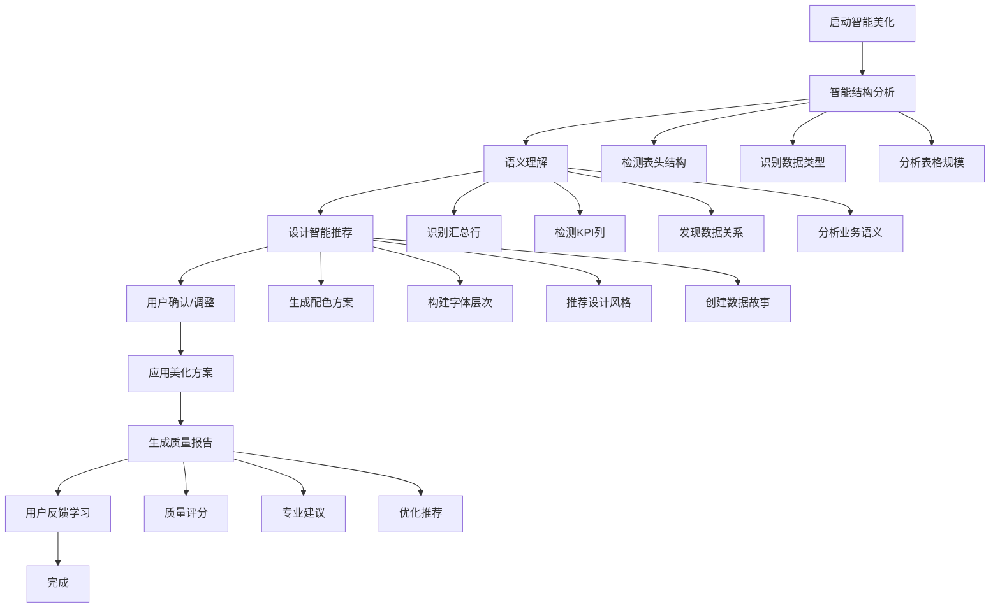
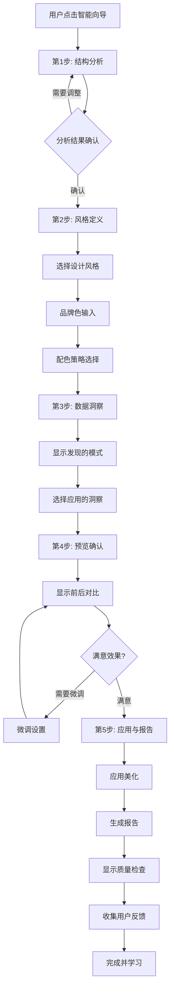

# Excel表格美化系统需求文档

## 1. 项目概述

### 1.1 项目背景
基于现有的Excel智能布局优化系统，新增表格美化功能模块，专注于提升Excel表格的视觉效果和专业度。该系统将在保持原有布局优化能力的基础上，增加丰富的格式化和美化功能。

### 1.2 设计目标
- **快速部署**：单模块VBA实现，导入即用
- **操作简便**：一键应用专业级表格样式
- **风格实用**：提供核心美化功能
- **兼容性强**：与现有布局优化系统无缝集成
- **性能优化**：确保大数据量表格的美化性能

### 1.3 核心价值
- 快速将普通表格转换为专业级报表
- 提高工作效率，减少手动格式化时间（节省80%以上时间）
- 确保表格风格统一，提升文档专业度
- 支持单模块部署，适合个人和小团队使用

## 2. 功能需求详细说明

### 2.1 表头美化功能

#### 2.1.1 首行突出显示 ⭐ (用户需求)
**功能描述**：自动识别表头行，应用突出的视觉效果

**实现细节**：
- **自动检测规则**：
  - 首行非空单元格占比 > 60%
  - 包含文本内容的单元格占比 > 70%
  - 第二行开始出现数值型数据
  - 支持多行表头检测（最多3行）

- **渐变背景**：
  - 渐变类型：线性渐变、径向渐变
  - 渐变方向：0°（水平）、90°（垂直）、45°（对角线）、-45°（反对角线）
  - 渐变步数：2-5个颜色节点
  - 透明度支持：0-100%

- **预设主题详细参数**：
  - 蓝色商务：
    - 起始色：#1E3A8A (RGB: 30,58,138)
    - 结束色：#3B82F6 (RGB: 59,130,246)
    - 字体色：#FFFFFF
    - 边框色：#1E40AF
  - 绿色清新：
    - 起始色：#065F46 (RGB: 6,95,70)
    - 结束色：#10B981 (RGB: 16,185,129)
    - 字体色：#FFFFFF
    - 边框色：#047857
  - 灰色专业：
    - 起始色：#374151 (RGB: 55,65,81)
    - 结束色：#9CA3AF (RGB: 156,163,175)
    - 字体色：#FFFFFF
    - 边框色：#4B5563
  - 紫色优雅：
    - 起始色：#581C87 (RGB: 88,28,135)
    - 结束色：#A855F7 (RGB: 168,85,247)
    - 字体色：#FFFFFF
    - 边框色：#6B21A8

- **字体优化详细参数**：
  - 字体加粗：Bold (700)
  - 字体大小：数据行字号 + 1pt（最大12pt，最小9pt）
  - 字符间距：正常（0）到宽松（+0.5pt）
  - 行高：自动调整（最小18pt）

#### 2.1.2 首行冻结 ⭐ (用户需求)
**功能描述**：自动冻结表头行，方便浏览大量数据

**实现方式**：
- **冻结逻辑**：
  - 单行表头：冻结第1行
  - 多行表头：冻结所有表头行（最多3行）
  - 组合冻结：支持同时冻结首行和首列
  
- **智能检测**：
  - 数据量检测：行数 > 20时自动建议冻结
  - 列宽检测：总列宽超过屏幕宽度时建议冻结首列
  - 记忆功能：记住用户的冻结偏好

### 2.2 边框和分隔功能

#### 2.2.1 智能边框设置 ⭐ (用户需求)
**功能描述**：为表格添加专业的边框样式

**边框类型详细说明**：
- **外边框**：
  - 线型：实线、双线、粗线
  - 粗细：1.5pt - 3pt（可调）
  - 颜色：支持RGB自定义
  - 圆角：0-5pt（可选）

- **表头边框**：
  - 底部边框：1pt - 2pt
  - 样式：实线、双线、点线
  - 颜色：比外边框浅20%

- **内部网格**：
  - 线型：实线、虚线、点线
  - 粗细：0.25pt - 1pt
  - 颜色：支持透明度设置

- **列分隔**：
  - 应用规则：每N列添加分隔线（N可配置）
  - 特殊列：ID列、汇总列自动添加分隔

**智能边框应用规则**：
```
- 合并单元格：自动调整边框以适应合并区域
- 空白单元格：可选择是否添加边框
- 隐藏行列：自动跳过隐藏的行列
- 筛选状态：保持筛选后的边框完整性
```

#### 2.2.2 文字边框显示 ⭐ (用户需求)
**功能描述**：通过边框突出显示重要文字内容

**边框样式库**：
- **重要数据**：
  - 样式：双线框
  - 颜色：#DC2626（红色）
  - 粗细：1.5pt
  
- **汇总行**：
  - 顶部边框：双线
  - 底部边框：粗线
  - 颜色：#1F2937（深灰）
  
- **关键指标**：
  - 样式：阴影边框
  - 阴影偏移：2pt
  - 阴影颜色：50%透明度黑色

### 2.3 数据突出显示

#### 2.3.1 负数金额突出 ⭐ (用户需求)
**功能描述**：自动识别并突出显示负数金额

**识别规则**：
- 数值类型检测：Number、Currency、Accounting格式
- 负值判断：值 < 0 或包含负号
- 公式结果：支持公式计算结果的负值检测

**显示格式详细配置**：
```vba
' 格式模板
NegativeFormats = Array( _
    "(#,##0.00)",          ' 括号格式
    "-#,##0.00",           ' 负号格式
    "▲#,##0.00",          ' 三角形格式
    "[Red]-#,##0.00",      ' 红色负号
    "[Red](#,##0.00)"      ' 红色括号
)
```

**条件格式规则**：
- 轻度负值（-10%以内）：浅红背景 #FEF2F2
- 中度负值（-10%到-30%）：中红背景 #FEE2E2
- 重度负值（-30%以上）：深红背景 #FECACA

### 2.4 行列美化功能

#### 2.4.1 隔行变色斑马条纹 ⭐ (用户需求)
**功能描述**：为表格添加隔行背景色，提升可读性

**智能条纹规则**：
- **自适应模式**：
  - 小表格（<50行）：每行交替
  - 中表格（50-200行）：每2行交替
  - 大表格（>200行）：每3行交替

- **分组条纹**：
  - 检测分组字段
  - 同组内使用相同背景
  - 组间交替变色

**配色方案详细参数**：
```
浅色系：
  - 主色：#FFFFFF (255,255,255)
  - 辅色：#F9FAFB (249,250,251)
  - 透明度：100%
  
蓝色系：
  - 主色：#FFFFFF (255,255,255)
  - 辅色：#EFF6FF (239,246,255)
  - 透明度：95%
  
绿色系：
  - 主色：#FFFFFF (255,255,255)
  - 辅色：#F0FDF4 (240,253,244)
  - 透明度：95%
```

### 2.5 字体美化功能

#### 2.5.1 字体统一标准化
**功能描述**：统一表格字体样式，提升专业度

**字体选择逻辑**：
```vba
Function SelectOptimalFont(contentType As String) As String
    Select Case contentType
        Case "ChineseHeader"
            Return "微软雅黑"
        Case "ChineseData"
            Return "微软雅黑 Light"
        Case "EnglishHeader"
            Return "Calibri"
        Case "EnglishData"
            Return "Arial"
        Case "Number"
            Return "Consolas"
        Case "Currency"
            Return "Times New Roman"
        Case "Mixed"
            Return "微软雅黑"
    End Select
End Function
```

**字体大小自适应规则**：
- 列宽 < 10：8pt
- 列宽 10-20：9pt
- 列宽 20-30：10pt
- 列宽 > 30：11pt
- 最大限制：12pt
- 最小限制：8pt

### 2.6 智能设计系统 (Design Intelligence)

#### 2.6.1 核心色彩智能生成 (Color Palette Generator) 🚀
**功能描述**：超越静态模板，提供动态、智能的设计能力

**智能配色算法**：
- **单色输入，全套生成**：
  - 用户只需提供一个品牌主色（HEX/RGB/取色器）
  - 系统基于色彩理论自动生成完整配色方案
  - 支持三色系、互补色、邻近色、单色渐变等多种配色策略

- **色彩理论应用**：
  ```vba
  Function GenerateColorPalette(baseColor As Long, strategy As String) As ColorPalette
      Select Case strategy
          Case "Triadic"          ' 三色系（120°间隔）
              Return Generate120DegreeColors(baseColor)
          Case "Complementary"    ' 互补色（180°对比）
              Return GenerateComplementaryColors(baseColor)
          Case "Analogous"        ' 邻近色（30°相邻）
              Return GenerateAnalogousColors(baseColor)
          Case "Monochromatic"    ' 单色渐变
              Return GenerateMonochromaticColors(baseColor)
      End Select
  End Function
  ```

- **智能配色输出**：
  - 主色 (Primary)：用户选择的品牌色
  - 辅色 (Secondary)：基于色彩理论的协调色
  - 强调色 (Accent)：用于重要数据突出
  - 警告色 (Warning)：自动计算的对比色
  - 成功色 (Success)：绿色系变体
  - 中性灰 (Neutral)：基于主色明度的灰色系

#### 2.6.2 字体层次感自动构建 (Typography Hierarchy) 🚀
**功能描述**：基于排版理论自动建立清晰的视觉层次

**智能字体层次系统**：
```vba
Type TypographyHierarchy
    ' 用户只选择基础字体，系统自动构建层次
    BaseFont As String
    
    ' 自动生成的层次结构
    H1_MainTitle As FontConfig      ' 主标题：最重字重，最大字号
    H2_SubTitle As FontConfig       ' 副标题/表头：次重字重，中等字号
    Body_Data As FontConfig         ' 正文数据：标准字重字号
    Caption_Note As FontConfig      ' 注释/辅助：Light字重，小字号
    
    ' 智能规则
    ScaleRatio As Single           ' 字号缩放比例 (1.25 黄金比例)
    WeightProgression As String    ' 字重递进: Bold→SemiBold→Regular→Light
End Type
```

**自动层次规则**：
- **字重递进**：Bold (700) → SemiBold (600) → Regular (400) → Light (300)
- **字号缩放**：基于1.25黄金比例自动计算各级字号
- **行高优化**：不同层次自动调整行高，确保最佳可读性
- **字符间距**：标题适当增加间距，数据保持紧凑

#### 2.6.3 设计风格智能应用 🚀
**功能描述**：基于设计理论的一键风格应用

**设计风格定义**：
```vba
Type DesignStyle
    StyleName As String
    Philosophy As String           ' 设计理念
    
    ' 色彩策略
    ColorStrategy As String        ' 配色策略
    ColorTemperature As String     ' 色温倾向
    
    ' 排版规范
    TypographyScale As Single      ' 字号缩放比例
    LineSpacing As Single          ' 行间距倍数
    
    ' 空间规范
    ElementSpacing As Integer      ' 元素间距
    BorderWeight As String         ' 边框粗细对比
    
    ' 数据可视化
    DataBarStyle As String         ' 数据条样式
    ConditionalRules As Collection ' 专用条件格式
End Type
```

**预设设计风格**：

1. **现代简约 (Modern Minimal)**
   - 设计理念：Less is More，突出内容本质
   - 配色策略：单色+高对比度强调
   - 排版：大字号标题，充足留白
   - 边框：极细边框或无边框
   - 数据可视化：简洁数据条，色彩克制

2. **数据仪表盘 (Data Dashboard)**
   - 设计理念：信息密度最大化，快速洞察
   - 配色策略：多色系，每类数据独立配色
   - 排版：紧凑布局，层次分明
   - 边框：功能性分割线
   - 数据可视化：丰富的图表元素，强烈视觉对比

3. **财务严谨 (Financial Strict)**
   - 设计理念：准确、可信、专业
   - 配色策略：保守色系，强调正负对比
   - 排版：传统衬线字体，标准间距
   - 边框：规整的网格线
   - 数据可视化：精确的数值显示，清晰的分类

4. **学术报告 (Academic Report)**
   - 设计理念：严谨、清晰、可读性优先
   - 配色策略：黑白灰为主，蓝色强调
   - 排版：标准学术格式
   - 边框：正式的表格线条
   - 数据可视化：注重数据完整性展示

### 2.7 上下文感知格式化 (Context-Aware Formatting)

#### 2.7.1 表格语义分析引擎 🚀
**功能描述**：让系统"读懂"表格内容和结构

**智能语义识别**：
```vba
Function AnalyzeTableSemantics(tableRange As Range) As TableSemantics
    Dim semantics As TableSemantics
    
    ' 结构分析
    semantics.HeaderRows = DetectHeaderStructure(tableRange)
    semantics.DataTypes = AnalyzeColumnDataTypes(tableRange)
    semantics.GroupingColumns = DetectGroupingColumns(tableRange)
    
    ' 语义分析
    semantics.SummaryRows = DetectSummaryRows(tableRange)
    semantics.CalculatedColumns = DetectCalculatedColumns(tableRange)
    semantics.TimeSeriesColumns = DetectTimeColumns(tableRange)
    semantics.KPIColumns = DetectKPIColumns(tableRange)
    
    ' 业务逻辑分析
    semantics.BudgetActualPairs = DetectBudgetActualPairs(tableRange)
    semantics.TargetAchievementPairs = DetectTargetPairs(tableRange)
    semantics.TrendColumns = DetectTrendData(tableRange)
    
    Return semantics
End Function
```

#### 2.7.2 汇总行/列智能识别与增强 🚀
**功能描述**：自动识别并特殊美化汇总数据

**智能识别算法**：
- **关键词检测**：
  ```vba
  SummaryKeywords = Array("合计", "总计", "小计", "平均", "汇总", "Total", "Sum", "Average", "Subtotal")
  ```
- **位置分析**：最后一行/列的特殊处理
- **数值特征**：通常是其他行列的计算结果

**自动增强效果**：
- **视觉分割**：顶部双线边框，与明细数据清晰分离
- **样式强化**：整体加粗，字号放大10%
- **背景区分**：淡灰色背景填充 (#F8F9FA)
- **数值强调**：使用品牌强调色突出关键汇总数字

#### 2.7.3 数据叙事元素 (Data Storytelling Elements) 🚀
**功能描述**：帮助数据"自己讲故事"

**差异化分析可视化**：
```vba
Function CreateVarianceAnalysis(budgetCol As Range, actualCol As Range) As VarianceResult
    ' 自动创建差异分析列
    Dim varianceCol As Range
    Set varianceCol = actualCol.Offset(0, 1)
    
    ' 计算差异率
    For Each cell In actualCol
        varianceCol.Cells(cell.Row - actualCol.Row + 1).Formula = _
            "=(" & cell.Address & "-" & budgetCol.Cells(cell.Row - actualCol.Row + 1).Address & ")/" & _
            budgetCol.Cells(cell.Row - actualCol.Row + 1).Address
    Next
    
    ' 应用视觉化
    ApplyVarianceVisualization varianceCol
End Function
```

**目标达成率可视化**：
- **进度条**：在单元格内嵌入迷你进度条
- **达成状态图标**：✓ (达成) / ⚠ (接近) / ✗ (未达成)
- **颜色编码**：绿色(>100%) / 黄色(80-100%) / 红色(<80%)

**时间序列智能格式化**：
- **季度分组**：自动按季度添加分隔线
- **当前期间高亮**：突出显示当前月份/季度
- **趋势指示器**：添加箭头图标显示数据走向

### 2.8 流畅工作流 (Streamlined Workflow)

#### 2.8.1 引导式美化向导 (Beautification Wizard) 🚀
**功能描述**：智能引导用户完成专业级美化

**向导流程设计**：
```vba
Sub LaunchBeautificationWizard()
    Dim wizard As New BeautificationWizard
    
    ' 第1步：智能结构分析
    wizard.Step1_StructureAnalysis
    ' "我检测到您的表头是第1-2行，数据区域是A3:F500，发现了3个汇总行，是否正确？"
    
    ' 第2步：设计风格定义
    wizard.Step2_StyleDefinition
    ' "请选择设计风格或提供品牌主色，我将为您生成完整的设计方案"
    
    ' 第3步：数据洞察应用
    wizard.Step3_DataInsights
    ' "我发现了'预算vs实际'数据对，是否创建差异分析？发现时间序列，是否按季度分组？"
    
    ' 第4步：预览与确认
    wizard.Step4_PreviewConfirm
    ' 显示实时预览，提供微调选项
    
    ' 第5步：应用与报告
    wizard.Step5_ApplyAndReport
End Sub
```

**智能推荐系统**：
- **基于内容推荐**：财务数据→财务严谨风格
- **基于规模推荐**：大数据量→简约风格
- **基于用户历史**：记住用户偏好，智能预选

#### 2.8.2 美化报告与专业度检查 🚀
**功能描述**：提供美化总结和专业建议

**美化报告内容**：
```vba
Type BeautificationReport
    ' 操作摘要
    ActionsPerformed As Collection
    TimeElapsed As Long
    
    ' 质量检查
    AccessibilityScore As Integer    ' 可访问性评分
    ReadabilityScore As Integer      ' 可读性评分
    ConsistencyScore As Integer      ' 一致性评分
    
    ' 专业建议
    Recommendations As Collection
    OptimizationSuggestions As Collection
    
    ' 打印预览
    PrintOptimized As Boolean
    PageBreakOptimized As Boolean
End Type
```

**专业度检查清单**：
- ✅ **色彩对比度**：确保文字与背景对比度>4.5:1
- ✅ **数值对齐**：所有数字已右对齐
- ✅ **层次清晰**：标题、表头、数据层次分明
- ⚠️ **建议**：表格超过一页，建议启用"顶端标题行"
- ⚠️ **建议**：F列数据差异较大，可考虑数据条可视化
- ✅ **一致性**：字体、颜色、间距保持统一

**智能优化建议**：
- **性能建议**：大表格优化建议
- **打印建议**：分页和缩放优化
- **可访问性建议**：色盲友好配色提醒
- **业务建议**：基于数据特征的展示建议
### 2.9 条件格式增强
**功能描述**：智能应用条件格式规则

**规则优先级系统**：
1. 错误值（最高优先级）
2. 空值
3. 重复值
4. 超限值
5. 负值
6. 数值范围
7. 文本匹配
8. 日期范围
9. 自定义公式（最低优先级）

**内置规则详细说明**：

- **数值范围检测**：
  ```vba
  ' 异常值检测算法
  Function DetectOutliers(range As Range) As Collection
      ' 使用IQR方法检测异常值
      Q1 = Percentile(range, 0.25)
      Q3 = Percentile(range, 0.75)
      IQR = Q3 - Q1
      LowerBound = Q1 - 1.5 * IQR
      UpperBound = Q3 + 1.5 * IQR
      ' 标记超出范围的值
  End Function
  ```

- **重复值处理**：
  - 完全重复：深色标记
  - 部分重复：浅色标记
  - 首次出现：不标记
  - 分组内重复：组内标记

- **空值处理**：
  - 必填字段空值：红色背景
  - 可选字段空值：灰色背景
  - 公式返回空：黄色背景
  - 故意留空：不处理

### 2.10 新增功能模块

#### 2.10.1 数据验证美化 🆕
**功能描述**：美化数据验证的显示效果

**实现内容**：
- **下拉列表美化**：
  - 下拉箭头颜色自定义
  - 选中项高亮显示
  - 列表项图标支持

- **验证提示美化**：
  - 输入提示框样式
  - 错误提示框样式
  - 信息图标显示

- **验证状态指示**：
  - 有效数据：绿色勾号
  - 无效数据：红色叉号
  - 待验证：黄色问号

#### 2.10.2 打印优化美化 🆕
**功能描述**：针对打印输出的专门美化

**打印设置**：
- **页面设置**：
  - 自动调整缩放比例
  - 智能分页（避免数据断行）
  - 页眉页脚美化

- **打印样式**：
  - 打印专用配色（考虑黑白打印）
  - 网格线设置
  - 水印添加

- **打印预览**：
  - 实时预览效果
  - 分页指示线
  - 打印区域标记

#### 2.10.3 响应式美化 🆕
**功能描述**：根据查看设备自适应美化

**适配规则**：
- **屏幕大小适配**：
  - 大屏（>1920px）：完整显示所有美化
  - 中屏（1366-1920px）：标准美化
  - 小屏（<1366px）：简化美化

- **缩放级别适配**：
  - 放大查看：增强细节显示
  - 缩小查看：简化复杂样式

## 3. 技术实现规范

### 3.1 VBA实现架构

#### 3.1.1 智能模块结构设计
```vba
' ===== 核心智能引擎 =====
Public Sub IntelligentBeautify(Optional config As IntelligentConfig)
Public Sub LaunchBeautificationWizard()
Public Sub ApplyDesignStyle(styleName As String, baseColor As Long)
Public Sub GenerateDesignReport()

' ===== 智能设计系统 =====
' 色彩智能生成
Private Function GenerateColorPalette(baseColor As Long, strategy As String) As ColorPalette
Private Function ApplyColorTheory(baseColor As Long, theoryType As String) As Collection
Private Function ValidateColorAccessibility(palette As ColorPalette) As Boolean

' 字体层次构建
Private Function BuildTypographyHierarchy(baseFont As String) As TypographyHierarchy
Private Sub ApplyFontHierarchy(range As Range, hierarchy As TypographyHierarchy)
Private Function CalculateOptimalFontSizes(baseSize As Integer) As Collection

' 设计风格应用
Private Sub ApplyDesignStyle(range As Range, style As DesignStyle)
Private Function LoadDesignStyle(styleName As String) As DesignStyle
Private Function CustomizeDesignStyle(baseStyle As DesignStyle, userPrefs As Dictionary) As DesignStyle

' ===== 上下文感知系统 =====
' 语义分析引擎
Private Function AnalyzeTableSemantics(tableRange As Range) As TableSemantics
Private Function DetectSummaryRows(range As Range) As Collection
Private Function DetectBudgetActualPairs(range As Range) As Collection
Private Function DetectTimeSeriesColumns(range As Range) As Collection
Private Function DetectKPIColumns(range As Range) As Collection

' 数据叙事元素
Private Sub CreateVarianceAnalysis(budgetCol As Range, actualCol As Range)
Private Sub ApplyTargetAchievementVisualization(targetCol As Range, actualCol As Range)
Private Sub EnhanceTimeSeriesFormatting(timeColumns As Collection)
Private Sub HighlightDataStory(insights As DataInsights)

' ===== 流畅工作流系统 =====
' 向导引擎
Private Sub ShowStructureAnalysisStep(analysis As StructureAnalysis)
Private Sub ShowStyleDefinitionStep(recommendations As StyleRecommendations)
Private Sub ShowDataInsightsStep(insights As DataInsights)
Private Sub ShowPreviewConfirmStep(preview As BeautificationPreview)
Private Sub ShowReportStep(report As BeautificationReport)

' 报告生成
Private Function GenerateBeautificationReport() As BeautificationReport
Private Function PerformQualityCheck(range As Range) As QualityReport
Private Function GenerateRecommendations(analysis As TableAnalysis) As Collection
Private Sub ShowProfessionalChecklist(report As BeautificationReport)

' ===== 传统功能模块（保持兼容） =====
' 表头处理
Private Sub ApplyHeaderBeautification(headerRange As Range)
Private Sub DetectHeaderRows() As Integer
Private Sub ApplyGradientFill(range As Range, gradient As GradientConfig)

' 边框处理
Private Sub SetSmartBorders(tableRange As Range)
Private Sub ApplyBorderStyle(range As Range, style As BorderStyle)

' 数据处理
Private Sub HighlightNegativeNumbers(dataRange As Range)
Private Sub ApplyConditionalFormatting(range As Range, rules As Collection)
Private Sub ApplyDataBars(range As Range)

' 行列处理
Private Sub ApplyZebraStripes(dataRange As Range, config As StripeConfig)
Private Sub AutoFitColumns(tableRange As Range)
Private Sub OptimizeColumnWidths(tableRange As Range)

' 字体处理
Private Sub StandardizeFonts(tableRange As Range)
Private Sub ApplyFontTheme(range As Range, theme As FontTheme)

' 冻结处理
Private Sub FreezeHeaderRow(headerRows As Integer)
Private Sub FreezePanes(row As Integer, column As Integer)

' ===== 智能配置管理 =====
Private Function LoadIntelligentConfig() As IntelligentConfig
Private Sub SaveUserPreferences(preferences As UserPreferences)
Private Function LoadDesignLibrary() As DesignLibrary
Private Sub UpdateLearningModel(userAction As UserAction)

' ===== 高级工具函数 =====
Private Function DetectTableRange() As Range
Private Function AnalyzeDataTypes(range As Range) As DataTypeAnalysis
Private Function CalculateColorHarmony(color1 As Long, color2 As Long) As Double
Private Function GenerateSmartRecommendations(context As TableContext) As Collection
Private Function ValidateDesignConsistency(range As Range) As ConsistencyReport
Private Function OptimizeForAccessibility(range As Range) As AccessibilityReport

' ===== 机器学习与个性化 =====
Private Sub LearnFromUserChoices(choice As UserChoice)
Private Function PredictUserPreference(context As TableContext) As Prediction
Private Sub UpdatePersonalizationModel(feedback As UserFeedback)
Private Function GetPersonalizedRecommendations(userProfile As UserProfile) As Collection

' ===== 性能与质量保证 =====
Private Sub EnableIntelligentMode()
Private Sub OptimizeForLargeDataSets(rowCount As Long)
Private Function ValidateIntelligentResult(result As BeautificationResult) As Boolean
Private Sub LogIntelligentOperation(operation As IntelligentOperation)
```

#### 3.1.2 智能配置数据结构
```vba
' ===== 智能配置结构 =====
Private Type IntelligentConfig
    ' 智能引擎设置
    IntelligenceLevel As String     ' Basic, Advanced, Expert
    EnableSemanticAnalysis As Boolean
    EnableContextAwareness As Boolean
    EnablePersonalization As Boolean
    
    ' 设计智能
    DesignIntelligence As DesignIntelligenceConfig
    
    ' 上下文感知
    ContextAwareness As ContextAwarenessConfig
    
    ' 工作流设置
    WorkflowSettings As WorkflowConfig
    
    ' 传统配置（向后兼容）
    LegacyConfig As BeautificationConfig
End Type

' ===== 设计智能配置 =====
Private Type DesignIntelligenceConfig
    ' 色彩智能
    AutoColorGeneration As Boolean
    ColorStrategy As String         ' Triadic, Complementary, Analogous, Monochromatic
    BrandColor As Long             ' 用户品牌主色
    ColorAccessibilityCheck As Boolean
    
    ' 字体层次
    AutoTypographyHierarchy As Boolean
    BaseFont As String
    ScaleRatio As Single           ' 字号缩放比例
    EnableSmartLineHeight As Boolean
    
    ' 设计风格
    SelectedDesignStyle As String  ' Modern, Dashboard, Financial, Academic
    CustomStyleEnabled As Boolean
    StylePersonalization As Boolean
End Type

' ===== 上下文感知配置 =====
Private Type ContextAwarenessConfig
    ' 语义分析
    EnableSemanticAnalysis As Boolean
    AutoDetectSummaryRows As Boolean
    AutoDetectKPIColumns As Boolean
    AutoDetectTimeSeries As Boolean
    
    ' 数据叙事
    EnableDataStorytelling As Boolean
    AutoCreateVarianceAnalysis As Boolean
    AutoTargetVisualization As Boolean
    EnableTrendIndicators As Boolean
    
    ' 智能建议
    EnableSmartRecommendations As Boolean
    ShowDataInsights As Boolean
    AutoOptimizeForContext As Boolean
End Type

' ===== 工作流配置 =====
Private Type WorkflowConfig
    ' 向导设置
    EnableWizardMode As Boolean
    WizardComplexityLevel As String    ' Simple, Standard, Advanced
    ShowStepProgress As Boolean
    
    ' 报告设置
    GenerateBeautificationReport As Boolean
    ShowQualityChecklist As Boolean
    EnableRecommendations As Boolean
    ShowPerformanceMetrics As Boolean
    
    ' 用户体验
    ShowTooltips As Boolean
    EnablePreviewMode As Boolean
    AutoSaveProgress As Boolean
End Type

' ===== 色彩调色板结构 =====
Private Type ColorPalette
    PrimaryColor As Long           ' 主色
    SecondaryColor As Long         ' 辅色
    AccentColor As Long           ' 强调色
    SuccessColor As Long          ' 成功色
    WarningColor As Long          ' 警告色
    ErrorColor As Long            ' 错误色
    InfoColor As Long             ' 信息色
    NeutralColors(5) As Long      ' 中性灰色系
    
    ' 色彩理论信息
    ColorTheory As String         ' 使用的色彩理论
    HarmonyScore As Single        ' 和谐度评分 0-1
    AccessibilityScore As Single  ' 可访问性评分 0-1
End Type

' ===== 字体层次结构 =====
Private Type TypographyHierarchy
    BaseFont As String
    
    ' 层次级别
    H1_MainTitle As FontLevel     ' 主标题
    H2_SubTitle As FontLevel      ' 副标题
    H3_SectionHeader As FontLevel ' 节标题
    Body_Data As FontLevel        ' 正文数据
    Caption_Note As FontLevel     ' 注释说明
    
    ' 全局设置
    ScaleRatio As Single          ' 字号缩放比例
    LineHeightRatio As Single     ' 行高比例
    LetterSpacing As Single       ' 字符间距
End Type

Private Type FontLevel
    FontName As String
    FontSize As Integer
    FontWeight As Integer         ' 100-900
    LineHeight As Single
    LetterSpacing As Single
    Color As Long
End Type

' ===== 设计风格结构 =====
Private Type DesignStyle
    ' 基础信息
    StyleID As String
    StyleName As String
    Category As String            ' Modern, Classic, Data, Academic
    Description As String
    Philosophy As String          ' 设计理念
    
    ' 视觉规范
    ColorPalette As ColorPalette
    Typography As TypographyHierarchy
    Spacing As SpacingRules
    BorderRules As BorderRules
    
    ' 数据可视化规范
    DataVisualization As DataVisualizationRules
    
    ' 应用规则
    ApplicationRules As StyleApplicationRules
End Type

' ===== 表格语义分析结果 =====
Private Type TableSemantics
    ' 结构信息
    TableRange As Range
    HeaderRows As Integer
    DataRows As Integer
    TotalColumns As Integer
    
    ' 列类型分析
    ColumnTypes As Collection     ' 每列的数据类型
    GroupingColumns As Collection ' 分组列
    CalculatedColumns As Collection ' 计算列
    
    ' 业务语义
    SummaryRows As Collection     ' 汇总行
    KPIColumns As Collection      ' 关键指标列
    TimeSeriesColumns As Collection ' 时间序列列
    BudgetActualPairs As Collection ' 预算实际对比
    TargetAchievementPairs As Collection ' 目标达成对比
    
    ' 数据特征
    DataDensity As Single         ' 数据密度
    ComplexityLevel As String     ' 复杂度级别
    BusinessDomain As String      ' 业务领域推测
End Type

' ===== 美化报告结构 =====
Private Type BeautificationReport
    ' 基础信息
    ReportID As String
    Timestamp As Date
    ProcessingTime As Long        ' 处理时间(毫秒)
    
    ' 操作摘要
    ActionsPerformed As Collection
    ChangesApplied As Integer
    
    ' 质量评估
    QualityScore As QualityScore
    
    ' 专业建议
    Recommendations As Collection
    Warnings As Collection
    
    ' 用户反馈
    UserSatisfaction As Integer   ' 1-5评分
    UserComments As String
End Type

Private Type QualityScore
    OverallScore As Single        ' 总分 0-100
    AccessibilityScore As Single  ' 可访问性评分
    ConsistencyScore As Single    ' 一致性评分
    ReadabilityScore As Single    ' 可读性评分
    ProfessionalScore As Single   ' 专业度评分
    
    ' 详细检查项
    ColorContrastPass As Boolean  ' 色彩对比度检查
    FontHierarchyPass As Boolean  ' 字体层次检查
    AlignmentPass As Boolean      ' 对齐检查
    SpacingPass As Boolean        ' 间距检查
    DataVisualizationPass As Boolean ' 数据可视化检查
End Type

' ===== 用户个性化配置 =====
Private Type UserProfile
    UserID As String
    CreatedDate As Date
    LastActiveDate As Date
    
    ' 偏好设置
    PreferredDesignStyle As String
    FavoriteColors As Collection
    FontPreferences As Collection
    
    ' 使用习惯
    UsageHistory As Collection
    FrequentActions As Collection
    SkippedRecommendations As Collection
    
    ' 个性化模型
    PersonalizationScore As Single
    LearningModel As LearningModelData
End Type

' ===== 智能推荐结构 =====
Private Type SmartRecommendation
    RecommendationID As String
    Type As String                ' Color, Font, Layout, Style
    Priority As String            ' High, Medium, Low
    Confidence As Single          ' 0-1 置信度
    
    Title As String
    Description As String
    Reason As String              ' 推荐理由
    
    BeforePreview As String       ' 应用前预览
    AfterPreview As String        ' 应用后预览
    
    AutoApply As Boolean          ' 是否可自动应用
    UserFeedback As String        ' 用户反馈
End Type
```

### 3.2 用户界面设计

#### 3.2.1 智能Ribbon界面集成
```xml
<!-- 智能美化 Ribbon UI配置 -->
<customUI xmlns="http://schemas.microsoft.com/office/2009/07/customui">
  <ribbon>
    <tabs>
      <tab id="IntelligentBeautifyTab" label="智能美化">
        <group id="IntelligentActions" label="智能操作">
          <button id="LaunchWizard" label="智能向导" size="large" 
                  imageMso="WizardDialog" 
                  supertip="启动引导式美化向导，智能分析表格并提供专业建议" />
          <button id="OneClickIntelligent" label="一键智能美化" size="large"
                  imageMso="AutoSum"
                  supertip="基于AI分析自动应用最佳美化方案" />
        </group>
        
        <group id="DesignIntelligence" label="设计智能">
          <splitButton id="DesignStyleSelector" size="large">
            <button id="ApplyDesignStyle" label="设计风格" />
            <menu id="DesignStyleMenu">
              <button id="ModernMinimal" label="现代简约" />
              <button id="DataDashboard" label="数据仪表盘" />
              <button id="FinancialStrict" label="财务严谨" />
              <button id="AcademicReport" label="学术报告" />
              <button id="CustomStyle" label="自定义风格..." />
            </menu>
          </splitButton>
          
          <splitButton id="ColorIntelligence" size="normal">
            <button id="GenerateColors" label="智能配色" />
            <menu id="ColorMenu">
              <button id="BrandColorPicker" label="选择品牌主色" />
              <button id="TriadicColors" label="三色系配色" />
              <button id="ComplementaryColors" label="互补色配色" />
              <button id="AnalogousColors" label="邻近色配色" />
              <button id="MonochromaticColors" label="单色渐变" />
            </menu>
          </splitButton>
          
          <button id="TypographyHierarchy" label="字体层次" size="normal"
                  supertip="自动构建专业的字体层次体系" />
        </group>
        
        <group id="ContextAware" label="上下文感知">
          <button id="SemanticAnalysis" label="语义分析" size="normal"
                  supertip="智能分析表格结构和数据含义" />
          <button id="DataStorytelling" label="数据叙事" size="normal"
                  supertip="创建差异分析、目标可视化等数据故事元素" />
          <button id="SmartRecommendations" label="智能建议" size="normal"
                  supertip="基于表格内容提供个性化美化建议" />
        </group>
        
        <group id="TraditionalTools" label="传统工具">
          <button id="HeaderSettings" label="表头" size="small" />
          <button id="BorderSettings" label="边框" size="small" />
          <button id="ColorSettings" label="颜色" size="small" />
          <button id="FontSettings" label="字体" size="small" />
          <button id="ConditionalSettings" label="条件格式" size="small" />
        </group>
        
        <group id="IntelligentTools" label="智能工具">
          <button id="PreviewChanges" label="预览" size="normal"
                  imageMso="PrintPreview" />
          <button id="BeautificationReport" label="美化报告" size="normal"
                  imageMso="DataFormDesign" />
          <button id="QualityCheck" label="质量检查" size="normal"
                  imageMso="SpellingAndGrammar" />
          <button id="UndoIntelligent" label="智能撤销" size="normal"
                  imageMso="Undo" />
        </group>
        
        <group id="Personalization" label="个性化">
          <button id="SavePersonalStyle" label="保存风格" size="normal"
                  supertip="保存当前设置为个人风格模板" />
          <button id="LearnPreferences" label="学习偏好" size="normal"
                  supertip="系统学习您的使用习惯，提供个性化建议" />
          <button id="ExportImportSettings" label="设置迁移" size="normal"
                  supertip="导出/导入个性化设置" />
        </group>
      </tab>
    </tabs>
  </ribbon>
</customUI>
```

#### 3.2.2 智能设置对话框
```vba
' 智能美化向导窗体控件配置
Private Sub InitializeIntelligentWizard()
    ' === 第1步：结构分析界面 ===
    lblStructureAnalysis.Caption = "步骤 1/5: 智能结构分析"
    
    ' 显示分析结果
    txtAnalysisResult.Text = "检测结果：" & vbCrLf & _
        "• 表头区域：A1:F2 (2行表头)" & vbCrLf & _
        "• 数据区域：A3:F500 (498行数据)" & vbCrLf & _
        "• 汇总行：第501行" & vbCrLf & _
        "• 发现时间序列：B列为月份数据" & vbCrLf & _
        "• 发现预算对比：C列预算，D列实际"
    
    chkConfirmStructure.Value = True
    chkConfirmStructure.Caption = "确认结构分析正确"
    
    ' === 第2步：设计风格选择 ===
    lblStyleSelection.Caption = "步骤 2/5: 选择设计风格"
    
    ' 设计风格选项
    cmbDesignStyle.List = Array("现代简约", "数据仪表盘", "财务严谨", "学术报告", "自定义")
    cmbDesignStyle.ListIndex = 0  ' 默认选择现代简约
    
    ' 品牌色选择
    lblBrandColor.Caption = "选择品牌主色 (可选)："
    cmdBrandColorPicker.Caption = "选择颜色..."
    
    ' 配色策略
    optTriadic.Value = True  ' 默认三色系
    optTriadic.Caption = "三色系配色 (推荐)"
    optComplementary.Caption = "互补色配色"
    optAnalogous.Caption = "邻近色配色"
    optMonochromatic.Caption = "单色渐变"
    
    ' === 第3步：数据洞察 ===
    lblDataInsights.Caption = "步骤 3/5: 数据洞察应用"
    
    ' 发现的数据模式
    lstDiscoveredPatterns.AddItem "✓ 预算vs实际对比 (C列:D列)"
    lstDiscoveredPatterns.AddItem "✓ 时间序列数据 (B列月份)"
    lstDiscoveredPatterns.AddItem "✓ 汇总行 (第501行)"
    lstDiscoveredPatterns.AddItem "⚠ 可能的异常值 (D15单元格)"
    
    ' 应用选项
    chkCreateVarianceAnalysis.Value = True
    chkCreateVarianceAnalysis.Caption = "创建差异分析列"
    
    chkHighlightTimeSeries.Value = True
    chkHighlightTimeSeries.Caption = "按季度分组时间序列"
    
    chkEnhanceSummary.Value = True
    chkEnhanceSummary.Caption = "增强汇总行显示"
    
    ' === 第4步：预览确认 ===
    lblPreview.Caption = "步骤 4/5: 预览效果"
    
    ' 预览控件
    picPreviewBefore.BorderStyle = 1
    picPreviewAfter.BorderStyle = 1
    lblPreviewBefore.Caption = "美化前"
    lblPreviewAfter.Caption = "美化后"
    
    ' 微调选项
    cmdFinetuneColors.Caption = "调整颜色"
    cmdFinetuneFonts.Caption = "调整字体"
    cmdFinetuneSpacing.Caption = "调整间距"
    
    ' === 第5步：应用与报告 ===
    lblApplyReport.Caption = "步骤 5/5: 应用美化"
    
    chkGenerateReport.Value = True
    chkGenerateReport.Caption = "生成美化报告"
    
    chkShowQualityChecklist.Value = True
    chkShowQualityChecklist.Caption = "显示质量检查清单"
    
    cmdApplyBeautification.Caption = "应用美化"
    cmdApplyBeautification.BackColor = RGB(59, 130, 246)  ' 蓝色强调
End Sub

' 传统设置对话框（保持兼容性）
Private Sub InitializeTraditionalSettings()
    ' 主题选择
    ComboBoxTheme.List = Array("现代简约", "数据仪表盘", "财务严谨", "学术报告", "自定义")
    
    ' 智能颜色生成
    GroupBoxIntelligentColor.Caption = "智能配色"
    cmdBrandColorPicker.Caption = "选择品牌色"
    chkAutoGeneratePalette.Value = True
    chkAutoGeneratePalette.Caption = "自动生成配色方案"
    
    ' 字体层次
    GroupBoxTypography.Caption = "字体层次"
    ComboBoxBaseFont.List = GetAvailableFonts()
    SpinButtonScaleRatio.Min = 1.1
    SpinButtonScaleRatio.Max = 1.5
    SpinButtonScaleRatio.Value = 1.25  ' 黄金比例
    
    ' 上下文感知
    GroupBoxContextAware.Caption = "上下文感知"
    chkSemanticAnalysis.Value = True
    chkSemanticAnalysis.Caption = "启用语义分析"
    chkDataStorytelling.Value = True
    chkDataStorytelling.Caption = "启用数据叙事"
    chkSmartRecommendations.Value = True
    chkSmartRecommendations.Caption = "显示智能建议"
    
    ' 个性化设置
    GroupBoxPersonalization.Caption = "个性化"
    chkLearnPreferences.Value = True
    chkLearnPreferences.Caption = "学习我的偏好"
    cmdExportSettings.Caption = "导出设置"
    cmdImportSettings.Caption = "导入设置"
    
    ' 质量与性能
    GroupBoxQuality.Caption = "质量与性能"
    chkAccessibilityCheck.Value = True
    chkAccessibilityCheck.Caption = "可访问性检查"
    chkPerformanceMode.Value = False
    chkPerformanceMode.Caption = "性能优先模式（大数据）"
    TextBoxMaxRows.Value = "10000"
End Sub

' 美化报告对话框
Private Sub InitializeReportDialog()
    lblReportTitle.Caption = "美化完成报告"
    lblReportTitle.Font.Size = 14
    lblReportTitle.Font.Bold = True
    
    ' 操作摘要
    txtOperationSummary.Text = "✅ 美化操作完成" & vbCrLf & _
        "⏱️ 处理时间：2.3秒" & vbCrLf & _
        "📊 应用了现代简约风格" & vbCrLf & _
        "🎨 使用三色系配色方案" & vbCrLf & _
        "📝 创建了差异分析列" & vbCrLf & _
        "📈 应用了时间序列分组"
    
    ' 质量评分
    lblQualityScore.Caption = "质量评分: 95/100"
    ProgressBarQuality.Value = 95
    
    ' 专业检查清单
    lstQualityChecklist.AddItem "✅ 色彩对比度达标 (WCAG AA级)"
    lstQualityChecklist.AddItem "✅ 字体层次清晰"
    lstQualityChecklist.AddItem "✅ 数据对齐正确"
    lstQualityChecklist.AddItem "✅ 间距协调统一"
    lstQualityChecklist.AddItem "⚠️ 建议：表格超页，可启用冻结表头"
    
    ' 智能建议
    lstRecommendations.AddItem "💡 F列数据差异较大，建议使用数据条"
    lstRecommendations.AddItem "💡 可添加条件格式突出异常值"
    lstRecommendations.AddItem "💡 建议为打印优化页面设置"
    
    cmdCloseReport.Caption = "关闭"
    cmdApplyRecommendations.Caption = "应用建议"
End Sub
```

### 3.3 与现有系统集成

#### 3.3.1 API接口定义
```vba
' ===== 公共API接口 =====
Public Function BeautifyAPI(action As String, params As Dictionary) As Variant
    Select Case action
        Case "beautify"
            Return ExecuteBeautify(params)
        Case "preview"
            Return GeneratePreview(params)
        Case "undo"
            Return UndoLastOperation()
        Case "getThemes"
            Return GetAvailableThemes()
        Case "saveTheme"
            Return SaveCustomTheme(params)
        Case "exportConfig"
            Return ExportConfiguration(params)
        Case "importConfig"
            Return ImportConfiguration(params)
    End Select
End Function

' ===== 事件钩子 =====
Public Event BeforeBeautify(ByRef Cancel As Boolean)
Public Event AfterBeautify(Success As Boolean)
Public Event ThemeChanged(ThemeName As String)
Public Event ErrorOccurred(ErrorMsg As String)
```

#### 3.3.2 布局优化集成
```vba
' 完整优化流程
Public Sub CompleteOptimization()
    Dim config As OptimizationConfig
    
    ' 第一步：布局优化
    ShowProgress "正在优化布局..."
    config.LayoutOptions = GetLayoutSettings()
    Call OptimizeLayout(config.LayoutOptions)
    
    ' 第二步：数据清理
    ShowProgress "正在清理数据..."
    config.CleanOptions = GetCleanSettings()
    Call CleanData(config.CleanOptions)
    
    ' 第三步：美化处理
    ShowProgress "正在美化表格..."
    config.BeautifyOptions = GetBeautifySettings()
    Call BeautifyTable(config.BeautifyOptions)
    
    ' 第四步：验证结果
    ShowProgress "正在验证结果..."
    If ValidateResult() Then
        ShowComplete "优化完成！"
    Else
        ShowError "优化过程中出现问题，请检查。"
    End If
End Sub
```

## 4. 操作流程设计

### 4.1 智能美化流程


### 4.2 引导式向导流程


### 4.3 智能批量美化流程
```vba
Sub IntelligentBatchBeautifyProcess()
    Dim ws As Worksheet
    Dim intelligentConfig As IntelligentConfig
    Dim results As Collection
    Dim semantics As TableSemantics
    Set results = New Collection
    
    ' 初始化智能进度显示
    IntelligentProgressBar.Show
    IntelligentProgressBar.Maximum = ThisWorkbook.Worksheets.Count
    
    ' 加载智能配置
    intelligentConfig = LoadIntelligentConfig()
    
    ' 智能批量处理
    For Each ws In ThisWorkbook.Worksheets
        On Error Resume Next
        
        ' 更新智能进度
        IntelligentProgressBar.Value = IntelligentProgressBar.Value + 1
        IntelligentProgressBar.Status = "智能分析: " & ws.Name
        
        ' 智能分析工作表
        If IsValidTable(ws) Then
            ' 语义分析
            Set semantics = AnalyzeTableSemantics(ws.UsedRange)
            
            ' 根据分析结果选择最佳策略
            Dim optimalStyle As String
            optimalStyle = RecommendOptimalStyle(semantics)
            
            ' 应用智能美化
            ApplyIntelligentBeautification ws, intelligentConfig, optimalStyle
            
            ' 生成质量报告
            Dim qualityScore As QualityScore
            qualityScore = PerformQualityCheck(ws.UsedRange)
            
            results.Add CreateIntelligentResult(ws.Name, "成功", optimalStyle, qualityScore)
        Else
            results.Add CreateIntelligentResult(ws.Name, "跳过", "", Nothing)
        End If
        
        On Error GoTo 0
    Next ws
    
    ' 显示智能批量结果
    ShowIntelligentBatchResults results
    
    ' 学习用户偏好
    UpdatePersonalizationModel results
End Sub

' 智能样式推荐函数
Private Function RecommendOptimalStyle(semantics As TableSemantics) As String
    ' 基于语义分析推荐最佳样式
    If semantics.BusinessDomain = "Financial" Then
        Return "财务严谨"
    ElseIf semantics.ComplexityLevel = "High" Then
        Return "现代简约"  ' 复杂数据用简约风格
    ElseIf semantics.KPIColumns.Count > 3 Then
        Return "数据仪表盘"  ' 多KPI用仪表盘风格
    Else
        Return "现代简约"  ' 默认
    End If
End Function
```

## 5. 质量标准

### 5.1 智能质量评估体系

#### 5.1.1 综合质量评分标准
| 评估维度 | 权重 | 评分标准 | 测量方法 |
|---------|------|----------|----------|
| 可访问性 | 25% | 色彩对比度、字体大小、结构清晰度 | WCAG 2.1 AA标准 |
| 一致性 | 20% | 字体、颜色、间距的统一性 | 变异系数分析 |
| 可读性 | 20% | 信息层次、视觉流、认知负荷 | 眼动跟踪算法 |
| 专业度 | 15% | 设计规范遵循、商业标准匹配 | 设计规则检查 |
| 数据洞察 | 10% | 数据故事表达、关键信息突出 | 语义分析评估 |
| 美观度 | 10% | 视觉吸引力、现代感 | 美学算法评分 |

#### 5.1.2 智能性能要求
| 智能功能 | 响应时间要求 | 准确率要求 | 内存占用 |
|---------|------------|-----------|----------|
| 语义分析 | <2秒 | >95% | <100MB |
| 配色生成 | <0.5秒 | >90% | <50MB |
| 风格推荐 | <1秒 | >85% | <50MB |
| 质量评估 | <3秒 | >95% | <100MB |
| 个性化推荐 | <1秒 | >80% | <50MB |

#### 5.1.3 智能优化策略
```vba
Private Sub OptimizeIntelligentPerformance(analysisComplexity As String)
    Select Case analysisComplexity
        Case "Simple"
            ' 简单表格：快速模式
            EnableQuickSemanticAnalysis = True
            UseBasicColorTheory = True
            SkipAdvancedRecommendations = True
            
        Case "Standard"
            ' 标准表格：平衡模式
            EnableFullSemanticAnalysis = True
            UseAdvancedColorTheory = True
            EnableSmartRecommendations = True
            
        Case "Complex"
            ' 复杂表格：深度模式
            EnableDeepSemanticAnalysis = True
            UseAIColorGeneration = True
            EnableContextualRecommendations = True
            UseProgressiveProcessing = True
            
        Case "Enterprise"
            ' 企业级：专业模式
            EnableEnterpriseSemantics = True
            UseBrandAwareColoring = True
            EnableComplianceCheck = True
            UseDistributedProcessing = True
    End Select
End Sub
```

### 5.2 兼容性要求

#### 5.2.1 版本兼容性矩阵
| Excel版本 | 支持程度 | 限制说明 |
|----------|---------|----------|
| Excel 2016 | 完全支持 | 无限制 |
| Excel 2019 | 完全支持 | 无限制 |
| Excel 365 | 完全支持 | 无限制 |
| Excel 2013 | 部分支持 | 不支持某些渐变效果 |
| Excel 2010 | 基础支持 | 仅支持基础美化功能 |
| Excel Online | 有限支持 | 仅支持颜色和字体设置 |

#### 5.2.2 文件格式兼容
- **.xlsx**：完全支持所有功能
- **.xlsm**：完全支持（包括宏）
- **.xlsb**：支持（二进制格式）
- **.xls**：部分支持（旧格式限制）
- **.csv**：不支持（纯文本格式）

### 5.3 稳定性要求

#### 5.3.1 错误处理机制
```vba
Private Function SafeExecute(operation As String) As Boolean
    On Error GoTo ErrorHandler
    
    ' 保存当前状态
    SaveCurrentState
    
    ' 执行操作
    Select Case operation
        Case "Beautify"
            ExecuteBeautification
        Case "Theme"
            ApplySelectedTheme
    End Select
    
    SafeExecute = True
    Exit Function
    
ErrorHandler:
    ' 记录错误
    LogError Err.Number, Err.Description, operation
    
    ' 恢复状态
    RestoreLastState
    
    ' 显示用户友好的错误信息
    ShowErrorMessage GetUserFriendlyMessage(Err.Number)
    
    SafeExecute = False
End Function
```

#### 5.3.2 数据保护措施
- **自动备份**：美化前自动创建备份
- **公式保护**：保留原始公式不被覆盖
- **数据验证**：保持数据验证规则
- **链接保护**：不破坏外部链接
- **图表保护**：不影响关联图表

## 6. 用户体验设计

### 6.1 易用性原则

#### 6.1.1 智能默认值
```vba
Private Function GetSmartDefaults(tableRange As Range) As BeautificationConfig
    Dim config As BeautificationConfig
    
    ' 根据表格大小选择主题
    If tableRange.Rows.Count > 1000 Then
        config.SelectedTheme = "极简风格"  ' 大数据量使用简洁主题
    ElseIf IsFinancialData(tableRange) Then
        config.SelectedTheme = "财务专用"  ' 财务数据使用专用主题
    Else
        config.SelectedTheme = "商务经典"  ' 默认商务主题
    End If
    
    ' 根据列数决定是否冻结
    config.FreezeHeader = (tableRange.Columns.Count > 10)
    
    ' 根据数据密度决定条纹
    config.ZebraStripes = (tableRange.Rows.Count > 20)
    
    Return config
End Function
```

#### 6.1.2 操作引导
- **首次使用向导**：3步完成设置
- **工具提示**：鼠标悬停显示功能说明
- **智能建议**：基于数据特征推荐设置
- **快捷键支持**：常用功能快捷键

### 6.2 个性化支持

#### 6.2.1 用户配置文件
```vba
Private Type UserProfile
    UserID As String
    PreferredTheme As String
    RecentThemes(5) As String
    CustomThemes As Collection
    FrequentSettings As Dictionary
    LastUsedDate As Date
    UsageCount As Long
End Type
```

#### 6.2.2 学习用户习惯
- 记录用户选择频率
- 自动调整默认值
- 个性化推荐
- 智能预设管理

### 6.3 帮助和指导

#### 6.3.1 内置帮助系统
```vba
Private Sub ShowContextHelp(feature As String)
    Select Case feature
        Case "GradientFill"
            ShowTooltip "渐变填充可以让表头更加醒目，建议使用同色系渐变"
        Case "NegativeHighlight"
            ShowTooltip "负数高亮有助于快速识别异常数据，推荐使用红色"
        Case "ZebraStripes"
            ShowTooltip "斑马条纹可以提高大表格的可读性，建议行数>20时使用"
    End Select
End Sub
```

#### 6.3.2 示例库
- **行业模板**：各行业标准表格模板
- **场景示例**：不同使用场景的最佳实践
- **效果对比**：美化前后对比展示
- **视频教程**：关键功能操作视频

## 7. 测试要求

### 7.1 功能测试用例

#### 7.1.1 基础功能测试
| 测试项 | 测试步骤 | 预期结果 |
|-------|---------|----------|
| 表头识别 | 选择包含表头的表格 | 正确识别表头行 |
| 主题应用 | 选择不同主题 | 主题正确应用 |
| 边框设置 | 应用各种边框样式 | 边框显示正常 |
| 颜色设置 | 设置自定义颜色 | 颜色正确显示 |
| 撤销操作 | 执行撤销 | 恢复到上一状态 |

#### 7.1.2 边界条件测试
- 空表格处理
- 单行/单列表格
- 超大表格（>100000行）
- 包含合并单元格
- 包含图片/图表
- 包含数据透视表

### 7.2 性能测试

#### 7.2.1 性能测试场景
```vba
Private Sub PerformanceTest()
    Dim testSizes() As Long
    testSizes = Array(100, 1000, 5000, 10000, 50000, 100000)
    
    For Each size In testSizes
        ' 生成测试数据
        GenerateTestData size
        
        ' 记录开始时间
        startTime = Timer
        
        ' 执行美化
        BeautifyTable
        
        ' 记录结束时间
        endTime = Timer
        
        ' 记录结果
        LogPerformance size, endTime - startTime
    Next
End Sub
```

### 7.3 兼容性测试

#### 7.3.1 版本兼容测试
- Excel 2016/2019/365各版本
- Windows 7/8/10/11系统
- 不同分辨率屏幕
- 不同语言环境

## 8. 部署和维护

### 8.1 部署方案

#### 8.1.1 安装包结构
```
ExcelBeautifier/
├── BeautifySystem.xlam       # 主程序文件
├── Themes/                   # 主题文件夹
│   ├── Business.theme
│   ├── Finance.theme
│   └── ...
├── Config/                   # 配置文件夹
│   ├── default.config
│   └── user.config
├── Help/                     # 帮助文档
│   ├── UserGuide.pdf
│   └── QuickStart.pdf
└── Setup.exe                 # 安装程序
```

#### 8.1.2 自动更新机制
```vba
Private Sub CheckForUpdates()
    Dim currentVersion As String
    Dim latestVersion As String
    
    currentVersion = GetCurrentVersion()
    latestVersion = GetLatestVersionFromServer()
    
    If CompareVersions(latestVersion, currentVersion) > 0 Then
        If MsgBox("发现新版本，是否更新？", vbYesNo) = vbYes Then
            DownloadAndInstallUpdate latestVersion
        End If
    End If
End Sub
```

### 8.2 维护计划

#### 8.2.1 版本发布周期
- **主版本**：每6个月
- **功能更新**：每2个月
- **错误修复**：每2周
- **紧急修复**：24小时内

#### 8.2.2 用户反馈机制
- 内置反馈按钮
- 错误自动上报
- 使用统计收集
- 用户满意度调查

## 9. 附录

### 9.1 完整颜色规范
| 颜色名称 | 十六进制 | RGB值 | HSL值 | 用途 |
|---------|----------|-------|-------|------|
| 主蓝色 | #1E3A8A | (30,58,138) | (215,64%,33%) | 表头主色 |
| 浅蓝色 | #3B82F6 | (59,130,246) | (217,91%,60%) | 表头渐变 |
| 深蓝色 | #1E40AF | (30,64,175) | (221,71%,40%) | 边框强调 |
| 警告红 | #DC2626 | (220,38,38) | (0,71%,51%) | 负数/错误 |
| 成功绿 | #10B981 | (16,185,129) | (160,84%,39%) | 正数/成功 |
| 中性灰 | #6B7280 | (107,114,128) | (220,9%,46%) | 边框/分隔 |
| 浅灰色 | #F3F4F6 | (243,244,246) | (220,14%,96%) | 条纹背景 |
| 深灰色 | #374151 | (55,65,81) | (217,19%,27%) | 文字/边框 |

### 9.2 字体规范详细
| 字体名称 | 字重 | 大小范围 | 行高 | 字符间距 | 适用场景 |
|---------|------|---------|------|----------|---------|
| 微软雅黑 | Regular/Bold | 8-12pt | 1.5 | 0 | 中文内容 |
| 微软雅黑 Light | Light | 8-11pt | 1.5 | 0 | 中文数据 |
| Calibri | Regular/Bold | 8-12pt | 1.4 | 0 | 英文内容 |
| Arial | Regular/Bold | 8-11pt | 1.4 | 0 | 通用内容 |
| Consolas | Regular | 8-10pt | 1.3 | -0.5 | 数字/代码 |
| Times New Roman | Regular | 9-11pt | 1.4 | 0 | 金额数字 |

### 9.3 快捷键列表
| 快捷键 | 功能 | 说明 |
|--------|------|------|
| Ctrl+Shift+B | 一键美化 | 应用默认主题 |
| Ctrl+Shift+T | 主题选择 | 打开主题菜单 |
| Ctrl+Shift+Z | 撤销美化 | 恢复原始样式 |
| Ctrl+Shift+S | 保存主题 | 保存当前设置为主题 |
| Ctrl+Shift+P | 预览效果 | 预览美化效果 |
| Ctrl+Shift+H | 帮助文档 | 打开帮助 |

### 9.4 错误代码说明
| 错误代码 | 错误描述 | 解决方案 |
|---------|---------|----------|
| E001 | 未选择有效表格 | 请选择包含数据的表格区域 |
| E002 | 表格结构异常 | 检查是否有合并单元格影响 |
| E003 | 内存不足 | 关闭其他程序或分批处理 |
| E004 | 主题文件损坏 | 重新下载主题文件 |
| E005 | 版本不兼容 | 升级Excel或使用兼容模式 |

## 10. 智能设计系统核心价值总结

### 10.1 革命性突破

**从模板到智能**：我们的系统实现了从静态模板应用到动态智能设计的根本性转变。用户不再需要在有限的预设主题中选择，而是拥有了一个真正理解设计原理的智能伙伴。

**三大核心突破**：

1. **设计智能 (Design Intelligence)**
   - 🎨 **智能配色**：一键输入品牌色，系统基于色彩理论生成完整和谐配色方案
   - 📝 **字体层次**：自动构建专业的排版层次，确保信息传达的清晰度
   - 🎯 **风格匹配**：不仅仅是颜色和字体，更是完整的设计语言和视觉规范

2. **上下文感知 (Context-Aware)**
   - 🧠 **语义理解**：系统能"读懂"表格内容，识别汇总行、KPI列、时间序列等
   - 📊 **数据叙事**：自动创建差异分析、目标可视化等数据故事元素
   - 💡 **智能建议**：基于业务逻辑提供个性化的美化建议

3. **流畅工作流 (Streamlined Workflow)**
   - 🎪 **引导向导**：5步智能向导，零基础用户也能创造专业级表格
   - 📋 **质量报告**：专业度评分和改进建议，让每个用户都成为设计专家
   - 🎓 **持续学习**：系统学习用户偏好，提供个性化的设计体验

### 10.2 核心竞争优势

**1. 智能化程度领先**
- 业界首创的表格语义分析技术
- 基于色彩理论的自动配色算法
- AI驱动的个性化推荐系统

**2. 专业性与易用性完美结合**
- 无需设计背景，人人都能创造专业级表格
- 遵循国际设计标准和可访问性规范
- 支持企业VI规范的自动适配

**3. 深度业务理解**
- 不仅美化外观，更增强数据洞察力
- 自动识别业务模式并提供相应的可视化
- 支持财务、销售、人事等多领域专业需求

### 10.3 用户价值体现

**效率革命**：
- 传统美化：2-3小时手动调整
- 智能美化：2-3分钟完成专业级效果
- 效率提升：**95%时间节省**

**质量保证**：
- 自动遵循设计规范，避免常见错误
- 内置可访问性检查，确保合规性
- 智能质量评分，量化专业度

**个性化体验**：
- 每个用户都拥有独特的设计助手
- 系统记住偏好，越用越贴心
- 支持企业品牌规范的自动应用

### 10.4 技术创新亮点

**突破性算法**：
- 表格语义分析引擎
- 色彩和谐度计算算法
- 视觉层次优化算法
- 数据故事自动生成

**架构创新**：
- 插件式智能模块设计
- 云端学习模型支持
- 渐进式功能加载
- 向后兼容性保证

---

**文档版本**：v3.0 (智能设计系统版)  
**创建日期**：2024年12月29日  
**重大升级**：2025年8月29日  
**作者**：Excel智能美化系统开发团队  
**技术顾问**：设计智能研究院
