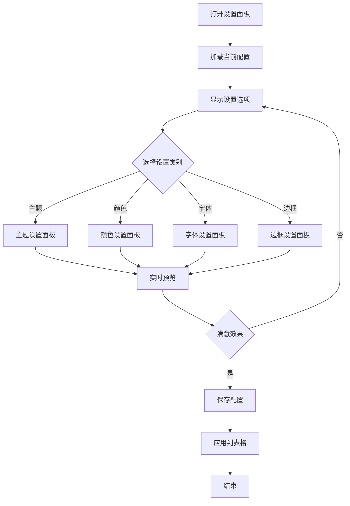

# Excel表格美化系统需求文档

## 1. 项目概述

### 1.1 项目背景
基于现有的Excel智能布局优化系统，新增表格美化功能模块，专注于提升Excel表格的视觉效果和专业度。该系统将在保持原有布局优化能力的基础上，增加丰富的格式化和美化功能。

### 1.2 设计目标
- **视觉统一**：建立一套标准化的表格美化规范
- **操作简便**：一键应用专业级表格样式
- **风格多样**：提供多种预设美化主题
- **兼容性强**：与现有布局优化系统无缝集成
- **性能优化**：确保大数据量表格的美化性能

### 1.3 核心价值
- 快速将普通表格转换为专业级报表
- 提高工作效率，减少手动格式化时间（节省80%以上时间）
- 确保表格风格统一，提升文档专业度
- 支持批量处理，适合企业级应用

## 2. 功能需求详细说明

### 2.1 表头美化功能

#### 2.1.1 首行突出显示 ⭐ (用户需求)
**功能描述**：自动识别表头行，应用突出的视觉效果

**实现细节**：
- **自动检测规则**：
  - 首行非空单元格占比 > 60%
  - 包含文本内容的单元格占比 > 70%
  - 第二行开始出现数值型数据
  - 支持多行表头检测（最多3行）

- **渐变背景**：
  - 渐变类型：线性渐变、径向渐变
  - 渐变方向：0°（水平）、90°（垂直）、45°（对角线）、-45°（反对角线）
  - 渐变步数：2-5个颜色节点
  - 透明度支持：0-100%

- **预设主题详细参数**：
  - 蓝色商务：
    - 起始色：#1E3A8A (RGB: 30,58,138)
    - 结束色：#3B82F6 (RGB: 59,130,246)
    - 字体色：#FFFFFF
    - 边框色：#1E40AF
  - 绿色清新：
    - 起始色：#065F46 (RGB: 6,95,70)
    - 结束色：#10B981 (RGB: 16,185,129)
    - 字体色：#FFFFFF
    - 边框色：#047857
  - 灰色专业：
    - 起始色：#374151 (RGB: 55,65,81)
    - 结束色：#9CA3AF (RGB: 156,163,175)
    - 字体色：#FFFFFF
    - 边框色：#4B5563
  - 紫色优雅：
    - 起始色：#581C87 (RGB: 88,28,135)
    - 结束色：#A855F7 (RGB: 168,85,247)
    - 字体色：#FFFFFF
    - 边框色：#6B21A8

- **字体优化详细参数**：
  - 字体加粗：Bold (700)
  - 字体大小：数据行字号 + 1pt（最大12pt，最小9pt）
  - 字符间距：正常（0）到宽松（+0.5pt）
  - 行高：自动调整（最小18pt）

- **对齐方式**：
  - 文本列：水平居左，垂直居中
  - 数值列：水平居右，垂直居中
  - 日期列：水平居中，垂直居中
  - 布尔列：水平居中，垂直居中

#### 2.1.2 首行冻结 ⭐ (用户需求)
**功能描述**：自动冻结表头行，方便浏览大量数据

**实现方式**：
- **冻结逻辑**：
  - 单行表头：冻结第1行
  - 多行表头：冻结所有表头行（最多3行）
  - 组合冻结：支持同时冻结首行和首列
  
- **智能检测**：
  - 数据量检测：行数 > 20时自动建议冻结
  - 列宽检测：总列宽超过屏幕宽度时建议冻结首列
  - 记忆功能：记住用户的冻结偏好

### 2.2 边框和分隔功能

#### 2.2.1 智能边框设置 ⭐ (用户需求)
**功能描述**：为表格添加专业的边框样式

**边框类型详细说明**：
- **外边框**：
  - 线型：实线、双线、粗线
  - 粗细：1.5pt - 3pt（可调）
  - 颜色：支持RGB自定义
  - 圆角：0-5pt（可选）

- **表头边框**：
  - 底部边框：1pt - 2pt
  - 样式：实线、双线、点线
  - 颜色：比外边框浅20%

- **内部网格**：
  - 线型：实线、虚线、点线
  - 粗细：0.25pt - 1pt
  - 颜色：支持透明度设置

- **列分隔**：
  - 应用规则：每N列添加分隔线（N可配置）
  - 特殊列：ID列、汇总列自动添加分隔

**智能边框应用规则**：
```
- 合并单元格：自动调整边框以适应合并区域
- 空白单元格：可选择是否添加边框
- 隐藏行列：自动跳过隐藏的行列
- 筛选状态：保持筛选后的边框完整性
```

#### 2.2.2 文字边框显示 ⭐ (用户需求)
**功能描述**：通过边框突出显示重要文字内容

**边框样式库**：
- **重要数据**：
  - 样式：双线框
  - 颜色：#DC2626（红色）
  - 粗细：1.5pt
  
- **汇总行**：
  - 顶部边框：双线
  - 底部边框：粗线
  - 颜色：#1F2937（深灰）
  
- **关键指标**：
  - 样式：阴影边框
  - 阴影偏移：2pt
  - 阴影颜色：50%透明度黑色

### 2.3 数据突出显示

#### 2.3.1 负数金额突出 ⭐ (用户需求)
**功能描述**：自动识别并突出显示负数金额

**识别规则**：
- 数值类型检测：Number、Currency、Accounting格式
- 负值判断：值 < 0 或包含负号
- 公式结果：支持公式计算结果的负值检测

**显示格式详细配置**：
```vba
' 格式模板
NegativeFormats = Array( _
    "(#,##0.00)",          ' 括号格式
    "-#,##0.00",           ' 负号格式
    "▲#,##0.00",          ' 三角形格式
    "[Red]-#,##0.00",      ' 红色负号
    "[Red](#,##0.00)"      ' 红色括号
)
```

**条件格式规则**：
- 轻度负值（-10%以内）：浅红背景 #FEF2F2
- 中度负值（-10%到-30%）：中红背景 #FEE2E2
- 重度负值（-30%以上）：深红背景 #FECACA

### 2.4 行列美化功能

#### 2.4.1 隔行变色斑马条纹 ⭐ (用户需求)
**功能描述**：为表格添加隔行背景色，提升可读性

**智能条纹规则**：
- **自适应模式**：
  - 小表格（<50行）：每行交替
  - 中表格（50-200行）：每2行交替
  - 大表格（>200行）：每3行交替

- **分组条纹**：
  - 检测分组字段
  - 同组内使用相同背景
  - 组间交替变色

**配色方案详细参数**：
```
浅色系：
  - 主色：#FFFFFF (255,255,255)
  - 辅色：#F9FAFB (249,250,251)
  - 透明度：100%
  
蓝色系：
  - 主色：#FFFFFF (255,255,255)
  - 辅色：#EFF6FF (239,246,255)
  - 透明度：95%
  
绿色系：
  - 主色：#FFFFFF (255,255,255)
  - 辅色：#F0FDF4 (240,253,244)
  - 透明度：95%
```

### 2.5 字体美化功能

#### 2.5.1 字体统一标准化
**功能描述**：统一表格字体样式，提升专业度

**字体选择逻辑**：
```vba
Function SelectOptimalFont(contentType As String) As String
    Select Case contentType
        Case "ChineseHeader"
            Return "微软雅黑"
        Case "ChineseData"
            Return "微软雅黑 Light"
        Case "EnglishHeader"
            Return "Calibri"
        Case "EnglishData"
            Return "Arial"
        Case "Number"
            Return "Consolas"
        Case "Currency"
            Return "Times New Roman"
        Case "Mixed"
            Return "微软雅黑"
    End Select
End Function
```

**字体大小自适应规则**：
- 列宽 < 10：8pt
- 列宽 10-20：9pt
- 列宽 20-30：10pt
- 列宽 > 30：11pt
- 最大限制：12pt
- 最小限制：8pt

### 2.6 高级美化功能

#### 2.6.1 主题化美化
**功能描述**：提供多套预设美化主题

**主题配置结构**：
```vba
Type ThemeConfig
    Name As String
    HeaderColors As ColorScheme
    DataColors As ColorScheme
    BorderStyle As BorderConfig
    FontConfig As FontSettings
    ConditionalRules As Collection
    PrintSettings As PrintConfig
End Type
```

**预设主题详细配置**：

1. **商务经典**
   - 主色调：蓝色系 (#1E3A8A, #3B82F6, #60A5FA)
   - 强调色：橙色 (#F97316)
   - 字体：Calibri / 微软雅黑
   - 边框：细线简约
   - 特点：专业、清晰、易读

2. **财务专用**
   - 主色调：绿色系 (#065F46, #10B981, #34D399)
   - 警告色：红色 (#DC2626)
   - 字体：Times New Roman / 宋体
   - 边框：双线表头
   - 特点：数字清晰、正负分明

3. **报告正式**
   - 主色调：灰色系 (#111827, #374151, #6B7280)
   - 强调色：深蓝 (#1E3A8A)
   - 字体：Arial / 黑体
   - 边框：粗外框
   - 特点：严谨、正式、层次分明

4. **清新活泼**
   - 主色调：多彩渐变
   - 配色：彩虹色系
   - 字体：Segoe UI / 微软雅黑Light
   - 边框：圆角柔和
   - 特点：现代、友好、吸引眼球

5. **极简风格**
   - 主色调：黑白灰
   - 强调色：单一强调色（可配置）
   - 字体：Helvetica / 思源黑体
   - 边框：无边框或极细边框
   - 特点：简洁、专注内容

#### 2.6.2 条件格式增强
**功能描述**：智能应用条件格式规则

**规则优先级系统**：
1. 错误值（最高优先级）
2. 空值
3. 重复值
4. 超限值
5. 负值
6. 数值范围
7. 文本匹配
8. 日期范围
9. 自定义公式（最低优先级）

**内置规则详细说明**：

- **数值范围检测**：
  ```vba
  ' 异常值检测算法
  Function DetectOutliers(range As Range) As Collection
      ' 使用IQR方法检测异常值
      Q1 = Percentile(range, 0.25)
      Q3 = Percentile(range, 0.75)
      IQR = Q3 - Q1
      LowerBound = Q1 - 1.5 * IQR
      UpperBound = Q3 + 1.5 * IQR
      ' 标记超出范围的值
  End Function
  ```

- **重复值处理**：
  - 完全重复：深色标记
  - 部分重复：浅色标记
  - 首次出现：不标记
  - 分组内重复：组内标记

- **空值处理**：
  - 必填字段空值：红色背景
  - 可选字段空值：灰色背景
  - 公式返回空：黄色背景
  - 故意留空：不处理

### 2.7 新增功能模块

#### 2.7.1 数据验证美化 🆕
**功能描述**：美化数据验证的显示效果

**实现内容**：
- **下拉列表美化**：
  - 下拉箭头颜色自定义
  - 选中项高亮显示
  - 列表项图标支持

- **验证提示美化**：
  - 输入提示框样式
  - 错误提示框样式
  - 信息图标显示

- **验证状态指示**：
  - 有效数据：绿色勾号
  - 无效数据：红色叉号
  - 待验证：黄色问号

#### 2.7.2 打印优化美化 🆕
**功能描述**：针对打印输出的专门美化

**打印设置**：
- **页面设置**：
  - 自动调整缩放比例
  - 智能分页（避免数据断行）
  - 页眉页脚美化

- **打印样式**：
  - 打印专用配色（考虑黑白打印）
  - 网格线设置
  - 水印添加

- **打印预览**：
  - 实时预览效果
  - 分页指示线
  - 打印区域标记

#### 2.7.3 响应式美化 🆕
**功能描述**：根据查看设备自适应美化

**适配规则**：
- **屏幕大小适配**：
  - 大屏（>1920px）：完整显示所有美化
  - 中屏（1366-1920px）：标准美化
  - 小屏（<1366px）：简化美化

- **缩放级别适配**：
  - 放大查看：增强细节显示
  - 缩小查看：简化复杂样式

## 3. 技术实现规范

### 3.1 VBA实现架构

#### 3.1.1 模块结构设计
```vba
' ===== 主模块 =====
Public Sub BeautifyTable(Optional config As BeautificationConfig)
Public Sub ApplyTheme(themeName As String)
Public Sub BatchBeautify(worksheets As Collection)
Public Sub UndoBeautification()

' ===== 功能模块 =====
' 表头处理
Private Sub ApplyHeaderBeautification(headerRange As Range)
Private Sub DetectHeaderRows() As Integer
Private Sub ApplyGradientFill(range As Range, gradient As GradientConfig)

' 边框处理
Private Sub SetSmartBorders(tableRange As Range)
Private Sub ApplyBorderStyle(range As Range, style As BorderStyle)

' 数据处理
Private Sub HighlightNegativeNumbers(dataRange As Range)
Private Sub ApplyConditionalFormatting(range As Range, rules As Collection)
Private Sub ApplyDataBars(range As Range)

' 行列处理
Private Sub ApplyZebraStripes(dataRange As Range, config As StripeConfig)
Private Sub AutoFitColumns(tableRange As Range)
Private Sub OptimizeColumnWidths(tableRange As Range)

' 字体处理
Private Sub StandardizeFonts(tableRange As Range)
Private Sub ApplyFontTheme(range As Range, theme As FontTheme)

' 冻结处理
Private Sub FreezeHeaderRow(headerRows As Integer)
Private Sub FreezePanes(row As Integer, column As Integer)

' ===== 配置管理 =====
Private Function LoadBeautificationConfig() As BeautificationConfig
Private Sub SaveBeautificationSettings(config As BeautificationConfig)
Private Function LoadTheme(themeName As String) As ThemeConfig
Private Sub SaveCustomTheme(theme As ThemeConfig)

' ===== 工具函数 =====
Private Function DetectTableRange() As Range
Private Function DetectDataType(range As Range) As String
Private Function CalculateContrastRatio(bg As Long, fg As Long) As Double
Private Function GenerateColorPalette(baseColor As Long) As Collection
Private Function IsFormulaCell(cell As Range) As Boolean
Private Function GetScreenResolution() As ScreenInfo

' ===== 性能优化 =====
Private Sub EnableFastMode()
Private Sub DisableFastMode()
Private Sub OptimizeForLargeData(rowCount As Long)

' ===== 错误处理 =====
Private Sub HandleError(errorCode As Long, errorMsg As String)
Private Sub LogOperation(operation As String, success As Boolean)
Private Function ValidateTableStructure(range As Range) As Boolean
```

#### 3.1.2 配置数据结构
```vba
' ===== 主配置结构 =====
Private Type BeautificationConfig
    ' 基础设置
    ConfigVersion As String
    LastModified As Date
    AutoSave As Boolean
    
    ' 主题设置
    SelectedTheme As String
    CustomColors() As String
    EnableAnimation As Boolean
    
    ' 表头设置
    HeaderGradient As Boolean
    HeaderGradientType As String    ' Linear, Radial
    HeaderGradientAngle As Integer  ' 0-360
    HeaderColors() As Long
    HeaderFontSize As Integer
    HeaderFontBold As Boolean
    HeaderAlignment As String
    AutoDetectHeader As Boolean
    MaxHeaderRows As Integer
    
    ' 条纹设置
    ZebraStripes As Boolean
    StripePattern As String         ' Alternating, Group, Custom
    StripeColor1 As Long
    StripeColor2 As Long
    StripeOpacity As Integer        ' 0-100
    StripeWidth As Integer          ' 1-5 rows
    SkipHeaderRows As Boolean
    
    ' 数值设置
    HighlightNegatives As Boolean
    NegativeColor As Long
    NegativeFormat As String
    NegativeBackgroundColor As Long
    UseDataBars As Boolean
    DataBarColor As Long
    ShowOnlyBar As Boolean
    
    ' 边框设置
    BorderStyle As String            ' Thin, Medium, Thick, Double
    OuterBorderColor As Long
    OuterBorderWeight As Single
    InnerBorderColor As Long
    InnerBorderWeight As Single
    HeaderBorderColor As Long
    UseRoundedCorners As Boolean
    CornerRadius As Integer
    
    ' 冻结设置
    FreezeHeader As Boolean
    FreezeColumns As Integer
    AutoDetectFreeze As Boolean
    
    ' 字体设置
    StandardFont As String
    StandardFontSize As Integer
    HeaderFont As String
    NumberFont As String
    AutoFitText As Boolean
    MinFontSize As Integer
    MaxFontSize As Integer
    
    ' 条件格式
    EnableConditionalFormat As Boolean
    HighlightDuplicates As Boolean
    HighlightOutliers As Boolean
    HighlightErrors As Boolean
    ColorScaleType As String        ' 2-Color, 3-Color, DataBar
    
    ' 性能设置
    EnableFastMode As Boolean
    MaxProcessRows As Long
    BatchSize As Integer
    ShowProgress As Boolean
    
    ' 打印设置
    OptimizeForPrint As Boolean
    PrintColorMode As String         ' Color, Grayscale, BlackWhite
    FitToPage As Boolean
    PrintGridlines As Boolean
    
    ' 高级设置
    PreserveFormulas As Boolean
    PreserveValidation As Boolean
    BackupBeforeApply As Boolean
    LogOperations As Boolean
End Type

' ===== 主题配置结构 =====
Private Type ThemeConfig
    ' 主题标识
    ThemeID As String
    ThemeName As String
    ThemeCategory As String          ' Business, Finance, Report, Modern, Minimal
    ThemeVersion As String
    Author As String
    Description As String
    
    ' 颜色方案
    PrimaryColor As Long
    SecondaryColor As Long
    AccentColor As Long
    WarningColor As Long
    ErrorColor As Long
    SuccessColor As Long
    InfoColor As Long
    
    ' 表头样式
    HeaderStyle As HeaderConfig
    
    ' 数据样式
    DataStyle As DataConfig
    
    ' 边框样式
    BorderStyle As BorderConfig
    
    ' 字体样式
    FontStyle As FontConfig
    
    ' 条件格式规则
    ConditionalRules As Collection
    
    ' 打印设置
    PrintSettings As PrintConfig
End Type

' ===== 子配置结构 =====
Private Type HeaderConfig
    BackgroundType As String         ' Solid, Gradient, Pattern
    BackgroundColor1 As Long
    BackgroundColor2 As Long
    GradientAngle As Integer
    FontColor As Long
    FontBold As Boolean
    FontSize As Integer
    BorderBottom As Boolean
    BorderColor As Long
    Height As Single
End Type

Private Type DataConfig
    AlternatingRows As Boolean
    RowColor1 As Long
    RowColor2 As Long
    FontColor As Long
    FontSize As Integer
    NumberFormat As String
    DateFormat As String
    CurrencyFormat As String
End Type

Private Type BorderConfig
    OuterStyle As String
    OuterColor As Long
    OuterWeight As Single
    InnerStyle As String
    InnerColor As Long
    InnerWeight As Single
    VerticalStyle As String
    HorizontalStyle As String
End Type

Private Type FontConfig
    HeaderFont As String
    DataFont As String
    NumberFont As String
    DefaultSize As Integer
    MinSize As Integer
    MaxSize As Integer
    LineSpacing As Single
End Type

Private Type PrintConfig
    Orientation As String            ' Portrait, Landscape
    PaperSize As String
    Margins As MarginSettings
    HeaderText As String
    FooterText As String
    ScaleToFit As Boolean
    CenterHorizontally As Boolean
    CenterVertically As Boolean
End Type

Private Type MarginSettings
    Top As Single
    Bottom As Single
    Left As Single
    Right As Single
    Header As Single
    Footer As Single
End Type

' ===== 运行时状态 =====
Private Type RuntimeState
    IsProcessing As Boolean
    CurrentRow As Long
    TotalRows As Long
    StartTime As Date
    LastError As String
    UndoStack As Collection
    RedoStack As Collection
    CacheEnabled As Boolean
    ColorCache As Dictionary
End Type
```

### 3.2 用户界面设计

#### 3.2.1 Ribbon界面集成
```xml
<!-- Ribbon UI配置 -->
<customUI xmlns="http://schemas.microsoft.com/office/2009/07/customui">
  <ribbon>
    <tabs>
      <tab id="BeautifyTab" label="表格美化">
        <group id="QuickBeautify" label="快速美化">
          <button id="OneClickBeautify" label="一键美化" size="large" />
          <splitButton id="ThemeSelector" size="large">
            <button id="ApplyTheme" label="应用主题" />
            <menu id="ThemeMenu">
              <button id="BusinessTheme" label="商务经典" />
              <button id="FinanceTheme" label="财务专用" />
              <button id="ReportTheme" label="报告正式" />
              <button id="ModernTheme" label="清新活泼" />
              <button id="MinimalTheme" label="极简风格" />
            </menu>
          </splitButton>
        </group>
        
        <group id="DetailSettings" label="详细设置">
          <button id="HeaderSettings" label="表头" size="normal" />
          <button id="BorderSettings" label="边框" size="normal" />
          <button id="ColorSettings" label="颜色" size="normal" />
          <button id="FontSettings" label="字体" size="normal" />
          <button id="ConditionalSettings" label="条件格式" size="normal" />
        </group>
        
        <group id="Tools" label="工具">
          <button id="Preview" label="预览" size="normal" />
          <button id="Undo" label="撤销" size="normal" />
          <button id="SaveTheme" label="保存主题" size="normal" />
          <button id="BatchProcess" label="批量处理" size="normal" />
        </group>
      </tab>
    </tabs>
  </ribbon>
</customUI>
```

#### 3.2.2 设置对话框
```vba
' 用户窗体控件配置
Private Sub InitializeSettingsDialog()
    ' 主题选择
    ComboBoxTheme.List = Array("商务经典", "财务专用", "报告正式", "清新活泼", "极简风格", "自定义")
    
    ' 颜色选择器
    ColorPickerPrimary.Value = RGB(30, 58, 138)
    ColorPickerSecondary.Value = RGB(59, 130, 246)
    
    ' 边框样式
    ComboBoxBorderStyle.List = Array("细线", "中等", "粗线", "双线", "点线", "虚线")
    
    ' 字体设置
    ComboBoxFont.List = GetAvailableFonts()
    SpinButtonFontSize.Min = 8
    SpinButtonFontSize.Max = 16
    
    ' 条纹设置
    CheckBoxZebraStripes.Value = True
    SpinButtonStripeWidth.Min = 1
    SpinButtonStripeWidth.Max = 5
    
    ' 性能设置
    CheckBoxFastMode.Value = True
    TextBoxMaxRows.Value = "10000"
End Sub
```

### 3.3 与现有系统集成

#### 3.3.1 API接口定义
```vba
' ===== 公共API接口 =====
Public Function BeautifyAPI(action As String, params As Dictionary) As Variant
    Select Case action
        Case "beautify"
            Return ExecuteBeautify(params)
        Case "preview"
            Return GeneratePreview(params)
        Case "undo"
            Return UndoLastOperation()
        Case "getThemes"
            Return GetAvailableThemes()
        Case "saveTheme"
            Return SaveCustomTheme(params)
        Case "exportConfig"
            Return ExportConfiguration(params)
        Case "importConfig"
            Return ImportConfiguration(params)
    End Select
End Function

' ===== 事件钩子 =====
Public Event BeforeBeautify(ByRef Cancel As Boolean)
Public Event AfterBeautify(Success As Boolean)
Public Event ThemeChanged(ThemeName As String)
Public Event ErrorOccurred(ErrorMsg As String)
```

#### 3.3.2 布局优化集成
```vba
' 完整优化流程
Public Sub CompleteOptimization()
    Dim config As OptimizationConfig
    
    ' 第一步：布局优化
    ShowProgress "正在优化布局..."
    config.LayoutOptions = GetLayoutSettings()
    Call OptimizeLayout(config.LayoutOptions)
    
    ' 第二步：数据清理
    ShowProgress "正在清理数据..."
    config.CleanOptions = GetCleanSettings()
    Call CleanData(config.CleanOptions)
    
    ' 第三步：美化处理
    ShowProgress "正在美化表格..."
    config.BeautifyOptions = GetBeautifySettings()
    Call BeautifyTable(config.BeautifyOptions)
    
    ' 第四步：验证结果
    ShowProgress "正在验证结果..."
    If ValidateResult() Then
        ShowComplete "优化完成！"
    Else
        ShowError "优化过程中出现问题，请检查。"
    End If
End Sub
```

## 4. 操作流程设计

### 4.1 基础美化流程


### 4.2 自定义美化流程


### 4.3 批量美化流程
```vba
Sub BatchBeautifyProcess()
    Dim ws As Worksheet
    Dim config As BeautificationConfig
    Dim results As Collection
    Set results = New Collection
    
    ' 初始化进度条
    ProgressBar.Show
    ProgressBar.Maximum = ThisWorkbook.Worksheets.Count
    
    ' 加载配置
    config = LoadBeautificationConfig()
    
    ' 批量处理
    For Each ws In ThisWorkbook.Worksheets
        On Error Resume Next
        
        ' 更新进度
        ProgressBar.Value = ProgressBar.Value + 1
        ProgressBar.Status = "正在处理: " & ws.Name
        
        ' 应用美化
        If IsValidTable(ws) Then
            ApplyBeautification ws, config
            results.Add CreateResult(ws.Name, "成功", "")
        Else
            results.Add CreateResult(ws.Name, "跳过", "非表格数据")
        End If
        
        On Error GoTo 0
    Next ws
    
    ' 显示结果
    ShowBatchResults results
End Sub
```

## 5. 质量标准

### 5.1 性能要求

#### 5.1.1 响应时间标准
| 数据规模 | 响应时间要求 | 内存占用 |
|---------|------------|----------|
| <1000行 | <1秒 | <50MB |
| 1000-5000行 | <3秒 | <100MB |
| 5000-10000行 | <5秒 | <200MB |
| 10000-50000行 | <10秒 | <500MB |
| >50000行 | 启用分批处理 | <1GB |

#### 5.1.2 性能优化策略
```vba
Private Sub OptimizePerformance(rowCount As Long)
    If rowCount > 1000 Then
        Application.ScreenUpdating = False
        Application.Calculation = xlCalculationManual
        Application.EnableEvents = False
    End If
    
    If rowCount > 10000 Then
        ' 使用数组处理代替逐单元格操作
        UseArrayProcessing = True
        ' 分批处理
        BatchSize = 5000
    End If
    
    If rowCount > 50000 Then
        ' 启用多线程处理（如果可用）
        EnableMultiThreading = True
        ' 使用缓存机制
        EnableCache = True
    End If
End Sub
```

### 5.2 兼容性要求

#### 5.2.1 版本兼容性矩阵
| Excel版本 | 支持程度 | 限制说明 |
|----------|---------|----------|
| Excel 2016 | 完全支持 | 无限制 |
| Excel 2019 | 完全支持 | 无限制 |
| Excel 365 | 完全支持 | 无限制 |
| Excel 2013 | 部分支持 | 不支持某些渐变效果 |
| Excel 2010 | 基础支持 | 仅支持基础美化功能 |
| Excel Online | 有限支持 | 仅支持颜色和字体设置 |

#### 5.2.2 文件格式兼容
- **.xlsx**：完全支持所有功能
- **.xlsm**：完全支持（包括宏）
- **.xlsb**：支持（二进制格式）
- **.xls**：部分支持（旧格式限制）
- **.csv**：不支持（纯文本格式）

### 5.3 稳定性要求

#### 5.3.1 错误处理机制
```vba
Private Function SafeExecute(operation As String) As Boolean
    On Error GoTo ErrorHandler
    
    ' 保存当前状态
    SaveCurrentState
    
    ' 执行操作
    Select Case operation
        Case "Beautify"
            ExecuteBeautification
        Case "Theme"
            ApplySelectedTheme
    End Select
    
    SafeExecute = True
    Exit Function
    
ErrorHandler:
    ' 记录错误
    LogError Err.Number, Err.Description, operation
    
    ' 恢复状态
    RestoreLastState
    
    ' 显示用户友好的错误信息
    ShowErrorMessage GetUserFriendlyMessage(Err.Number)
    
    SafeExecute = False
End Function
```

#### 5.3.2 数据保护措施
- **自动备份**：美化前自动创建备份
- **公式保护**：保留原始公式不被覆盖
- **数据验证**：保持数据验证规则
- **链接保护**：不破坏外部链接
- **图表保护**：不影响关联图表

## 6. 用户体验设计

### 6.1 易用性原则

#### 6.1.1 智能默认值
```vba
Private Function GetSmartDefaults(tableRange As Range) As BeautificationConfig
    Dim config As BeautificationConfig
    
    ' 根据表格大小选择主题
    If tableRange.Rows.Count > 1000 Then
        config.SelectedTheme = "极简风格"  ' 大数据量使用简洁主题
    ElseIf IsFinancialData(tableRange) Then
        config.SelectedTheme = "财务专用"  ' 财务数据使用专用主题
    Else
        config.SelectedTheme = "商务经典"  ' 默认商务主题
    End If
    
    ' 根据列数决定是否冻结
    config.FreezeHeader = (tableRange.Columns.Count > 10)
    
    ' 根据数据密度决定条纹
    config.ZebraStripes = (tableRange.Rows.Count > 20)
    
    Return config
End Function
```

#### 6.1.2 操作引导
- **首次使用向导**：3步完成设置
- **工具提示**：鼠标悬停显示功能说明
- **智能建议**：基于数据特征推荐设置
- **快捷键支持**：常用功能快捷键

### 6.2 个性化支持

#### 6.2.1 用户配置文件
```vba
Private Type UserProfile
    UserID As String
    PreferredTheme As String
    RecentThemes(5) As String
    CustomThemes As Collection
    FrequentSettings As Dictionary
    LastUsedDate As Date
    UsageCount As Long
End Type
```

#### 6.2.2 学习用户习惯
- 记录用户选择频率
- 自动调整默认值
- 个性化推荐
- 智能预设管理

### 6.3 帮助和指导

#### 6.3.1 内置帮助系统
```vba
Private Sub ShowContextHelp(feature As String)
    Select Case feature
        Case "GradientFill"
            ShowTooltip "渐变填充可以让表头更加醒目，建议使用同色系渐变"
        Case "NegativeHighlight"
            ShowTooltip "负数高亮有助于快速识别异常数据，推荐使用红色"
        Case "ZebraStripes"
            ShowTooltip "斑马条纹可以提高大表格的可读性，建议行数>20时使用"
    End Select
End Sub
```

#### 6.3.2 示例库
- **行业模板**：各行业标准表格模板
- **场景示例**：不同使用场景的最佳实践
- **效果对比**：美化前后对比展示
- **视频教程**：关键功能操作视频

## 7. 测试要求

### 7.1 功能测试用例

#### 7.1.1 基础功能测试
| 测试项 | 测试步骤 | 预期结果 |
|-------|---------|----------|
| 表头识别 | 选择包含表头的表格 | 正确识别表头行 |
| 主题应用 | 选择不同主题 | 主题正确应用 |
| 边框设置 | 应用各种边框样式 | 边框显示正常 |
| 颜色设置 | 设置自定义颜色 | 颜色正确显示 |
| 撤销操作 | 执行撤销 | 恢复到上一状态 |

#### 7.1.2 边界条件测试
- 空表格处理
- 单行/单列表格
- 超大表格（>100000行）
- 包含合并单元格
- 包含图片/图表
- 包含数据透视表

### 7.2 性能测试

#### 7.2.1 性能测试场景
```vba
Private Sub PerformanceTest()
    Dim testSizes() As Long
    testSizes = Array(100, 1000, 5000, 10000, 50000, 100000)
    
    For Each size In testSizes
        ' 生成测试数据
        GenerateTestData size
        
        ' 记录开始时间
        startTime = Timer
        
        ' 执行美化
        BeautifyTable
        
        ' 记录结束时间
        endTime = Timer
        
        ' 记录结果
        LogPerformance size, endTime - startTime
    Next
End Sub
```

### 7.3 兼容性测试

#### 7.3.1 版本兼容测试
- Excel 2016/2019/365各版本
- Windows 7/8/10/11系统
- 不同分辨率屏幕
- 不同语言环境

## 8. 部署和维护

### 8.1 部署方案

#### 8.1.1 安装包结构
```
ExcelBeautifier/
├── BeautifySystem.xlam       # 主程序文件
├── Themes/                   # 主题文件夹
│   ├── Business.theme
│   ├── Finance.theme
│   └── ...
├── Config/                   # 配置文件夹
│   ├── default.config
│   └── user.config
├── Help/                     # 帮助文档
│   ├── UserGuide.pdf
│   └── QuickStart.pdf
└── Setup.exe                 # 安装程序
```

#### 8.1.2 自动更新机制
```vba
Private Sub CheckForUpdates()
    Dim currentVersion As String
    Dim latestVersion As String
    
    currentVersion = GetCurrentVersion()
    latestVersion = GetLatestVersionFromServer()
    
    If CompareVersions(latestVersion, currentVersion) > 0 Then
        If MsgBox("发现新版本，是否更新？", vbYesNo) = vbYes Then
            DownloadAndInstallUpdate latestVersion
        End If
    End If
End Sub
```

### 8.2 维护计划

#### 8.2.1 版本发布周期
- **主版本**：每6个月
- **功能更新**：每2个月
- **错误修复**：每2周
- **紧急修复**：24小时内

#### 8.2.2 用户反馈机制
- 内置反馈按钮
- 错误自动上报
- 使用统计收集
- 用户满意度调查

## 9. 附录

### 9.1 完整颜色规范
| 颜色名称 | 十六进制 | RGB值 | HSL值 | 用途 |
|---------|----------|-------|-------|------|
| 主蓝色 | #1E3A8A | (30,58,138) | (215,64%,33%) | 表头主色 |
| 浅蓝色 | #3B82F6 | (59,130,246) | (217,91%,60%) | 表头渐变 |
| 深蓝色 | #1E40AF | (30,64,175) | (221,71%,40%) | 边框强调 |
| 警告红 | #DC2626 | (220,38,38) | (0,71%,51%) | 负数/错误 |
| 成功绿 | #10B981 | (16,185,129) | (160,84%,39%) | 正数/成功 |
| 中性灰 | #6B7280 | (107,114,128) | (220,9%,46%) | 边框/分隔 |
| 浅灰色 | #F3F4F6 | (243,244,246) | (220,14%,96%) | 条纹背景 |
| 深灰色 | #374151 | (55,65,81) | (217,19%,27%) | 文字/边框 |

### 9.2 字体规范详细
| 字体名称 | 字重 | 大小范围 | 行高 | 字符间距 | 适用场景 |
|---------|------|---------|------|----------|---------|
| 微软雅黑 | Regular/Bold | 8-12pt | 1.5 | 0 | 中文内容 |
| 微软雅黑 Light | Light | 8-11pt | 1.5 | 0 | 中文数据 |
| Calibri | Regular/Bold | 8-12pt | 1.4 | 0 | 英文内容 |
| Arial | Regular/Bold | 8-11pt | 1.4 | 0 | 通用内容 |
| Consolas | Regular | 8-10pt | 1.3 | -0.5 | 数字/代码 |
| Times New Roman | Regular | 9-11pt | 1.4 | 0 | 金额数字 |

### 9.3 快捷键列表
| 快捷键 | 功能 | 说明 |
|--------|------|------|
| Ctrl+Shift+B | 一键美化 | 应用默认主题 |
| Ctrl+Shift+T | 主题选择 | 打开主题菜单 |
| Ctrl+Shift+Z | 撤销美化 | 恢复原始样式 |
| Ctrl+Shift+S | 保存主题 | 保存当前设置为主题 |
| Ctrl+Shift+P | 预览效果 | 预览美化效果 |
| Ctrl+Shift+H | 帮助文档 | 打开帮助 |

### 9.4 错误代码说明
| 错误代码 | 错误描述 | 解决方案 |
|---------|---------|----------|
| E001 | 未选择有效表格 | 请选择包含数据的表格区域 |
| E002 | 表格结构异常 | 检查是否有合并单元格影响 |
| E003 | 内存不足 | 关闭其他程序或分批处理 |
| E004 | 主题文件损坏 | 重新下载主题文件 |
| E005 | 版本不兼容 | 升级Excel或使用兼容模式 |

---

**文档版本**：v2.0  
**创建日期**：2024年12月29日  
**最后更新**：2024年12月29日  
**作者**：Excel美化系统开发团队
