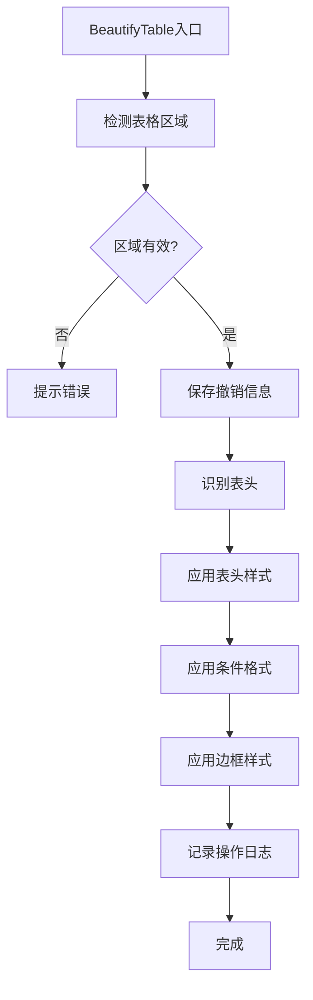

# Excel表格美化系统 - 技术实现明细 v2.0

## 🔄 v2.1 重要变更说明（2025-09-03）

**基于用户反馈的10项关键优化**：

1. **统一R1C1架构** ✅
   - 删除所有A1变体实现，统一使用R1C1相对引用
   - 避免列字母解析的脆弱性，支持跨列区域/合并单元格
   - 精确AppliesTo控制，防止条件格式跨列误伤

2. **精确撤销最小闭环** ✅
   - BeautifyLog仅保留：SessionId、Timestamp、CFRulesAdded、StylesAdded、TableStylesMap
   - 删除未实现的OriginalFormats/ModifiedRanges/CFRuleCount字段
   - 按会话标签精确删除，避免误删用户既有格式

3. **保护用户既有格式** ✅
   - 删除"全清空条件格式"路径，禁用dataRange.FormatConditions.Delete
   - 仅清理带会话标签的规则：ClearTaggedRules()
   - 撤销时按标签匹配，确保不影响用户原有格式

4. **高性能斑马纹实现** ✅
   - 使用条件格式替代逐行着色：`=MOD(ROW()-(起始行)+1,步长*2)<=步长`（R1C1格式）
   - 智能自适应步长：小表1行、中表2行、大表3行
   - 支持分组条纹逻辑

5. **避免NumberFormat覆盖** ✅
   - 负数检测仅修改字体颜色，不改变用户的小数位设置
   - 统一使用表达式条件格式，避免xlCellValue + NumberFormat强制覆盖
   - 仅在IsNumericColumn()判定后应用数值相关规则

6. **Business主题默认斑马纹** ✅
   - EnableZebraStripes = True（原False改为True）
   - 大表性能模式自动关闭复杂样式
   - 智能性能分级：>=10000行自动简化

7. **中英文友好字体** ✅
   - 金额数字统一使用Consolas等宽字体
   - 中文环境优先"微软雅黑"，避免中西文混排割裂
   - 针对不同内容类型优化字体选择

8. **统一日志接口** ✅
   - LogCFRule()统一记录格式：地址|标签（两段式）
   - 删除分叉的日志记录方式，确保撤销一致性

9. **条件格式终止逻辑优化** 🆕
   - 错误值(优先级1)和空值(优先级2)设置StopIfTrue=True
   - 避免无效的规则叠加计算，提升大表性能
   - 重复值和负数保持StopIfTrue=False，允许合理叠加

10. **分层边框颜色设计** 🆕
    - 外边框：深灰色RGB(75,85,99)，内边框：浅灰色RGB(209,213,219)
    - 表头底部：双线样式+主色调深色变体，强化分隔感
    - 形成深→浅的视觉层次，增强专业感

---

## 目录
1. [系统架构设计](#1-系统架构设计)
2. [核心数据结构](#2-核心数据结构)
3. [表头识别算法](#3-表头识别算法)
4. [条件格式实现](#4-条件格式实现)
5. [主题样式系统](#5-主题样式系统)
6. [撤销机制实现](#6-撤销机制实现)
7. [性能优化策略](#7-性能优化策略)
8. [错误处理机制](#8-错误处理机制)
9. [API接口设计](#9-api接口设计)
10. [测试策略](#10-测试策略)

---

## 1. 系统架构设计

### 1.1 模块架构
```
ExcelBeautifier (单VBA模块)
├── 公共接口层
│   ├── BeautifyTable()          # 主入口函数
│   └── UndoBeautify()           # 撤销函数
├── 核心功能层
│   ├── 表格检测模块
│   ├── 表头识别模块
│   ├── 样式应用模块
│   ├── 条件格式模块
│   └── 撤销管理模块
└── 工具支持层
    ├── 性能优化工具
    ├── 错误处理工具
    └── 日志记录工具
```

### 1.2 执行流程


---

## 2. 核心数据结构

### 2.1 美化配置结构
```vba
' 美化配置结构
Private Type BeautifyConfig
    ' 主题设置
    ThemeName As String              ' 主题名称: Business/Financial/Minimal
    PrimaryColor As Long             ' 主色调RGB值
    SecondaryColor As Long           ' 辅助色RGB值
    AccentColor As Long              ' 强调色RGB值
    
    ' 功能开关
    EnableHeaderBeautify As Boolean  ' 启用表头美化
    EnableConditionalFormat As Boolean ' 启用条件格式
    EnableBorders As Boolean         ' 启用边框样式
    EnableZebraStripes As Boolean    ' 启用隔行变色
    EnableFreezeHeader As Boolean    ' 启用冻结表头
    
    ' 样式参数
    HeaderFontSize As Single         ' 表头字号
    DataFontSize As Single           ' 数据字号
    BorderWeight As XlBorderWeight   ' 边框粗细
    StripeOpacity As Single          ' 条纹透明度(0-1)
End Type
```

### 2.2 撤销信息结构
```vba
' 撤销日志结构（精确撤销最小闭环字段）
Private Type BeautifyLog
    ' 会话标识
    SessionId As String              ' 唯一会话ID：Format(Now, "yyyymmddhhmmss") & "_" & Int(Rnd * 1000)
    Timestamp As Date                ' 操作时间戳
    
    ' 条件格式记录（按标签删除）
    CFRulesAdded As String           ' 格式: "地址|标签;地址|标签..." 支持精确删除
    
    ' 样式记录（会话级管理）
    StylesAdded As String            ' 本会话添加的样式名称: "ELO_主题_SessionId;..."
    TableStylesMap As String         ' 表格样式映射: "表名:原样式;表名:原样式"
End Type
```

### 2.3 表格分析结构
```vba
' 表格分析结果
Private Type TableAnalysis
    ' 区域信息
    TotalRange As Range              ' 完整表格区域
    HeaderRange As Range             ' 表头区域
    DataRange As Range               ' 数据区域
    
    ' 表格特征
    HasHeaders As Boolean            ' 是否有表头
    HeaderRows As Long               ' 表头行数
    DataRows As Long                 ' 数据行数
    DataColumns As Long              ' 数据列数
    
    ' 内容特征
    HasNumbers As Boolean            ' 包含数值
    HasDates As Boolean              ' 包含日期
    HasFormulas As Boolean           ' 包含公式
    HasMergedCells As Boolean        ' 包含合并单元格
    
    ' 数据类型分析
    ColumnTypes() As String          ' 每列数据类型
    NumericColumns() As Long         ' 数值列索引
    TextColumns() As Long            ' 文本列索引
End Type
```

---

## 3. 表头识别算法

### 3.1 智能表头检测算法
```vba
Private Function DetectHeaderRange(tableRange As Range) As Range
    Dim headerScore As Long
    Dim maxHeaderRows As Long
    maxHeaderRows = 3  ' 最多检测3行作为表头
    
    ' 评分标准
    Const SCORE_ALL_TEXT As Long = 30       ' 全部为文本
    Const SCORE_NO_EMPTY As Long = 25       ' 无空单元格
    Const SCORE_FORMAT_DIFF As Long = 20    ' 格式差异
    Const SCORE_BOLD_FONT As Long = 15      ' 加粗字体
    Const SCORE_BG_COLOR As Long = 10       ' 背景色
    Const SCORE_TYPE_DIFF As Long = 20      ' 数据类型差异
    
    Dim testRows As Long
    testRows = Application.Min(maxHeaderRows, tableRange.Rows.Count)
    
    For rowNum = 1 To testRows
        headerScore = 0
        Set testRow = tableRange.Rows(rowNum)
        
        ' 评分逻辑
        If IsAllText(testRow) Then headerScore = headerScore + SCORE_ALL_TEXT
        If HasNoEmpty(testRow) Then headerScore = headerScore + SCORE_NO_EMPTY
        If HasFormatting(testRow) Then headerScore = headerScore + SCORE_FORMAT_DIFF
        If HasBoldFont(testRow) Then headerScore = headerScore + SCORE_BOLD_FONT
        If HasBackgroundColor(testRow) Then headerScore = headerScore + SCORE_BG_COLOR
        
        ' 与下一行对比
        If rowNum < tableRange.Rows.Count Then
            If HasTypeDifference(testRow, tableRange.Rows(rowNum + 1)) Then
                headerScore = headerScore + SCORE_TYPE_DIFF
            End If
        End If
        
        ' 判断是否为表头（阈值60分）
        If headerScore < 60 Then
            If rowNum = 1 Then
                ' 第一行分数不够，默认第一行为表头
                Set DetectHeaderRange = tableRange.Rows(1)
            Else
                ' 找到数据行，前面的行都是表头
                Set DetectHeaderRange = tableRange.Rows("1:" & (rowNum - 1))
            End If
            Exit Function
        End If
    Next rowNum
    
    ' 默认第一行为表头
    Set DetectHeaderRange = tableRange.Rows(1)
End Function
```

### 3.2 辅助检测函数
```vba
' 检测是否全部为文本
Private Function IsAllText(rng As Range) As Boolean
    Dim cell As Range
    Dim textCount As Long, totalCount As Long
    
    For Each cell In rng.Cells
        If Not IsEmpty(cell.Value) Then
            totalCount = totalCount + 1
            If Not IsNumeric(cell.Value) And Not IsDate(cell.Value) Then
                textCount = textCount + 1
            End If
        End If
    Next cell
    
    IsAllText = (textCount = totalCount And totalCount > 0)
End Function

' 检测是否无空单元格
Private Function HasNoEmpty(rng As Range) As Boolean
    Dim cell As Range
    
    For Each cell In rng.Cells
        If IsEmpty(cell.Value) Or Trim(cell.Value) = "" Then
            HasNoEmpty = False
            Exit Function
        End If
    Next cell
    
    HasNoEmpty = True
End Function

' 检测是否有格式化
Private Function HasFormatting(rng As Range) As Boolean
    Dim cell As Range
    
    For Each cell In rng.Cells
        ' 检查是否有非默认的背景色、字体样式等
        If cell.Interior.Color <> xlNone Or _
           cell.Font.Bold = True Or _
           cell.Font.Italic = True Or _
           cell.Font.Underline <> xlUnderlineStyleNone Then
            HasFormatting = True
            Exit Function
        End If
    Next cell
    
    HasFormatting = False
End Function

' 检测是否有粗体字体
Private Function HasBoldFont(rng As Range) As Boolean
    Dim cell As Range
    
    For Each cell In rng.Cells
        If cell.Font.Bold = True Then
            HasBoldFont = True
            Exit Function
        End If
    Next cell
    
    HasBoldFont = False
End Function

' 检测是否有背景色
Private Function HasBackgroundColor(rng As Range) As Boolean
    Dim cell As Range
    
    For Each cell In rng.Cells
        If cell.Interior.Color <> xlNone And cell.Interior.Color <> RGB(255, 255, 255) Then
            HasBackgroundColor = True
            Exit Function
        End If
    Next cell
    
    HasBackgroundColor = False
End Function

' 检测数据类型差异
Private Function HasTypeDifference(row1 As Range, row2 As Range) As Boolean
    Dim diffCount As Long, colCount As Long
    Dim i As Long
    
    colCount = row1.Cells.Count
    For i = 1 To colCount
        If GetCellType(row1.Cells(i)) <> GetCellType(row2.Cells(i)) Then
            diffCount = diffCount + 1
        End If
    Next i
    
    ' 超过50%的列类型不同
    HasTypeDifference = (diffCount > colCount * 0.5)
End Function

' 获取单元格数据类型
Private Function GetCellType(cell As Range) As String
    If IsEmpty(cell.Value) Then
        GetCellType = "Empty"
    ElseIf IsNumeric(cell.Value) Then
        GetCellType = "Number"
    ElseIf IsDate(cell.Value) Then
        GetCellType = "Date"
    Else
        GetCellType = "Text"
    End If
End Function
```

---

## 4. 条件格式实现（统一R1C1架构）

### 4.1 统一R1C1实现策略
```vba
' 条件格式统一应用（删除A1变体，仅保留R1C1实现）
Private Sub ApplyStandardConditionalFormat(dataRange As Range)
    Dim sessionTag As String
    Dim col As Range
    
    ' *** 统一会话标签，确保撤销一致性 ***
    sessionTag = GetSessionTag()  ' 使用全局统一标签
    
    ' *** 关键：R1C1引用风格切换保护 ***
    Dim prevStyle As XlReferenceStyle
    prevStyle = Application.ReferenceStyle
    Application.ReferenceStyle = xlR1C1
    
    On Error GoTo ErrorHandler
    Application.EnableEvents = False
    Application.ScreenUpdating = False
    
    ' *** 关键：仅清理带标签的规则，保护用户既有格式 ***
    ' 先清理整体数据区域
    ClearTaggedRules dataRange, sessionTag
    
    ' 统一优先级顺序（R1C1相对引用）
    ' 1. 错误值检测（优先级1，终止后续判断）
    ApplyErrorHighlight dataRange, sessionTag
    
    ' 2. 空值标记（优先级2，终止后续判断）  
    ApplyEmptyHighlight dataRange, sessionTag
    
    ' 3. 逐列应用重复值检测（精确范围控制，逐列预清理确保幂等性）
    For Each col In dataRange.Columns
        ' *** 修复：逐列预清理，确保多次运行的幂等性 ***
        ClearTaggedRules col, sessionTag
        ApplyDuplicateHighlight col, sessionTag
    Next col
    
    ' 4. 数值列负数检测（仅数值列，避免格式覆盖，逐列预清理）
    For Each col In dataRange.Columns
        If IsNumericColumn(col) Then
            ' *** 修复：逐列预清理，确保多次运行的幂等性 ***
            ClearTaggedRules col, sessionTag
            ApplyNegativeHighlight col, sessionTag
        End If
    Next col
    
    ' *** 恢复原始引用风格 ***
    Application.ReferenceStyle = prevStyle
    
CleanUp:
    ' *** 恢复原始引用风格（错误情况下也要恢复）***
    Application.ReferenceStyle = prevStyle
    Application.EnableEvents = True
    Application.ScreenUpdating = True
    Exit Sub
    
ErrorHandler:
    Application.ReferenceStyle = prevStyle  ' 错误时也恢复
    MsgBox "条件格式应用失败: " & Err.Description, vbExclamation
    Resume CleanUp
End Sub

' 仅清理带会话标签的规则（避免误删用户既有格式）
Private Sub ClearTaggedRules(rng As Range, sessionTag As String)
    Dim i As Long, cf As FormatCondition
    
    ' 从后往前删除，避免索引变化
    For i = rng.FormatConditions.Count To 1 Step -1
        Set cf = rng.FormatConditions(i)
        
        ' 检查公式中是否包含会话标签
        If InStr(cf.Formula1, sessionTag) > 0 Or InStr(cf.Formula2, sessionTag) > 0 Then
            cf.Delete
        End If
    Next i
End Sub
```

### 4.2 R1C1相对引用规则实现（真正的R1C1统一）
```vba
' 错误值高亮（纯R1C1，优先级1，终止后续）
Private Sub ApplyErrorHighlight(rng As Range, tag As String)
    Dim formula As String
    formula = "=ISERROR(RC)+N(0*LEN(""" & tag & """))"
    
    With rng.FormatConditions.Add(Type:=xlExpression, Formula1:=formula)
        .Interior.Color = RGB(254, 226, 226)  ' 浅红背景
        .Font.Color = RGB(127, 29, 29)        ' 深红字体
        .StopIfTrue = True                    ' *** 错误值终止后续判断 ***
        .Priority = 1  ' 最高优先级
    End With
    
    ' 统一两段式记录：地址|标签
    LogCFRule rng.Address & "|" & tag
End Sub

' 空值标记（纯R1C1，优先级2，终止后续）
Private Sub ApplyEmptyHighlight(rng As Range, tag As String)
    Dim formula As String
    formula = "=ISBLANK(RC)+N(0*LEN(""" & tag & """))"
    
    With rng.FormatConditions.Add(Type:=xlExpression, Formula1:=formula)
        .Interior.Color = RGB(249, 250, 251)  ' 浅灰背景
        .StopIfTrue = True                    ' *** 空值终止后续判断 ***
        .Priority = 2
    End With
    
    LogCFRule rng.Address & "|" & tag
End Sub

' 重复值检测（R1C1列相对引用，优先级3，允许叠加）
Private Sub ApplyDuplicateHighlight(col As Range, tag As String)
    Dim formula As String
    
    ' *** 关键修正：使用R1C1列相对引用 C[0]，避免Address解析 ***
    formula = "=AND(RC<>"""",COUNTIF(C[0],RC)>1)+N(0*LEN(""" & tag & """))"
    
    ' 精确控制AppliesTo到当前列
    With col.FormatConditions.Add(Type:=xlExpression, Formula1:=formula)
        .Interior.Color = RGB(255, 251, 235)  ' 浅黄背景
        .StopIfTrue = False                   ' *** 允许与负数规则叠加 ***
        .Priority = 3
    End With
    
    LogCFRule col.Address & "|" & tag
End Sub

' 负数检测（仅表达式+字体颜色，优先级4，允许叠加）
Private Sub ApplyNegativeHighlight(col As Range, tag As String)
    Dim formula As String
    formula = "=RC<0+N(0*LEN(""" & tag & """))"
    
    ' *** 关键修正：仅设字体颜色，保护用户NumberFormat ***
    With col.FormatConditions.Add(Type:=xlExpression, Formula1:=formula)
        .Font.Color = RGB(220, 38, 38)       ' 红色字体
        .StopIfTrue = False                   ' *** 仅设字体色，可叠加背景色 ***
        .Priority = 4
        ' *** 不设置NumberFormat，保护用户小数位/千分位设置 ***
    End With
    
    LogCFRule col.Address & "|" & tag
End Sub

' 重复值检测（R1C1列相对引用，避免列字母解析）
Private Sub ApplyDuplicateHighlight(col As Range, tag As String)
    Dim formula As String
    
    ' *** 关键修正：使用R1C1列相对引用 C[0]，避免Address解析 ***
    formula = "=AND(RC<>"""",COUNTIF(C[0],RC)>1)+N(0*LEN(""" & tag & """))"
    
    ' 精确控制AppliesTo到当前列
    With col.FormatConditions.Add(Type:=xlExpression, Formula1:=formula)
        .Interior.Color = RGB(255, 251, 235)  ' 浅黄背景
        .StopIfTrue = False
        .Priority = 3
    End With
    
    LogCFRule col.Address & "|" & tag
End Sub

' 负数检测（仅表达式+字体颜色，不触碰NumberFormat）
Private Sub ApplyNegativeHighlight(col As Range, tag As String)
    Dim formula As String
    formula = "=RC<0+N(0*LEN(""" & tag & """))"
    
    ' *** 关键修正：仅设字体颜色，保护用户NumberFormat ***
    With col.FormatConditions.Add(Type:=xlExpression, Formula1:=formula)
        .Font.Color = RGB(220, 38, 38)  ' 红色字体
        .Font.Bold = True                ' 可选加粗
        .StopIfTrue = False
        .Priority = 4
        ' *** 不设置NumberFormat，保护用户小数位/千分位设置 ***
    End With
    
    LogCFRule col.Address & "|" & tag
End Sub
```

### 4.2 统一日志接口（两段式一致）
```vba
' 快速数值列检测（避免逐单元格遍历）
Private Function IsNumericColumn(col As Range) As Boolean
    Dim checkCount As Long, numericCount As Long
    Dim cell As Range, maxCheck As Long
    
    ' 仅检查前5个非空单元格，提升性能
    maxCheck = 5
    checkCount = 0
    numericCount = 0
    
    For Each cell In col.Cells
        If Not IsEmpty(cell.Value) And checkCount < maxCheck Then
            checkCount = checkCount + 1
            If IsNumeric(cell.Value) And Not IsDate(cell.Value) Then
                numericCount = numericCount + 1
            End If
        End If
        If checkCount >= maxCheck Then Exit For
    Next cell
    
    ' 60%以上为数值则认为是数值列
    IsNumericColumn = (numericCount >= (checkCount * 0.6)) And checkCount > 0
End Function

' *** 统一日志记录接口（两段式：地址|标签）***
Private Sub LogCFRule(ruleInfo As String)
    If g_BeautifyHistory.CFRulesAdded = "" Then
        g_BeautifyHistory.CFRulesAdded = ruleInfo
    Else
        g_BeautifyHistory.CFRulesAdded = g_BeautifyHistory.CFRulesAdded & ";" & ruleInfo
    End If
End Sub

' *** 会话标签统一生成（全局一致）***
Private Function GetSessionTag() As String
    GetSessionTag = "ELO_" & g_BeautifyHistory.SessionId
End Function
```
```

---

## 5. 主题样式系统

### 5.1 主题定义与管理
```vba
' 获取主题配置
Private Function GetThemeConfig(themeName As String) As BeautifyConfig
    Dim config As BeautifyConfig
    
    Select Case themeName
        Case "Business"
            config = GetBusinessTheme()
        Case "Financial"
            config = GetFinancialTheme()
        Case "Minimal"
            config = GetMinimalTheme()
        Case Else
            config = GetBusinessTheme()  ' 默认主题
    End Select
    
    GetThemeConfig = config
End Function

' 商务主题配置（默认开启斑马纹）
Private Function GetBusinessTheme() As BeautifyConfig
    Dim config As BeautifyConfig
    
    With config
        .ThemeName = "Business"
        .PrimaryColor = RGB(30, 58, 138)      ' 深蓝
        .SecondaryColor = RGB(59, 130, 246)   ' 亮蓝
        .AccentColor = RGB(239, 246, 255)     ' 浅蓝背景
        
        .EnableHeaderBeautify = True
        .EnableConditionalFormat = True
        .EnableBorders = True
        .EnableZebraStripes = True            ' *** 默认开启斑马纹 ***
        .EnableFreezeHeader = True
        
        .HeaderFontSize = 11
        .DataFontSize = 10
        .BorderWeight = xlThin
        .StripeOpacity = 0.05
    End With
    
    GetBusinessTheme = config
End Function

' 财务主题配置（针对金额优化字体）
Private Function GetFinancialTheme() As BeautifyConfig
    Dim config As BeautifyConfig
    
    With config
        .ThemeName = "Financial"
        .PrimaryColor = RGB(6, 95, 70)        ' 深绿
        .SecondaryColor = RGB(16, 185, 129)   ' 亮绿
        .AccentColor = RGB(240, 253, 244)     ' 浅绿背景
        
        .EnableHeaderBeautify = True
        .EnableConditionalFormat = True
        .EnableBorders = True
        .EnableZebraStripes = True
        .EnableFreezeHeader = True
        
        .HeaderFontSize = 10
        .DataFontSize = 9
        .BorderWeight = xlMedium
        .StripeOpacity = 0.03
    End With
    
    GetFinancialTheme = config
End Function

' 大表性能模式（自动关闭复杂样式）
Private Function GetPerformanceTheme(rowCount As Long) As BeautifyConfig
    Dim config As BeautifyConfig
    
    ' 基于Business主题
    config = GetBusinessTheme()
    
    ' 大表优化调整
    If rowCount > 10000 Then
        config.EnableZebraStripes = False     ' 大表关闭斑马纹
        config.EnableConditionalFormat = False ' 简化条件格式
        config.StripeOpacity = 0              ' 禁用透明度
    End If
    
    GetPerformanceTheme = config
End Function
```

### 5.2 样式应用引擎
```vba
' 应用主题样式
Private Sub ApplyThemeStyle(tableRange As Range, config As BeautifyConfig)
    Dim headerRange As Range
    Dim dataRange As Range
    
    ' 分离表头和数据区域
    Set headerRange = DetectHeaderRange(tableRange)
    Set dataRange = GetDataRange(tableRange, headerRange)
    
    ' 应用表头样式
    If config.EnableHeaderBeautify And Not headerRange Is Nothing Then
        ApplyHeaderStyle headerRange, config
    End If
    
    ' 应用数据区域样式
    ApplyDataStyle dataRange, config
    
    ' 应用边框
    If config.EnableBorders Then
        ApplyBorderStyle tableRange, headerRange, config
    End If
    
    ' 应用隔行变色（条件格式实现，高性能）
    If config.EnableZebraStripes Then
        ApplyZebraStripes dataRange, config
    End If
    
    ' 冻结表头
    If config.EnableFreezeHeader And Not headerRange Is Nothing Then
        FreezeHeader headerRange
    End If
End Sub

' 冻结表头实现
Private Sub FreezeHeader(headerRange As Range)
    On Error Resume Next
    ' 在表头下方一行设置冻结窗格
    Dim freezeRow As Long
    freezeRow = headerRange.Row + headerRange.Rows.Count
    
    ' 设置冻结位置（表头下方第一行的A列）
    headerRange.Worksheet.Cells(freezeRow, 1).Select
    ActiveWindow.FreezePanes = True
    
    On Error GoTo 0
End Sub

' 分层边框样式应用（强化表头分隔，细化颜色层次）
Private Sub ApplyBorderStyle(tableRange As Range, headerRange As Range, config As BeautifyConfig)
    ' === 数据区域边框（浅色内部网格） ===
    With tableRange.Borders
        .LineStyle = xlContinuous
        .Weight = xlThin
        .Color = RGB(209, 213, 219)  ' 内部网格：浅灰色，柔和分隔
    End With
    
    ' === 外边框加粗（深色边界） ===
    Dim outerBorders As Variant
    outerBorders = Array(xlEdgeLeft, xlEdgeRight, xlEdgeTop, xlEdgeBottom)
    
    Dim i As Long
    For i = 0 To UBound(outerBorders)
        With tableRange.Borders(outerBorders(i))
            .Weight = xlThick
            .Color = RGB(75, 85, 99)     ' 外边框：深灰色，明确边界
            .LineStyle = xlContinuous
        End With
    Next i
    
    ' === 表头底部强化分隔（双线+主色调深色） ===
    If Not headerRange Is Nothing Then
        With headerRange.Borders(xlEdgeBottom)
            .LineStyle = xlDouble         ' 双线样式，增强分隔感
            .Weight = xlThick
            .Color = RGB(30, 58, 138)     ' 主色调深色变体（深蓝），呼应主题
        End With
    End If
End Sub

' 应用表头样式（商务蓝渐变）
Private Sub ApplyHeaderStyle(headerRange As Range, config As BeautifyConfig)
    With headerRange
        ' *** 商务蓝线性渐变（≥Excel 2007）***
        On Error Resume Next
        If Application.Version >= 12 Then  ' Excel 2007+
            With .Interior
                .Pattern = xlPatternLinearGradient
                .Gradient.Degree = 90  ' 垂直渐变
                ' 渐变色设置
                .Gradient.ColorStops.Clear
                .Gradient.ColorStops.Add(0).Color = config.PrimaryColor      ' 起始色
                .Gradient.ColorStops.Add(1).Color = RGB(41, 98, 156)          ' 深蓝结束色
            End With
        Else
            ' 旧版Excel回退为纯色
            .Interior.Color = config.PrimaryColor
        End If
        On Error GoTo 0
        
        ' 字体设置
        .Font.Color = RGB(255, 255, 255)  ' 白色字体
        .Font.Bold = True
        .Font.Size = config.HeaderFontSize
        .Font.Name = GetOptimalFont("ChineseHeader")  ' 中英文友好字体
        
        ' 对齐
        .HorizontalAlignment = xlCenter
        .VerticalAlignment = xlCenter
        
        ' 边框
        .Borders(xlEdgeBottom).LineStyle = xlContinuous
        .Borders(xlEdgeBottom).Weight = xlThick
        .Borders(xlEdgeBottom).Color = config.SecondaryColor
    End With
End Sub

' 条件格式实现隔行变色（单条CF规则，高性能可撤销）
Private Sub ApplyZebraStripes(dataRange As Range, config As BeautifyConfig)
    Dim sessionTag As String, stripeStep As Long
    Dim formula As String
    
    ' *** 统一会话标签 ***
    sessionTag = GetSessionTag()
    
    ' *** 关键：R1C1引用风格切换保护 ***
    Dim prevStyle As XlReferenceStyle
    prevStyle = Application.ReferenceStyle
    Application.ReferenceStyle = xlR1C1
    
    ' 智能步长：小表1行，中表2行，大表3行
    If dataRange.Rows.Count <= 50 Then
        stripeStep = 1  ' 每行交替
    ElseIf dataRange.Rows.Count <= 200 Then
        stripeStep = 2  ' 每2行交替
    Else
        stripeStep = 3  ' 每3行交替
    End If
    
    ' *** 单条条件格式实现斑马纹（R1C1格式）***
    ' 使用R1C1相对引用，避免固定行号依赖
    formula = "=MOD(ROW()-" & dataRange.Row & "+1," & (stripeStep * 2) & ")<=" & stripeStep & _
              "+N(0*LEN(""" & sessionTag & """))"
    
    With dataRange.FormatConditions.Add(Type:=xlExpression, Formula1:=formula)
        .Interior.Color = config.AccentColor
        .StopIfTrue = False
        .Priority = 10  ' 低优先级，不覆盖其他条件格式
    End With
    
    ' *** 恢复原始引用风格 ***
    Application.ReferenceStyle = prevStyle
    
    ' *** 统一两段式日志记录 ***
    LogCFRule dataRange.Address & "|" & sessionTag
End Sub

' 优化字体选择（兼容性+可读性优先）
Private Function GetOptimalFont(contentType As String) As String
    Select Case contentType
        Case "ChineseHeader"
            ' 中文标题：优先微软雅黑，回退宋体/苹方
            If IsFontAvailable("微软雅黑") Then
                GetOptimalFont = "微软雅黑"
            ElseIf IsFontAvailable("苹方-简") Then
                GetOptimalFont = "苹方-简"
            Else
                GetOptimalFont = "宋体"  ' 最后回退
            End If
            
        Case "ChineseData"
            ' 中文数据：统一微软雅黑，删除Light字重
            If IsFontAvailable("微软雅黑") Then
                GetOptimalFont = "微软雅黑"
            Else
                GetOptimalFont = "宋体"  ' 回退
            End If
            
        Case "NumericData", "FinancialData"
            ' *** 数字/金额：等宽字体优先，解决对齐问题 ***
            If IsFontAvailable("Consolas") Then
                GetOptimalFont = "Consolas"  ' 首选等宽
            ElseIf IsFontAvailable("Courier New") Then
                GetOptimalFont = "Courier New"  ' 回退等宽
            ElseIf IsFontAvailable("SF Mono") Then
                GetOptimalFont = "SF Mono"  ' Mac等宽
            ElseIf IsFontAvailable("Menlo") Then
                GetOptimalFont = "Menlo"    ' Mac回退
            Else
                GetOptimalFont = "微软雅黑"  ' 最终回退
            End If
            
        Case "EnglishContent"
            GetOptimalFont = "Calibri"  ' 英文内容
            
        Case Else
            ' 默认中英文兼容
            GetOptimalFont = "微软雅黑"
    End Select
End Function

' 字体可用性检查（稳定的形状试探法）
Private Function IsFontAvailable(fontName As String) As Boolean
    Dim originalUpdating As Boolean
    Dim testShape As Shape
    Dim testSheet As Worksheet
    Dim success As Boolean
    
    ' 关闭屏幕更新提升性能
    originalUpdating = Application.ScreenUpdating
    Application.ScreenUpdating = False
    
    On Error Resume Next
    
    ' 方法1：尝试使用临时形状试探字体（不落盘）
    Set testSheet = ActiveSheet
    If Not testSheet Is Nothing Then
        ' 创建隐藏的临时文本框
        Set testShape = testSheet.Shapes.AddTextbox(msoTextOrientationHorizontal, 0, 0, 1, 1)
        testShape.Visible = msoFalse
        
        ' 尝试设置字体
        testShape.TextFrame2.TextRange.Font.Name = fontName
        success = (testShape.TextFrame2.TextRange.Font.Name = fontName)
        
        ' 立即删除临时形状
        testShape.Delete
        Set testShape = Nothing
    End If
    
    ' 方法2：如果形状方法失败，回退到CommandBars检测
    If Err.Number <> 0 Or Not success Then
        Err.Clear
        ' 尝试CommandBars方法（可能在某些环境下不稳定）
        On Error Resume Next
        success = (Application.CommandBars.FindControl(Id:=1728).List(fontName) <> "")
        
        ' 方法3：最终回退，直接尝试设置字体到当前选区的一个临时副本
        If Err.Number <> 0 Then
            Err.Clear
            Dim testCell As Range
            Set testCell = testSheet.Cells(1, 1)  ' 使用A1作为测试
            Dim originalFont As String
            originalFont = testCell.Font.Name
            testCell.Font.Name = fontName
            success = (testCell.Font.Name = fontName)
            testCell.Font.Name = originalFont  ' 恢复原始字体
        End If
    End If
    
    On Error GoTo 0
    Application.ScreenUpdating = originalUpdating
    
    IsFontAvailable = success
End Function
```

---

## 6. 撤销机制实现（精确撤销最小闭环）

### 6.1 撤销信息管理
```vba
' 全局撤销信息（最小闭环字段）
Private g_BeautifyHistory As BeautifyLog
Private g_HasBeautifyHistory As Boolean

' 初始化撤销日志
Private Sub InitializeBeautifyLog()
    With g_BeautifyHistory
        .SessionId = Format(Now, "yyyymmddhhmmss") & "_" & Int(Rnd * 1000)
        .Timestamp = Now
        .CFRulesAdded = ""          ' 条件格式记录：地址|标签;地址|标签
        .StylesAdded = ""           ' 样式记录：ELO_主题_SessionId;...
        .TableStylesMap = ""        ' 表格样式映射：表名:原样式;...
    End With
    g_HasBeautifyHistory = True
End Sub

' 记录表格样式变更
Private Sub LogTableStyleChange(tblName As String, originalStyle As String)
    Dim mapping As String
    mapping = tblName & ":" & originalStyle
    
    If g_BeautifyHistory.TableStylesMap = "" Then
        g_BeautifyHistory.TableStylesMap = mapping
    Else
        g_BeautifyHistory.TableStylesMap = g_BeautifyHistory.TableStylesMap & ";" & mapping
    End If
End Sub

' 记录样式创建
Private Sub LogStyleCreation(styleName As String)
    If g_BeautifyHistory.StylesAdded = "" Then
        g_BeautifyHistory.StylesAdded = styleName
    Else
        g_BeautifyHistory.StylesAdded = g_BeautifyHistory.StylesAdded & ";" & styleName
    End If
End Sub
```

### 6.2 精确撤销实现（按标签删除）
```vba
' 主撤销函数
Sub UndoBeautify()
    Dim ws As Worksheet
    Dim cfRuleEntries() As String
    Dim tableStyleMappings() As String
    Dim styleNames() As String
    Dim i As Long
    Dim sessionTag As String
    
    Set ws = ActiveSheet
    sessionTag = "ELO_" & g_BeautifyHistory.SessionId
    
    ' 确认撤销操作
    If MsgBox("确定要撤销美化效果吗？", vbYesNo + vbQuestion) = vbNo Then
        Exit Sub
    End If
    
    Application.ScreenUpdating = False
    
    ' 1. 精确删除带标签的条件格式规则
    If g_BeautifyHistory.CFRulesAdded <> "" Then
        cfRuleEntries = Split(g_BeautifyHistory.CFRulesAdded, ";")
        For i = 0 To UBound(cfRuleEntries)
            Call RemoveTaggedCFRule(ws, cfRuleEntries(i))
        Next i
    End If
    
    ' 2. 还原表格样式
    If g_BeautifyHistory.TableStylesMap <> "" Then
        tableStyleMappings = Split(g_BeautifyHistory.TableStylesMap, ";")
        For i = 0 To UBound(tableStyleMappings)
            Call RestoreTableStyle(ws, tableStyleMappings(i))
        Next i
    End If
    
    ' 3. 删除本会话创建的样式
    If g_BeautifyHistory.StylesAdded <> "" Then
        styleNames = Split(g_BeautifyHistory.StylesAdded, ";")
        For i = 0 To UBound(styleNames)
            Call SafeDeleteStyle(styleNames(i))
        Next i
    End If
    
    ' 4. 删除本会话的表格样式
    Call RemoveSessionTableStyles(sessionTag)
    
    Application.ScreenUpdating = True
    
    ' 清空历史记录
    Call InitializeBeautifyLog
    g_HasBeautifyHistory = False
    
    MsgBox "撤销完成！已移除本次美化样式。", vbInformation
End Sub

' 删除指定标签的条件格式规则
Private Sub RemoveTaggedCFRule(ws As Worksheet, ruleEntry As String)
    Dim parts() As String, rngAddress As String, tag As String
    Dim targetRange As Range, i As Long
    
    parts = Split(ruleEntry, "|")
    If UBound(parts) >= 1 Then
        rngAddress = parts(0)
        tag = parts(1)
        
        On Error Resume Next
        Set targetRange = ws.Range(rngAddress)
        On Error GoTo 0
        
        If Not targetRange Is Nothing Then
            ' 从后往前删除含标签的规则
            For i = targetRange.FormatConditions.Count To 1 Step -1
                If InStr(targetRange.FormatConditions(i).Formula1, tag) > 0 Then
                    targetRange.FormatConditions(i).Delete
                End If
            Next i
        End If
    End If
End Sub

' 还原表格样式
Private Sub RestoreTableStyle(ws As Worksheet, mapping As String)
    Dim parts() As String, tblName As String, originalStyle As String
    Dim tbl As ListObject
    
    parts = Split(mapping, ":")
    If UBound(parts) = 1 Then
        tblName = parts(0)
        originalStyle = parts(1)
        
        On Error Resume Next
        Set tbl = ws.ListObjects(tblName)
        On Error GoTo 0
        
        If Not tbl Is Nothing Then
            tbl.TableStyle = originalStyle
        End If
    End If
End Sub

' 安全删除样式
Private Sub SafeDeleteStyle(styleName As String)
    On Error Resume Next
    ActiveWorkbook.Styles(styleName).Delete
    On Error GoTo 0
End Sub

' 删除会话表格样式
Private Sub RemoveSessionTableStyles(sessionTag As String)
    Dim i As Long
    
    For i = ActiveWorkbook.TableStyles.Count To 1 Step -1
        If InStr(ActiveWorkbook.TableStyles(i).Name, sessionTag) > 0 Then
            On Error Resume Next
            ActiveWorkbook.TableStyles(i).Delete
            On Error GoTo 0
        End If
    Next i
End Sub
```vba
Public Sub UndoBeautify()
    If Not g_HasBeautifyHistory Then
        MsgBox "没有可撤销的美化操作", vbInformation
        Exit Sub
    End If
    
    On Error GoTo ErrorHandler
    
    Application.ScreenUpdating = False
    Application.EnableEvents = False
    
    ' 1. 删除条件格式规则（基于标签）
    UndoConditionalFormats
    
    ' 2. 恢复表格样式
    UndoTableStyles
    
    ' 3. 删除自定义样式
    UndoCustomStyles
    
    ' 4. 恢复原始格式（如果需要）
    RestoreOriginalFormats
    
    ' 清空撤销历史
    g_HasBeautifyHistory = False
    
    Application.EnableEvents = True
    Application.ScreenUpdating = True
    
    MsgBox "美化效果已撤销", vbInformation
    Exit Sub
    
ErrorHandler:
    Application.EnableEvents = True
    Application.ScreenUpdating = True
    MsgBox "撤销操作失败: " & Err.Description, vbCritical
End Sub

' 撤销条件格式
Private Sub UndoConditionalFormats()
    If g_BeautifyHistory.CFRulesAdded = "" Then Exit Sub
    
    Dim entries() As String
    Dim parts() As String
    Dim i As Long, j As Long
    Dim targetRange As Range
    
    entries = Split(g_BeautifyHistory.CFRulesAdded, ";")
    
    For i = 0 To UBound(entries)
        parts = Split(entries(i), "|")
        If UBound(parts) = 1 Then
            Set targetRange = Range(parts(0))
            
            ' 遍历删除包含标签的规则
            For j = targetRange.FormatConditions.Count To 1 Step -1
                On Error Resume Next
                If InStr(targetRange.FormatConditions(j).Formula1, parts(1)) > 0 Then
                    targetRange.FormatConditions(j).Delete
                End If
                On Error GoTo 0
            Next j
        End If
    Next i
End Sub
```

---

## 7. 性能优化策略

### 7.1 性能监控与优化
```vba
' 性能优化包装器
Private Function OptimizedExecute(ByVal proc As String, targetRange As Range) As Boolean
    Dim startTime As Double
    Dim originalState As AppState
    
    startTime = Timer
    
    ' 保存并优化应用状态
    originalState = SaveAppState()
    Call SetPerformanceMode()
    
    On Error GoTo ErrorHandler
    
    ' 执行操作
    Select Case proc
        Case "Beautify"
            Call ExecuteBeautification(targetRange)
        Case "Undo"
            Call ExecuteUndo()
    End Select
    
    ' 恢复状态
    RestoreAppState originalState
    
    ' 记录性能
    Debug.Print proc & " completed in " & Format(Timer - startTime, "0.00") & " seconds"
    
    OptimizedExecute = True
    Exit Function
    
ErrorHandler:
    RestoreAppState originalState
    OptimizedExecute = False
End Function

' 应用状态管理
Private Type AppState
    ScreenUpdating As Boolean
## 7. 性能优化策略（R1C1统一架构）

### 7.1 应用状态管理
```vba
' 应用状态结构
Private Type AppState
    ScreenUpdating As Boolean
    Calculation As XlCalculation
    EnableEvents As Boolean
    DisplayAlerts As Boolean
    Cursor As XlMousePointer
End Type

Private Function SaveAppState() As AppState
    With Application
        SaveAppState.ScreenUpdating = .ScreenUpdating
        SaveAppState.Calculation = .Calculation
        SaveAppState.EnableEvents = .EnableEvents
        SaveAppState.DisplayAlerts = .DisplayAlerts
        SaveAppState.Cursor = .Cursor
    End With
End Function

Private Sub RestoreAppState(state As AppState)
    With Application
        .ScreenUpdating = state.ScreenUpdating
        .Calculation = state.Calculation
        .EnableEvents = state.EnableEvents
        .DisplayAlerts = state.DisplayAlerts
        .Cursor = state.Cursor
    End With
End Sub

Private Sub SetPerformanceMode()
    With Application
        .ScreenUpdating = False
        .Calculation = xlCalculationManual
        .EnableEvents = False
        .DisplayAlerts = False
        .Cursor = xlWait
    End With
End Sub
```

### 7.2 大数据优化（避免逐单元格操作）
```vba
' 大表性能模式检测
Private Function NeedsPerformanceMode(rng As Range) As Boolean
    Const LARGE_ROW_COUNT As Long = 10000
    Const LARGE_COL_COUNT As Long = 50
    
    NeedsPerformanceMode = (rng.Rows.Count > LARGE_ROW_COUNT) Or _
                           (rng.Columns.Count > LARGE_COL_COUNT)
End Function

' 条件格式优化策略
Private Sub OptimizeConditionalFormats(dataRange As Range)
    ' 大表优先使用TableStyle而非条件格式
    If NeedsPerformanceMode(dataRange) Then
        ' 仅应用基础错误检测，跳过复杂规则
        ApplyErrorHighlight dataRange, "ELO_" & g_BeautifyHistory.SessionId
        Exit Sub
    End If
    
    ' 正常大小表格应用全套条件格式
    Call ApplyStandardConditionalFormat(dataRange)
End Sub

' R1C1公式优化（避免A1列字母解析）
Private Function GetOptimizedR1C1Formula(ruleType As String, sessionTag As String) As String
    Select Case ruleType
        Case "Error"
            GetOptimizedR1C1Formula = "=ISERROR(RC)+N(0*LEN(""" & sessionTag & """))"
        Case "Blank"
            GetOptimizedR1C1Formula = "=ISBLANK(RC)+N(0*LEN(""" & sessionTag & """))"
        Case "Negative"
            GetOptimizedR1C1Formula = "=RC<0+N(0*LEN(""" & sessionTag & """))"
        Case "Duplicate"
            ' 注意：重复值检测需要在调用时指定具体列范围
            GetOptimizedR1C1Formula = "=AND(RC<>"""",COUNTIF({RANGE},RC)>1)+N(0*LEN(""" & sessionTag & """))"
    End Select
End Function

' 避免A1列字母脆弱解析
Private Sub ApplyColumnSpecificRule(col As Range, ruleType As String, sessionTag As String)
    Dim formula As String
    
    Select Case ruleType
        Case "Duplicate"
            ' 精确控制AppliesTo范围，避免跨列误伤
            formula = "=AND(RC<>"""",COUNTIF(" & col.Address(True, True) & ",RC)>1)+N(0*LEN(""" & sessionTag & """))"
            
            With col.FormatConditions.Add(Type:=xlExpression, Formula1:=formula)
                .Interior.Color = RGB(255, 251, 235)  ' 浅黄背景
                .Priority = 3
            End With
            
        Case "Negative"
            ' 仅数值列应用，避免字符类型误伤
            If IsNumericColumn(col) Then
                formula = "=RC<0+N(0*LEN(""" & sessionTag & """))"
                
                With col.FormatConditions.Add(Type:=xlExpression, Formula1:=formula)
                    .Font.Color = RGB(220, 38, 38)  ' 红色字体
                    .Priority = 4
                End With
            End If
    End Select
    
    ' 记录规则用于精确撤销
    LogCFRule col.Address & "|" & sessionTag & "|" & ruleType & "|" & _
              IIf(ruleType = "Duplicate", "3", "4")
End Sub
    Dim currentBatch As Long
    Dim startRow As Long, endRow As Long
    Dim batchRange As Range
    
    totalRows = dataRange.Rows.Count
    
    For startRow = 1 To totalRows Step batchSize
        endRow = Application.Min(startRow + batchSize - 1, totalRows)
        Set batchRange = dataRange.Rows(startRow & ":" & endRow)
        
        ' 处理当前批次
        ProcessBatch batchRange
        
        ' 更新进度
        currentBatch = currentBatch + 1
        If currentBatch Mod 10 = 0 Then
            Application.StatusBar = "处理进度: " & _
                Format(endRow / totalRows, "0%")
            DoEvents
        End If
    Next startRow
    
    Application.StatusBar = False
End Sub
```

---

## 8. 错误处理机制

### 8.1 统一错误处理
```vba
' 错误代码定义
Private Enum BeautifyError
    ERR_NO_SELECTION = 1001
    ERR_INVALID_RANGE = 1002
    ERR_MEMORY_LIMIT = 1003
    ERR_FORMAT_CONFLICT = 1004
    ERR_UNDO_FAILED = 1005
End Enum

' 错误处理函数
Private Sub HandleError(errCode As BeautifyError, Optional details As String = "")
    Dim message As String
    
    Select Case errCode
        Case ERR_NO_SELECTION
            message = "请先选择要美化的表格区域"
        Case ERR_INVALID_RANGE
            message = "选择的区域无效，请选择包含数据的区域"
        Case ERR_MEMORY_LIMIT
            message = "数据量过大，建议分批处理"
        Case ERR_FORMAT_CONFLICT
            message = "检测到格式冲突: " & details
        Case ERR_UNDO_FAILED
            message = "撤销操作失败: " & details
        Case Else
            message = "未知错误: " & errCode
    End Select
    
    ' 记录错误日志
    LogError errCode, message
    
    ' 显示用户友好提示
    MsgBox message, vbExclamation, "Excel美化工具"
End Sub

' 错误日志记录
Private Sub LogError(errCode As Long, message As String)
    Debug.Print "BeautifyError [" & Now & "] Code: " & errCode & " - " & message
End Sub
```

### 8.2 验证与预检查
```vba
' 操作前验证
Private Function ValidateBeautifyOperation(targetRange As Range) As Boolean
    On Error GoTo ValidationError
    
    ' 检查1: 区域有效性
    If targetRange Is Nothing Then
        HandleError ERR_NO_SELECTION
        ValidateBeautifyOperation = False
        Exit Function
    End If
    
    ' 检查2: 数据存在性
    If Application.WorksheetFunction.CountA(targetRange) = 0 Then
        HandleError ERR_INVALID_RANGE
        ValidateBeautifyOperation = False
        Exit Function
    End If
    
    ' 检查3: 大小限制
    If targetRange.Cells.Count > 1000000 Then
        If MsgBox("数据量很大，可能需要较长时间。是否继续？", _
                  vbYesNo + vbQuestion) = vbNo Then
            ValidateBeautifyOperation = False
            Exit Function
        End If
    End If
    
    ' 检查4: 格式冲突
    If HasConflictingFormats(targetRange) Then
        If MsgBox("检测到已有格式，是否覆盖？", _
                  vbYesNo + vbQuestion) = vbNo Then
            ValidateBeautifyOperation = False
            Exit Function
        End If
    End If
    
    ValidateBeautifyOperation = True
    Exit Function
    
ValidationError:
    HandleError ERR_INVALID_RANGE, Err.Description
    ValidateBeautifyOperation = False
End Function
```

---

## 9. API接口设计

### 9.1 公共接口
```vba
' ========== 公共API接口 ==========

' 主美化函数
Public Sub BeautifyTable()
    Dim targetRange As Range
    Dim config As BeautifyConfig
    
    ' 获取目标区域
    Set targetRange = DetectTableRange()
    
    ' 验证操作
    If Not ValidateBeautifyOperation(targetRange) Then
        Exit Sub
    End If
    
    ' 初始化撤销日志
    InitializeBeautifyLog
    
    ' 获取主题配置（使用默认商务主题）
    config = GetThemeConfig("Business")
    
    ' 执行美化
    If OptimizedExecute("Beautify", targetRange) Then
        MsgBox "表格美化完成！", vbInformation
    End If
End Sub

' 撤销函数
Public Sub UndoBeautify()
    If OptimizedExecute("Undo", Nothing) Then
        ' 成功消息已在函数内显示
    End If
End Sub
```

### 9.2 高级接口
```vba
' 自定义美化
Public Sub CustomBeautify(config As BeautifyConfig)
    Dim targetRange As Range
    
    Set targetRange = DetectTableRange()
    If Not ValidateBeautifyOperation(targetRange) Then Exit Sub
    
    InitializeBeautifyLog
    ApplyThemeStyle targetRange, config
    
    If config.EnableConditionalFormat Then
        ApplyStandardConditionalFormat GetDataRange(targetRange, Nothing)
    End If
End Sub

' 部分美化
Public Sub BeautifySelection(selectionRange As Range)
    If Not ValidateBeautifyOperation(selectionRange) Then Exit Sub
    
    Dim config As BeautifyConfig
    config = GetThemeConfig("Business")  ' 使用默认商务主题
    
    InitializeBeautifyLog
    ApplyThemeStyle selectionRange, config
End Sub

' 批量美化
Public Sub BatchBeautify()
    Dim ws As Worksheet
    Dim successCount As Long
    
    For Each ws In ActiveWorkbook.Worksheets
        On Error Resume Next
        ws.Activate
        If DetectTableRange() Is Nothing Then
            ' 跳过空表
        Else
            BeautifyTable  ' 使用默认主题
            successCount = successCount + 1
        End If
        On Error GoTo 0
    Next ws
    
    MsgBox "批量美化完成！处理了 " & successCount & " 个工作表", vbInformation
End Sub
```

---

## 10. 测试策略

### 10.1 单元测试
```vba
' 测试套件主函数
Private Sub RunAllTests()
    Debug.Print "===== 开始测试套件 ====="
    
    TestHeaderDetection
    TestConditionalFormats
    TestThemeApplication
    TestUndoMechanism
    TestPerformance
    
    Debug.Print "===== 测试完成 ====="
End Sub

' 表头检测测试
Private Sub TestHeaderDetection()
    Dim testRange As Range
    Dim result As Range
    
    ' 测试用例1: 标准表头
    Set testRange = CreateTestTable(True, False)
    Set result = DetectHeaderRange(testRange)
    Debug.Assert result.Rows.Count = 1
    Debug.Print "✓ 标准表头检测通过"
    
    ' 测试用例2: 无表头
    Set testRange = CreateTestTable(False, False)
    Set result = DetectHeaderRange(testRange)
    Debug.Assert result.Rows.Count = 1  ' 默认第一行
    Debug.Print "✓ 无表头检测通过"
    
    ' 清理测试数据
    ClearTestData
End Sub

' 条件格式测试
Private Sub TestConditionalFormats()
    Dim testRange As Range
    Dim initialCount As Long
    Dim finalCount As Long
    
    Set testRange = CreateTestTable(True, True)
    initialCount = testRange.FormatConditions.Count
    
    ' 应用条件格式
    ApplyStandardConditionalFormat testRange
    
    finalCount = testRange.FormatConditions.Count
    Debug.Assert finalCount > initialCount
    Debug.Print "✓ 条件格式应用通过"
    
    ClearTestData
End Sub
```

### 10.2 集成测试场景
```vba
' 完整流程测试
Private Sub TestCompleteWorkflow()
    Dim testTable As Range
    
    ' 1. 创建测试数据
    Set testTable = CreateComplexTestTable()
    
    ' 2. 执行美化
    BeautifyTable "Business"
    
    ' 3. 验证结果
    Debug.Assert TableIsBeautified(testTable)
    
    ' 4. 执行撤销
    UndoBeautify
    
    ' 5. 验证撤销
    Debug.Assert Not TableIsBeautified(testTable)
    
    Debug.Print "✓ 完整工作流测试通过"
    
    ClearTestData
End Sub

' 性能测试
Private Sub TestPerformance()
    Dim sizes() As Long
    Dim i As Long
    Dim startTime As Double
    Dim elapsed As Double
    
    sizes = Array(100, 1000, 5000, 10000)
    
    For i = 0 To UBound(sizes)
        ' 创建指定大小的测试数据
        CreateLargeTestTable sizes(i), 20
        
        startTime = Timer
        BeautifyTable "Minimal"  ' 使用最简主题
        elapsed = Timer - startTime
        
        Debug.Print "Size: " & sizes(i) & " rows, Time: " & _
                   Format(elapsed, "0.00") & " seconds"
        
        ' 性能基准: 10000行应在5秒内完成
        If sizes(i) = 10000 Then
            Debug.Assert elapsed < 5
        End If
        
        ClearTestData
    Next i
    
    Debug.Print "✓ 性能测试通过"
End Sub
```

### 10.3 测试数据生成
```vba
' 创建测试表格
Private Function CreateTestTable(withHeader As Boolean, withData As Boolean) As Range
    Dim ws As Worksheet
    Dim startRow As Long
    
    ' 使用临时工作表
    Set ws = ThisWorkbook.Worksheets.Add
    ws.Name = "TestSheet_" & Format(Now, "hhmmss")
    
    startRow = 1
    
    ' 添加表头
    If withHeader Then
        ws.Range("A1:E1").Value = Array("ID", "Name", "Date", "Amount", "Status")
        ws.Range("A1:E1").Font.Bold = True
        startRow = 2
    End If
    
    ' 添加数据
    If withData Then
        Dim i As Long
        For i = startRow To startRow + 9
            ws.Cells(i, 1).Value = i - startRow + 1
            ws.Cells(i, 2).Value = "Item " & (i - startRow + 1)
            ws.Cells(i, 3).Value = Date - (10 - i)
            ws.Cells(i, 4).Value = Rnd() * 1000
            ws.Cells(i, 5).Value = IIf(Rnd() > 0.5, "Active", "Inactive")
        Next i
    End If
    
    Set CreateTestTable = ws.UsedRange
End Function

' 清理测试数据
Private Sub ClearTestData()
    Dim ws As Worksheet
    Application.DisplayAlerts = False
    
    For Each ws In ThisWorkbook.Worksheets
        If InStr(ws.Name, "TestSheet_") > 0 Then
            ws.Delete
        End If
    Next ws
    
    Application.DisplayAlerts = True
End Sub
```

---

## 技术实现总结

### 核心技术特点
1. **单模块架构**：所有功能集成在一个VBA模块中，便于部署
2. **智能识别**：自动检测表头、数据类型和表格结构
3. **精确撤销**：基于会话标签的条件格式撤销机制
4. **性能优化**：批处理和状态管理确保大数据处理效率
5. **错误处理**：完善的错误捕获和用户友好提示

### 关键创新点
1. **条件格式标签化**：通过嵌入唯一标签实现精确撤销
2. **动态列引用**：条件格式公式自适应列位置
3. **智能表头评分**：多维度评分算法准确识别表头
4. **性能模式切换**：根据数据量自动优化处理策略

### 兼容性保证
- 支持Excel 2013及以上版本
- 兼容.xlsx、.xlsm、.xlsb格式
- 支持包含公式、图表的复杂工作表
- 保护原有数据和公式不被破坏

---

**文档版本**：v1.0  
**创建日期**：2024年12月29日  
**作者**：Excel美化系统开发团队
